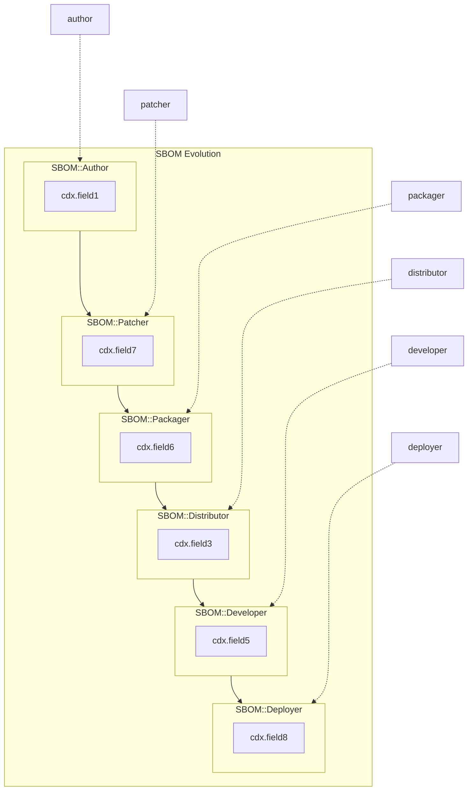

```mermaid
graph TB
    subgraph sbom_lifecycle [SBOM Evolution]
        direction TB
        author_sbom
        patcher_sbom
        packager_sbom
        distributor_sbom
        developer_sbom
        deployer_sbom
    end

    direction LR
    author_sbom ---> patcher_sbom
    patcher_sbom --> packager_sbom
    packager_sbom --> distributor_sbom
    distributor_sbom --> developer_sbom
    developer_sbom --> deployer_sbom

    subgraph author_sbom [SBOM::Author]
        cdx.field1
    end

    subgraph packager_sbom [SBOM::Packager]
        cdx.field6
    end

    subgraph patcher_sbom [SBOM::Patcher]
        cdx.field7
    end

    subgraph distributor_sbom [SBOM::Distributor]
        cdx.field3
    end

    subgraph developer_sbom [SBOM::Developer]
        cdx.field5
    end

    subgraph deployer_sbom [SBOM::Deployer]
        cdx.field8
    end

    author -...-> author_sbom
    patcher -...-> patcher_sbom
    packager -...-> packager_sbom
    distributor -...-> distributor_sbom
    developer -...-> developer_sbom
    deployer -...-> deployer_sbom


```