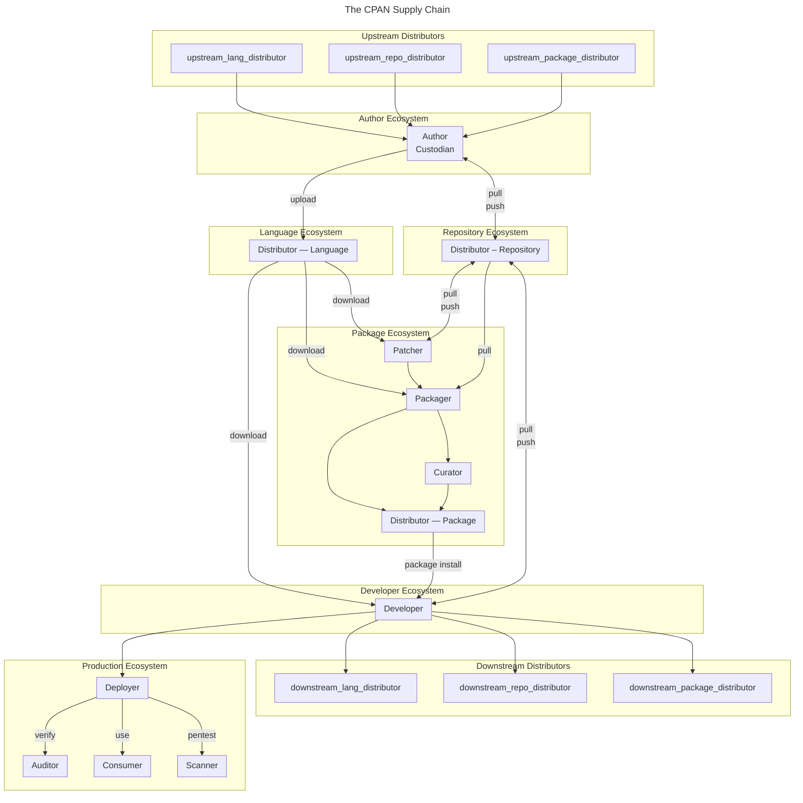

# SBOM::Roles

Owner – Has the legal owership rights for the dist (e.g a business, or the author)

Author – The initial and/or main creator of the component in question. Typically works on all aspects of the code, including features, bugfixes, tests and security issues. Has the final say on the original contents of the package. The Author _can_ be a group of people, though a single point of responsibility is common. If an Author has upstream (reverse) dependencies, the Author is also considered to be a Developer (as seen from the upstream Author's perspective. See below).

Steward – An type of Author with reduced responsibilities. Ensures the ongoing quality of the code. Typically only works on security issues and bugfixes. Usually doesn't work on new features. Works with the Author primarily, and may take responsiblity on their behalf when security and bugs are concerned.

Custodian – A type of Steward with reduced responsibilities. Cares about the ongoing security of the code. Typically only conserned with updating dependencies or applying security fixes. Works with the Author primarily, and may take responsibility on their behalf when it comes to security concerns.

Publisher – Places the component on an ecosystem publishing platform, on behalf of the Author, Steward or Custodian. Typically this role is done by the same people, but in some cases a separate account may be used; e.g. a business or organization account.

RepositoryHost – A Publisher that offers a public repository to Authors, so they may cooperate and share ongoing work in public.

Patcher – Applies security and bugfixes to distributed native packages. Works mainly with the Packager, and is downstream of the Author. This task is only necessary if upstream (Author, Steward or Custodian) roles are not responsive or available, or when downstream constraints requirements call for it (e.g. when backporting of fixes are needed due to downstream version pinning).

Packager – Builds and creates native packages from a dist received from upstream, optionally with patches applied from the Patcher. Concerns themselves with correct package format and structure, and that package metadata is preserved and updated.

Curator – Selects or pins which releases are suitable for use within an organization. Concerns themselves with both the stability and predictability of components, and how this is prioritized against the need for features, bugfixes and security updates.

Distributor – Ensures the availability of packages, that they are indexed correctly, and that any related metadata is up-to-date, correct and available.

Developer — Uses packages and components as dependencies in their own project or product. A Developer is considered to be identical to an Author from the upstream (Author's) perspective. A common difference from an Author is that a Developer doesn't publish their work as Open Source.

Deployer – Final preparation and installation of the software into production environment.

Scanner – Runtime and static security checks; Vulnerability monitoring, etc.

Consumer – The software in use in production

Auditor / Compliance – Verifies that all necessary metadata is available, up-to-date and made use of.

This file is © Salve J. Nilsen <sjn@cpan.org>. Some rights reserved.
You may use, modify and share this file under the terms of the CC-BY-SA-4.0 license.

