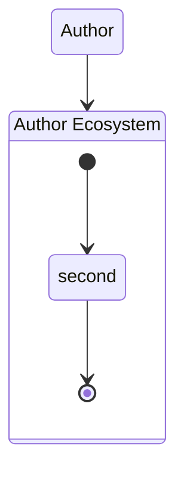
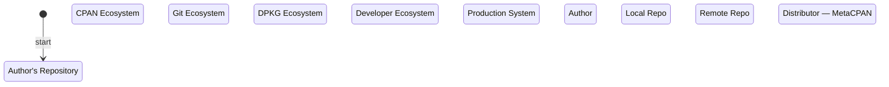

```mermaid
---
title: 
---
stateDiagram-v2
    author_ecosystem: Author Ecosystem
    author: Author
    second: 

    author --> author_ecosystem
    state author_ecosystem {
        [*] --> second
        second --> [*]
    }

```

```mermaid
stateDiagram-v2
    [*] --> ecosystem_author : start
    ecosystem_author : Author's Repository
    ecosystem_cpan : CPAN Ecosystem
    ecosystem_git : Git Ecosystem
    ecosystem_dpkg : DPKG Ecosystem
    ecosystem_developer : Developer Ecosystem
    ecosystem_production : Production System
    author : Author
    author_repo : Local Repo
    server_repo : Remote Repo
    distributor_metacpan : Distributor — MetaCPAN
```
