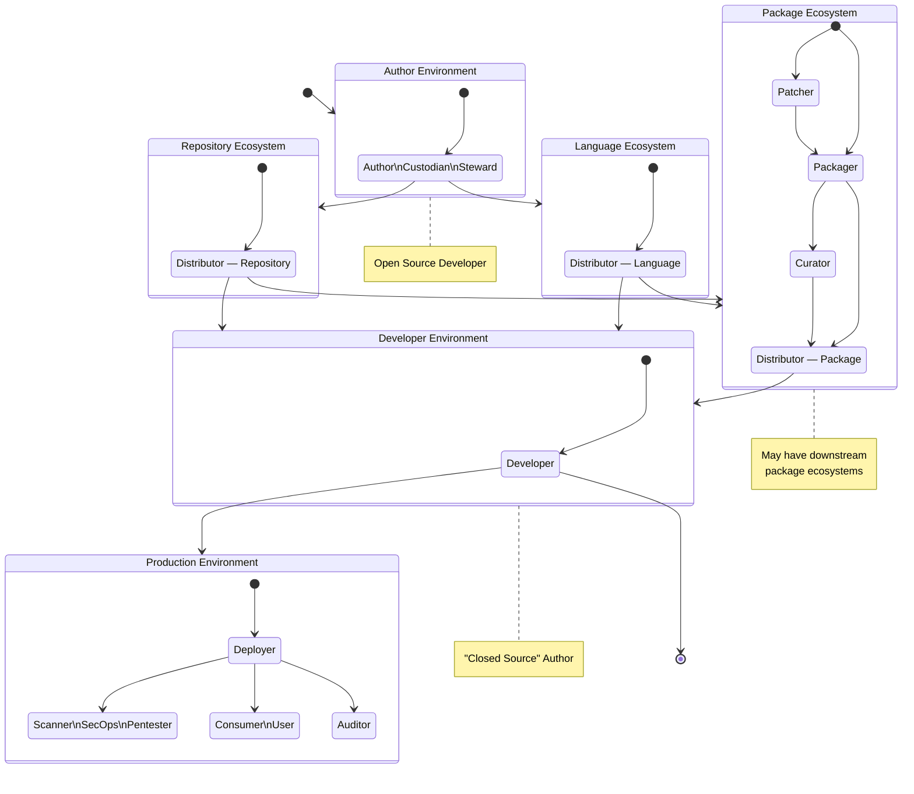

# A Simplified Open Source Supply Chain

* Community: CPAN Security Working Group
* Homepage: https://security.cpan.org
* Projects
    * CPAN Metadata & Software Bills of Materials
    * CPAN Security Outreach & Information
* Contact
	* Email: Salve J. Nilsen <sjn@oslo.pm>
	* Mastodon: @sjn@chaos.social

Below is an illustration showing the different roles that influence a typical Open Source supply chain. 

The purpose of this, is to establish effective narratives that can help people with these roles get a clear picture of what benefit SBOMs can play in their work, and for their downstream users.

# License

This is © Salve J. Nilsen <sjn@cpan.org>. Some rights reserved.
You may use, modify and share this file under the terms of the CC-BY-SA-4.0 license.
