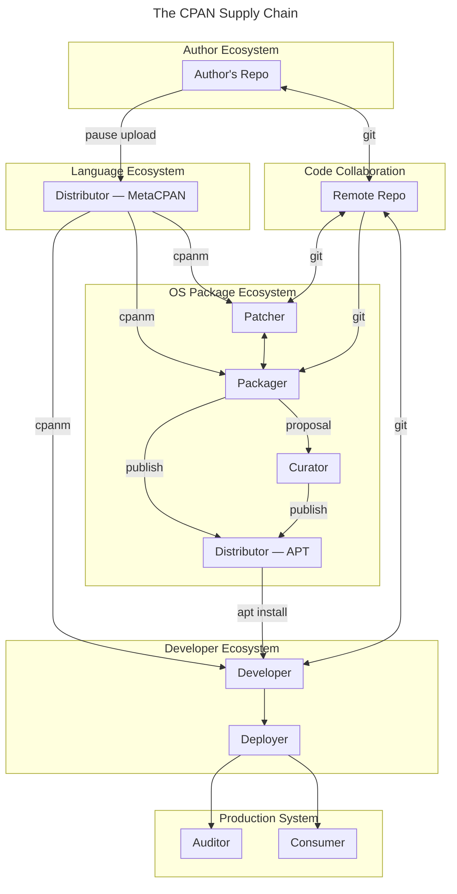

```mermaid
---
title: The CPAN Supply Chain
---
flowchart TD
    subgraph ecosystem_author [Author Ecosystem]
        author_repo
    end

    subgraph ecosystem_cpan [Language Ecosystem]
        distributor_metacpan
    end

    subgraph ecosystem_git [Code Collaboration]
        central_repo
    end

    subgraph ecosystem_dpkg [OS Package Ecosystem]
        patcher
        packager
        curator
        distributor_apt
    end

    subgraph ecosystem_developer [Developer Ecosystem]
        developer
        deployer
    end

    subgraph ecosystem_production [Production System]
        consumer
        auditor
    end

    subgraph author_repo [Author's Repo]
    end

    subgraph central_repo [Remote Repo]
    end

    subgraph distributor_metacpan [Distributor — MetaCPAN]
    end

    subgraph distributor_apt [Distributor — APT]
    end

    subgraph developer [Developer]
    end

    subgraph patcher [Patcher]
    end

    subgraph packager [Packager]
    end

    subgraph curator [Curator]
    end

    subgraph deployer [Deployer]
    end

    subgraph consumer [Consumer]
    end

    subgraph auditor [Auditor]
    end


    author_repo -->|pause upload| distributor_metacpan
    distributor_metacpan -->|cpanm| developer
    distributor_metacpan -->|cpanm| packager
    distributor_metacpan -->|cpanm| patcher
    patcher <--> packager
    packager -->|publish| distributor_apt
    packager -->|proposal| curator
    curator -->|publish| distributor_apt
    developer --> deployer
    distributor_apt -->|apt install| developer
    deployer --> consumer
    deployer --> auditor

    author_repo <-->|git| central_repo
    central_repo -->|git| packager
    central_repo <-->|git| patcher
    central_repo <-->|git| developer

```