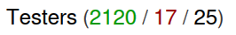

# CPAN StarJacking
## Rationale
StarJacking is an undertaking to make people prefer a module because of manipulated popularity. See [StarJacking](https://checkmarx.com/blog/starjacking-making-your-new-open-source-package-popular-in-a-snap/)

While a known topic, checking CPAN for "StarJacking" was mainly the result of the attention drawn to it thanks to experiments from Eugene Rojavski ([EUGENER](https://metacpan.org/author/EUGENER))

## How to choose what CPAN module to depend on?
CPAN has such a huge collection of modules available it's sometimes difficult to make a decision about the best one to use.

Some lists are available like [Task::Kensho](https://metacpan.org/pod/Task::Kensho), [Awesome Perl](https://github.com/hachiojipm/awesome-perl) or [Awesome Perl](https://github.com/uhub/awesome-perl) (again) but they definitely don't cover all needs.

Naming of modules can also help, for instance `Mojo::*` modules should be, by convention, mainly using other `Mojo` inner circle modules as dependencies. `*::Tiny` are generally smaller alternative to other modules of the same purpose, etc...

Most of the time and when possible, users will choose modules and authors that have an established "reputation". This reputation gives them authority on a topic, and the trust of users in term of security.

On top of that, some indicators of quality (build reports and known problems) and activity (maintainance) can be taken into account.

## Popularity indicators with CPAN
Beyond reputation (module and/or author), MetaCPAN provides some popularity indicators for CPAN modules:
- ++


- [river](https://neilb.org/2015/04/20/river-of-cpan.html) position


## Quality indicators in CPAN
Some other indicators can help in the choice but give more informations about *quality*:
- Issues

- CPANTesters

- Bus factor


## StarJacking 
StarJacking refers to the trust that VCS stars provide to a module.

By reusing the popularity of another project, unrelated to the module,
and exploiting the non-verification of the link (metadata),
an attacker can make a module appear much more popular than it actually is.

Other ecosystems like PyPI and npm are also impacted by this problem.

Like many other programming language ecosystems, we can attach "metadata"
such as a public repository, website and issue tracker URLs to CPAN packages.

It has to be done directly in the release metadata.

Example of using resources metadata pointing to a popular project, for instance in `META.yml`
```
META_MERGE   => {
    resources => {
        repository => {
            type => 'git',
            url  => 'https://github.com/popular/lot-of-stars.git',
            web  => 'https://github.com/popular/lot-of-stars',
        },
        bugtracker => {
            web => 'https://github.com/popular/lot-of-stars-and-tickets',
        },
    },
},
```

Read [CPAN add link to version control system](https://perlmaven.com/how-to-add-link-to-version-control-system-of-a-cpan-distributions) for more about how to set the metadata.

CPAN metadats are effectively unverified.

PyPI now implements a mechanism for verifying metadata with [Project Metadata Verifications](https://docs.pypi.org/project_metadata/#verified-details):


Or it can warn you about metadata information being "unverified":


Back to MetaCPAN, the outcome is that GitHub/Gitlab/... numbers are almost invisible in MetaCPAN. For instance, for a module with more than 200 stars in GitHub:


Only issues are visible, but how can issues help in StarJacking?

Still, we can get more details on metadata by hovering **Repository**:


As a conclusion, CPAN is not impacted even though CPAN modules can provide inaccurate or incorrect metadata.

It's because GitHub's popularity is not strongly enough propagated to MetaCPAN, so lying on metadata (in a particular repository) does not bring any real advantage over other modules.

## PlusPlusJacking 
MetaCPAN package popularity uses an independant indicator, the "++" (PlusPlus).

++ are sent by other CPAN authors.

Manipulation of a PlusPlus score is possible but not cheap: it require creation of several spammy authors.

And creations of authors requires a [request](https://pause.perl.org/pause/query?ACTION=request_id) and [manual acceptance](https://www.nntp.perl.org/group/perl.modules/2024/11/msg105533.html) by CPAN admins.

## RiverJacking 
The river score appears next to the module name in several places:


The river score audience is mostly the maintainers.

The calculation is made externally to PAUSE and MetaCPAN.

## Conclusion
CPAN is not vulnerable to StarJacking, because VCS stars are not helping the popularity of a module in MetaCPAN.

Manipulating popularity via other CPAN in-house indicators is possible but not easy to implement.

The very social nature of CPAN (manual acceptance of new users, code reviews of new modules) makes it difficult overall to exploit.

## Resources
- [StarJacking](https://checkmarx.com/blog/falling-stars/)
- [PyPI security](https://www.youtube.com/watch?v=ZvNuHKDyQXc)
- [PyPI details verification](https://docs.pypi.org/project_metadata/#verified-details)
- [PyPI trusted publishing](https://docs.pypi.org/trusted-publishers/)
