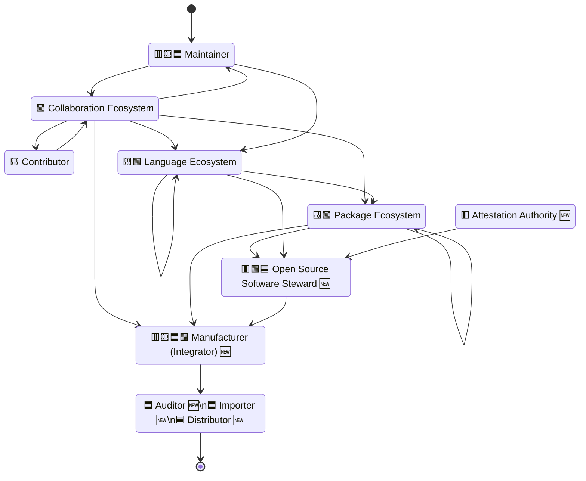
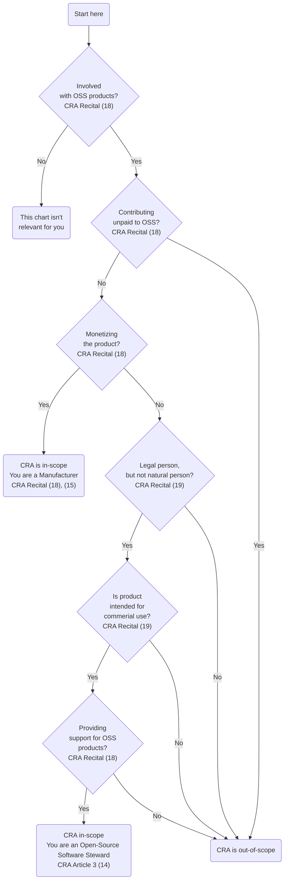

## Document status: ⚠️  DRAFT

> [!CAUTION]
> What you see here is a DRAFT overview by the CPAN Security Group (CPANSec) of the core obligations set out by the EU Cyber Resilience Act, as applied to Open Source ecosystems and supply chains,
> As long as this document is in DRAFT, all of the points and ideas below are _suggestions_, and open to revision, deletion or amending – by you!
>
> - Contribute on Github: [https://github.com/CPAN-Security/security.metacpan.org/tree/cra-summary/docs/eu-cra-summary.md](https://github.com/CPAN-Security/security.metacpan.org/tree/cra-summary/docs/eu-cra-summary.md)
> - Discuss on IRC: [ircs://ssl.irc.perl.org:7063/#cpan-security](ircs://ssl.irc.perl.org:7063/#cpan-security)
> - Discuss on Matrix: [https://matrix.to/#/#cpansec:matrix.org](https://matrix.to/#/#cpansec:matrix.org)

## About this document

This text attempts to summarize the most important parts of the CRA, for Open Source ecosystems.

For license information and acknowledgements, see the [end of this document](#license-and-use-of-this-document).

### Manufacturers

Manufacturers are obliged to _exercise due diligence when integrating components from third parties_, as laid out in **[Article 13(5)](https://www.europarl.europa.eu/doceo/document/TA-9-2024-0130_EN.pdf#page=163)**

* …after the Manufacturer conducts a risk assessment, as laid out in [Article 13(2)](https://www.europarl.europa.eu/doceo/document/TA-9-2024-0130_EN.pdf#page=161)
* …in accordance with essential requirements laid out in [Annex I, Part I](https://www.europarl.europa.eu/doceo/document/TA-9-2024-0130_EN.pdf#page=297)
  * The product is designed and developed in a way that ensures appropriate levels cybersecurity
  * …made available on the market without any known exploitable vulnerabilities
  * …made with a secure by default configuration
  * …made in such a way that security updates may be automatically applied within an appropriate time frame
  * …and more.

Manufacturers must report on actively exploited vulnerabilities and severe incidents via an ENISA-run single reporting platform (as laid out in [Article 16](https://www.europarl.europa.eu/doceo/document/TA-9-2024-0130_EN.pdf#page=187))

* …in the way described in [Article 14](https://www.europarl.europa.eu/doceo/document/TA-9-2024-0130_EN.pdf#page=176)
  * …submit an early warning if actively exploited vulnerabilities within 24 hours of discovery
  * …submit all relevant details about the nature of the exploit, without delay and within 72 hours
  * …submit a final report including available mitigations, within 14 days.

Manufacturers are required to **report discovered vulnerabilities in components to their maintainers**, as laid out in [Article 13(6)](https://www.europarl.europa.eu/doceo/document/TA-9-2024-0130_EN.pdf#page=164)

* …in accordance with instructions laid out in [Annex I, part II](https://www.europarl.europa.eu/doceo/document/TA-9-2024-0130_EN.pdf#page=300).
  * …identify and document the vulnerability, including by drawing up an SBOM covering at minimum the top-level dependencies involved
  * …depending on risk posed, provide without delay a security update that addresses the vulnerability
  * …apply regular tests and reviews of the security of the product
  * …publicly share information about the vulnerability, it's impact and relevance, and how to remediate it
  * …publish and enforce a policy for coordinated vulnerability disclosure
  * …facilitate information sharing about vulnerabilities in the product and the components it uses
  * …provide mechanisms to securely distribute fixes in a timely manner
  * …

Manufacturers are to draw up the EU declaration of conformity in accordance with [Article 28](https://www.europarl.europa.eu/doceo/document/TA-9-2024-0130_EN.pdf#page=218) and affix the CE marking in accordance with [Article 30](https://www.europarl.europa.eu/doceo/document/TA-9-2024-0130_EN.pdf#page=220), as laid out in [Article 13(12)](https://www.europarl.europa.eu/doceo/document/TA-9-2024-0130_EN.pdf#page=168))

* …to indicate conformity prior to entering the market ([Article 30(3)](https://www.europarl.europa.eu/doceo/document/TA-9-2024-0130_EN.pdf#page=220))
* …and keep records for ten years, as laid out in [Article 23(2)](https://www.europarl.europa.eu/doceo/document/TA-9-2024-0130_EN.pdf#page=207).

Manufacturers must provide a Software Bill of Materials (SBOM) upon request by authorities, as laid out in [Recital (78)](https://www.europarl.europa.eu/doceo/document/TA-9-2024-0130_EN.pdf#page=86)
* …but no need for making these public.

#### Authorised representatives of Manufacturers

(Art 13 to Art 17, Art 18 for authorised representatives)

* …Testing necessary, provide technical documentation, as laid out in [Article 13(6)](https://www.europarl.europa.eu/doceo/document/TA-9-2024-0130_EN.pdf#page=164). ⚠️  FIXME: (Dis)confirm this.
* …Vulnerability management
* …perform risk assessments
* …Coordinated vulnerability disclosure (CVD) policy mandatory

* …offer support for their products for at least 5 years, security updates for 10 years

### Importers and Distributors

### Open Source Stewards

* Open Source Stewards are obliged to
  * …facilitate the Manufacturer's _due diligence_ obligation set out in [Article 13(5)](https://www.europarl.europa.eu/doceo/document/TA-9-2024-0130_EN.pdf#page=163) ⚠️  FIXME: (Dis)confirm this.
  * …provide a cybersecurity policy for voluntary reporting of vulnerabilities, as laid out in [Article 15](https://www.europarl.europa.eu/doceo/document/TA-9-2024-0130_EN.pdf#page=185)
  * …cooperate with market surveillance authorities and provide documentation. ⚠️  FIXME: (Dis)confirm this.
  * …report on actively exploited vulnerabilities and severe incidents via an ENISA-run single reporting platform (as laid out in [Article 16](https://www.europarl.europa.eu/doceo/document/TA-9-2024-0130_EN.pdf#page=187)), in the way described in [Article 14](https://www.europarl.europa.eu/doceo/document/TA-9-2024-0130_EN.pdf#page=176).

* FOSS Software may get a voluntary security attestation, as described in [Article 25](https://www.europarl.europa.eu/doceo/document/TA-9-2024-0130_EN.pdf#page=210) ⚠️  FIXME: (Dis)confirm this.
  * …using an EU Attestation program as laid out in [Recital (21)](https://www.europarl.europa.eu/doceo/document/TA-9-2024-0130_EN.pdf#page=25)
    * …by requesting a certification from ENISA, as laid out in [Regulation (EU) 2019/881, Article (48)](https://eur-lex.europa.eu/legal-content/EN/TXT/PDF/?uri=CELEX:32019R0881#page=8)
    * …in such a way that this security attestation can be initiated or financed by not only FOSS projects, but also by others, including manufacturers, users, or public administrations.
    * …so this Attestation becomes a "proof of due diligence exercised"? ⚠️  FIXME: (Dis)confirm this.
  * …to facilitate Manufacturers' obligations to exercise due diligence when integrating components from third parties.

#### Open questions

* "Commission shall publish guidance to assist economic operators in applying this Regulation"
  * 
* 

## An idealized Open Source Steward Supply-Chain graph

## Are you… a Manufacturer, Steward or Author?

## References

* (CISA-2024)  [CISA SBOM Sharing Roles and Considerations](https://www.cisa.gov/resources-tools/resources/sbom-sharing-roles-and-considerations), published 2024-03-28.
* (CRA-AII)    [Cyber Resilience Act, Annex II](https://www.europarl.europa.eu/doceo/document/TA-9-2024-0130_EN.pdf#page=303) Information and Instructions to the User, Dated 2024-03-12
* (CRA-AV)     [Cyber Resilience Act, Annex V](https://www.europarl.europa.eu/doceo/document/TA-9-2024-0130_EN.pdf#page=311) EU Declaration of Conformity, Dated 2024-03-12
* (CRA-AVII)   [Cyber Resilience Act, Annex VII](https://www.europarl.europa.eu/doceo/document/TA-9-2024-0130_EN.pdf#page=314) Contents of the Technical Documentation, Dated 2024-03-12
* (CRA-Art-3)  [Cyber Resilience Act, Article 3](https://www.europarl.europa.eu/doceo/document/TA-9-2024-0130_EN.pdf#page=136) Definitions, Dated 2024-03-12
* (CRA-Art-20) [Cyber Resilience Act, Article 20](https://www.europarl.europa.eu/doceo/document/TA-9-2024-0130_EN.pdf#page=202) Obligations of distributors, Dated 2024-03-12
* (CRA-Art-47) [Cyber Resilience Act, Article 47](https://www.europarl.europa.eu/doceo/document/TA-9-2024-0130_EN.pdf#page=249) Operational obligations of notified bodies, Dated 2024-03-12
* (CRA-Rec-15) [Cyber Resilience Act, Recital 15](https://www.europarl.europa.eu/doceo/document/TA-9-2024-0130_EN.pdf#page=17) Economic operators, Dated 2024-03-12
* (CRA-Rec-18) [Cyber Resilience Act, Recital 18](https://www.europarl.europa.eu/doceo/document/TA-9-2024-0130_EN.pdf#page=20) Open Source Software Contributors, Dated 2024-03-12
* (CRA-Rec-19) [Cyber Resilience Act, Recital 19](https://www.europarl.europa.eu/doceo/document/TA-9-2024-0130_EN.pdf#page=22) Open Source Software Stewards, Dated 2024-03-12
* (DE-TR) German Technical Requirement [TR-03183 Cyber Resilience Requirements for Manufacturers and Products (part 2)](https://bsi.bund.de/dok/TR-03183), Version 1.1, published 2023-11-28.
* (NTIA-2021) [SBOM Tool Classification Taxonomy](https://www.ntia.gov/files/ntia/publications/ntia_sbom_tooling_taxonomy-2021mar30.pdf), published 2021-03-30.
* (NTIA-SBOM) [NTIA Minimum Elements for a Software Bill of Materials (SBOM)](https://www.ntia.doc.gov/files/ntia/publications/sbom_minimum_elements_report.pdf#page=9), Published 2021-07-12

* (CPANSec-2024) CPAN Security Group commentary by Author.

## License and use of this document

* Version: 0.5.2
* License: [CC-BY-SA-4.0](https://creativecommons.org/licenses/by-sa/4.0/deed)
* Copyright: © Salve J. Nilsen <sjn@oslo.pm>, Some rights reserved.

You may use, modify and share this file under the terms of the [CC-BY-SA-4.0](https://creativecommons.org/licenses/by-sa/4.0/deed) license.

### Acknowledgements

Several people have been involved in the development of this document

* Salve J. Nilsen (main author)
