## Document status: ⚠️  DRAFT

> [!CAUTION]
> What you see here is a DRAFT overview by the CPAN Security Group (CPANSec) of the core obligations set out by the EU Cyber Resilience Act, as applied to Open Source ecosystems and supply chains,
> As long as this document is in DRAFT, all of the points and ideas below are _suggestions_, and open to revision, deletion or amending – by you!
>
> - Contribute on Github: [https://github.com/CPAN-Security/security.metacpan.org/tree/cra-summary/docs/eu-cra-summary.md](https://github.com/CPAN-Security/security.metacpan.org/tree/cra-summary/docs/eu-cra-summary.md)
> - Discuss on IRC: [ircs://ssl.irc.perl.org:7063/#cpan-security](ircs://ssl.irc.perl.org:7063/#cpan-security)
> - Discuss on Matrix: [https://matrix.to/#/#cpansec:matrix.org](https://matrix.to/#/#cpansec:matrix.org)

[Recital (10)]:https://eur-lex.europa.eu/legal-content/EN/TXT/HTML/?uri=OJ:L_202402847#rct_10 'CRA relevance for supply chains'
[Recital (15)]:https://eur-lex.europa.eu/legal-content/EN/TXT/HTML/?uri=OJ:L_202402847#rct_15 'CRA applies to economic operators that have an intention to monetise a product'
[Recital (18)]:https://eur-lex.europa.eu/legal-content/EN/TXT/HTML/?uri=OJ:L_202402847#rct_18 'Open Source Software Contributors'
[Recital (19)]:https://eur-lex.europa.eu/legal-content/EN/TXT/HTML/?uri=OJ:L_202402847#rct_19 'Open Source Software Stewards, light-touch regulatory regime, and CE mark implications'
[Recital (20)]:https://eur-lex.europa.eu/legal-content/EN/TXT/HTML/?uri=OJ:L_202402847#rct_20 'Open Source package managers considerations as "distributors"'
[Recital (21)]:https://eur-lex.europa.eu/legal-content/EN/TXT/HTML/?uri=OJ:L_202402847#rct_21 'Voluntary security attestation programs for Open Source projects'
[Recital (22)]:https://eur-lex.europa.eu/legal-content/EN/TXT/HTML/?uri=OJ:L_202402847#rct_22 'Submission of SBOMs for Open Source projects'
[Recital (24)]:https://eur-lex.europa.eu/legal-content/EN/TXT/HTML/?uri=OJ:L_202402847#rct_24 'CRA relevance for the NIS2 directive'
[Recital (31)]:https://eur-lex.europa.eu/legal-content/EN/TXT/HTML/?uri=OJ:L_202402847#rct_31 "Manufacturer's liability due to lack of security updates"
[Recital (34)]:https://eur-lex.europa.eu/legal-content/EN/TXT/HTML/?uri=OJ:L_202402847#rct_34 'Exercise due diligence when integrating third-party components'
[Recital (37)]:https://eur-lex.europa.eu/legal-content/EN/TXT/HTML/?uri=OJ:L_202402847#rct_37 'Software for testing purposes, alphas, betas'
[Recital (39)]:https://eur-lex.europa.eu/legal-content/EN/TXT/HTML/?uri=OJ:L_202402847#rct_39 'Continued security updates'
[Recital (41)]:https://eur-lex.europa.eu/legal-content/EN/TXT/HTML/?uri=OJ:L_202402847#rct_41 'Substantial modifications requires a new conformity assessment to be done'
[Recital (43)]:https://eur-lex.europa.eu/legal-content/EN/TXT/HTML/?uri=OJ:L_202402847#rct_43 'Important products with digital elements'
[Recital (44)]:https://eur-lex.europa.eu/legal-content/EN/TXT/HTML/?uri=OJ:L_202402847#rct_44 'Class I and Class II products'
[Recital (45)]:https://eur-lex.europa.eu/legal-content/EN/TXT/HTML/?uri=OJ:L_202402847#rct_45 'Class II products are subject to mandatory third-party conformity assessment'
[Recital (56)]:https://eur-lex.europa.eu/legal-content/EN/TXT/HTML/?uri=OJ:L_202402847#rct_56 'On the download and installation of security updates, and notification of end of support'
[Recital (57)]:https://eur-lex.europa.eu/legal-content/EN/TXT/HTML/?uri=OJ:L_202402847#rct_57 'On the requirement to be able to get security updates separately from functionality updates'
[Recital (60)]:https://eur-lex.europa.eu/legal-content/EN/TXT/HTML/?uri=OJ:L_202402847#rct_60 'Support period'
[Recital (61)]:https://eur-lex.europa.eu/legal-content/EN/TXT/HTML/?uri=OJ:L_202402847#rct_61 'Support period'
[Recital (62)]:https://eur-lex.europa.eu/legal-content/EN/TXT/HTML/?uri=OJ:L_202402847#rct_62 'Support period'
[Recital (63)]:https://eur-lex.europa.eu/legal-content/EN/TXT/HTML/?uri=OJ:L_202402847#rct_63 'Point of contact'
[Recital (64)]:https://eur-lex.europa.eu/legal-content/EN/TXT/HTML/?uri=OJ:L_202402847#rct_64 'Secure by default'
[Recital (77)]:https://eur-lex.europa.eu/legal-content/EN/TXT/HTML/?uri=OJ:L_202402847#rct_77 'Manufacturers should facilitate vulnerability analysis by drawing up an SBOM, though they are not obliged to make it public'
[Recital (117)]:https://eur-lex.europa.eu/legal-content/EN/TXT/HTML/?uri=OJ:L_202402847#rct_117 '[…] establish voluntary security attestation programmes for assessing the conformity of products with digital elements qualifying as free and open-source software […]'

[Chapter I]:https://eur-lex.europa.eu/legal-content/EN/TXT/HTML/?uri=OJ:L_202402847#cpt_I 'General Provisions'
[Article 3]:https://eur-lex.europa.eu/legal-content/EN/TXT/HTML/?uri=OJ:L_202402847#art_3 'Definitions'

[Chapter II]:https://eur-lex.europa.eu/legal-content/EN/TXT/HTML/?uri=OJ:L_202402847#cpt_II 'Obligations of Economic Operators and Provisions in relation to Free and Open-Source Software'
[Article 1]:https://eur-lex.europa.eu/legal-content/EN/TXT/HTML/?uri=OJ:L_202402847#art_1 'Subject Matter'
[Article 2]:https://eur-lex.europa.eu/legal-content/EN/TXT/HTML/?uri=OJ:L_202402847#art_2 'Scope'
[Article 9]:https://eur-lex.europa.eu/legal-content/EN/TXT/HTML/?uri=OJ:L_202402847#art_9 'Obligations of Manufacturers'
[Article 9(1)]:https://eur-lex.europa.eu/legal-content/EN/TXT/HTML/?uri=OJ:L_202402847#art_9.tit_1 'Stakeholder consultation'

[Article 13]:https://eur-lex.europa.eu/legal-content/EN/TXT/HTML/?uri=OJ:L_202402847#art_13 'Obligations of Manufacturers'
[Article 13(2)]:https://eur-lex.europa.eu/legal-content/EN/TXT/HTML/?uri=OJ:L_202402847#013.002 'Manufacturers shall undertake a cybersecurity risk assessment'
[Article 13(5)]:https://eur-lex.europa.eu/legal-content/EN/TXT/HTML/?uri=OJ:L_202402847#013.005 'Manufacturers shall exercise due diligence when integrating components, including FOSS'
[Article 13(6)]:https://eur-lex.europa.eu/legal-content/EN/TXT/HTML/?uri=OJ:L_202402847#013.006 'Manufacturers shall share relevant code or documentation with the supplier or maintainer of the component'
[Article 13(12)]:https://eur-lex.europa.eu/legal-content/EN/TXT/HTML/?uri=OJ:L_202402847#013.012 'Manufacturers shall before placing a product on the market, draw up technical documentation'
[Article 13(14)]:https://eur-lex.europa.eu/legal-content/EN/TXT/HTML/?uri=OJ:L_202402847#013.014 'Manufacturers shall ensure that procedures are in place for products to remain in conformity with this Regulation'
[Article 13(15)]:https://eur-lex.europa.eu/legal-content/EN/TXT/HTML/?uri=OJ:L_202402847#013.015 'Manufacturers shall ensure that their products is identifiable'
[Article 13(16)]:https://eur-lex.europa.eu/legal-content/EN/TXT/HTML/?uri=OJ:L_202402847#013.016 'Manufacturers shall indicate their name and identification'
[Article 13(17)]:https://eur-lex.europa.eu/legal-content/EN/TXT/HTML/?uri=OJ:L_202402847#013.017 'Manufacturers shall designate a single point of contact for reporting vulnerabilities'
[Article 13(18)]:https://eur-lex.europa.eu/legal-content/EN/TXT/HTML/?uri=OJ:L_202402847#013.018 'Manufacturers shall ensure products are accompanied by documentation listed in Annex II, and available for at least 10 years'
[Article 13(19)]:https://eur-lex.europa.eu/legal-content/EN/TXT/HTML/?uri=OJ:L_202402847#013.019 'Manufacturers shall shall clearly mark the end date of the support period'
[Article 13(20)]:https://eur-lex.europa.eu/legal-content/EN/TXT/HTML/?uri=OJ:L_202402847#013.020 'Manufacturers shall provide a copy of or the exact internet addrees to the EU declaration of conformity'
[Article 14]:https://eur-lex.europa.eu/legal-content/EN/TXT/HTML/?uri=OJ:L_202402847#art_14 'Reporting obligations of manufacturers'
[Article 14(1)]:https://eur-lex.europa.eu/legal-content/EN/TXT/HTML/?uri=OJ:L_202402847#014.001 'A manufacturer shall notify any actively exploited vulnerability contained in the product that it becomes aware of'
[Article 14(2)]:https://eur-lex.europa.eu/legal-content/EN/TXT/HTML/?uri=OJ:L_202402847#014.002 'A manufacturer shall notify within 24 hours, 72 hours and 14 days'
[Article 14(3)]:https://eur-lex.europa.eu/legal-content/EN/TXT/HTML/?uri=OJ:L_202402847#014.003 'A manufacturer shall notify any severe incident having an impact on the security of the product that it becomes aware of'
[Article 14(8)]:https://eur-lex.europa.eu/legal-content/EN/TXT/HTML/?uri=OJ:L_202402847#014.008 'After becoming aware of an incident or vulnerability, the manufacturer shall inform the impacted users of the product, and about risk mitigation and any corrective measures that users can deploy'
[Article 15]:https://eur-lex.europa.eu/legal-content/EN/TXT/HTML/?uri=OJ:L_202402847#art_15 'Voluntary reporting'
[Article 16]:https://eur-lex.europa.eu/legal-content/EN/TXT/HTML/?uri=OJ:L_202402847#art_16 'Establishment of a single reporting platform'
[Article 17]:https://eur-lex.europa.eu/legal-content/EN/TXT/HTML/?uri=OJ:L_202402847#art_17 'Other provisions related to reporting'
[Article 18]:https://eur-lex.europa.eu/legal-content/EN/TXT/HTML/?uri=OJ:L_202402847#art_18 'Authorised representatives'
[Article 19]:https://eur-lex.europa.eu/legal-content/EN/TXT/HTML/?uri=OJ:L_202402847#art_19 'Obligations of importers'
[Article 19(1)]:https://eur-lex.europa.eu/legal-content/EN/TXT/HTML/?uri=OJ:L_202402847#019.001 'Importers shall only place products on the market that comply with requirements in Annex I part I'
[Article 20]:https://eur-lex.europa.eu/legal-content/EN/TXT/HTML/?uri=OJ:L_202402847#art_20 'Obligations of distributors'
[Article 21]:https://eur-lex.europa.eu/legal-content/EN/TXT/HTML/?uri=OJ:L_202402847#art_21 'Cases in which obligations of manufacturers apply to importers and distributors'
[Article 22]:https://eur-lex.europa.eu/legal-content/EN/TXT/HTML/?uri=OJ:L_202402847#art_22 'Other cases in which obligations of manufacturers apply'
[Article 23]:https://eur-lex.europa.eu/legal-content/EN/TXT/HTML/?uri=OJ:L_202402847#art_23 'Identification of economic operators'
[Article 23(2)]:https://eur-lex.europa.eu/legal-content/EN/TXT/HTML/?uri=OJ:L_202402847#023.002 'Be able to present supplier information for 10 years'
[Article 24]:https://eur-lex.europa.eu/legal-content/EN/TXT/HTML/?uri=OJ:L_202402847#art_24 'Obligations of open-source software stewards'
[Article 25]:https://eur-lex.europa.eu/legal-content/EN/TXT/HTML/?uri=OJ:L_202402847#art_25 'Security attestation of free and open-source software'
[Article 26]:https://eur-lex.europa.eu/legal-content/EN/TXT/HTML/?uri=OJ:L_202402847#art_26 'Guidance'

[Chapter III]:https://eur-lex.europa.eu/legal-content/EN/TXT/HTML/?uri=OJ:L_202402847#cpt_III 'Conformity of the product with digital elements'
[Article 28]:https://eur-lex.europa.eu/legal-content/EN/TXT/HTML/?uri=OJ:L_202402847#art_28 'EU declaration of conformity'
[Article 30]:https://eur-lex.europa.eu/legal-content/EN/TXT/HTML/?uri=OJ:L_202402847#art_30 'Rules and conditions for affixing the CE marking'
[Article 30(3)]:https://eur-lex.europa.eu/legal-content/EN/TXT/HTML/?uri=OJ:L_202402847#030.003 'The CE marking shall be affixed before the product with digital elements is placed on the market'
[Article 32]:https://eur-lex.europa.eu/legal-content/EN/TXT/HTML/?uri=OJ:L_202402847#art_32 'Conformity assessment procedures'

[Chapter IV]:https://eur-lex.europa.eu/legal-content/EN/TXT/HTML/?uri=OJ:L_202402847#cpt_IV 'Notification of Conformity Assessment Bodies'
[Article 47]:https://eur-lex.europa.eu/legal-content/EN/TXT/HTML/?uri=OJ:L_202402847#art_47 'Operational obligations of notified bodies'

[Chapter V]:https://eur-lex.europa.eu/legal-content/EN/TXT/HTML/?uri=OJ:L_202402847#cpt_V 'Market Surveillance and Enforcement'
[Article 52]:https://eur-lex.europa.eu/legal-content/EN/TXT/HTML/?uri=OJ:L_202402847#art_52 'Market surveillance and control of products'
[Article 52(3)]:https://eur-lex.europa.eu/legal-content/EN/TXT/HTML/?uri=OJ:L_202402847#052.003 'Market surveillance authorities shall also be responsible for carrying out market surveillance activities in relation to the obligations for open-source software stewards.'
[Article 52(11)]:https://eur-lex.europa.eu/legal-content/EN/TXT/HTML/?uri=OJ:L_202402847#052.011 'Market surveillance authorities shall inform consumers of where to submit complaints that could indicate non-compliance with this Regulation and facilitate reporting of vulnerabilities, incidents and cyber threats'
[Article 54]:https://eur-lex.europa.eu/legal-content/EN/TXT/HTML/?uri=OJ:L_202402847#art_54 'Procedure concerning products presenting a significant cybersecurity risk'
[Article 54(1)]:https://eur-lex.europa.eu/legal-content/EN/TXT/HTML/?uri=OJ:L_202402847#054.001 '[If a market authority finds] sufficient reason to consider that a product, including its vulnerability handling, presents a significant cybersecurity risk, it shall carry out an evaluation of the product concerned in respect of its compliance with all the requirements laid down in this Regulation.'
[Article 54(5)]:https://eur-lex.europa.eu/legal-content/EN/TXT/HTML/?uri=OJ:L_202402847#054.005 '[If the economic operator does] not take adequate corrective action, the market surveillance authority shall take all appropriate provisional measures to prohibit or restrict that product from being made available, to withdraw it from that market or to recall it.'
[Article 58]:https://eur-lex.europa.eu/legal-content/EN/TXT/HTML/?uri=OJ:L_202402847#art_58 'Formal non-compliance'

[Chapter VII]:https://eur-lex.europa.eu/legal-content/EN/TXT/HTML/?uri=OJ:L_202402847#cpt_VII 'Confidentiality and Penalties'
[Article 64]:https://eur-lex.europa.eu/legal-content/EN/TXT/HTML/?uri=OJ:L_202402847#art_64 'Penalties'
[Article 64(4)]:https://eur-lex.europa.eu/legal-content/EN/TXT/HTML/?uri=OJ:L_202402847#064.004 'Supplying incorrect, incomplete or misleading information may be fined up to 5M EUR or 1% of global turnover'
[Article 64(10)(b)]:https://eur-lex.europa.eu/legal-content/EN/TXT/HTML/?uri=OJ:L_202402847#064.010 'Rules on administrative fines shall not apply to Open Source Software Stewards'

[Chapter VIII]:https://eur-lex.europa.eu/legal-content/EN/TXT/HTML/?uri=OJ:L_202402847#cpt_VIII 'Transitional and final provisions'
[Article 71]:https://eur-lex.europa.eu/legal-content/EN/TXT/HTML/?uri=OJ:L_202402847#art_71 'Entry into force and application'
[Article 71(2)]:https://eur-lex.europa.eu/legal-content/EN/TXT/HTML/?uri=OJ:L_202402847#071.002 'This Regulation shall apply from 11 December 2027. However, Article 14 shall apply from 11 September 2026 and Chapter IV (Articles 35 to 51) shall apply from 11 June 2026.'

[Annex I]:https://eur-lex.europa.eu/legal-content/EN/TXT/HTML/?uri=OJ:L_202402847#anx_I 'Essential Cybersecurity Requirements'
[Annex I, Part I]:https://eur-lex.europa.eu/legal-content/EN/TXT/HTML/?uri=OJ:L_202402847#d1e47-68-1 'Cybersecurity requirements relating to the properties of products with digital elements'
[Annex I, Part II]:https://eur-lex.europa.eu/legal-content/EN/TXT/HTML/?uri=OJ:L_202402847#d1e143-68-1 'Vulnerability handling requirements'
[Annex II]:https://eur-lex.europa.eu/legal-content/EN/TXT/HTML/?uri=OJ:L_202402847#anx_II 'Information and Instructions to the User'
[Annex V]:https://eur-lex.europa.eu/legal-content/EN/TXT/HTML/?uri=OJ:L_202402847#anx_V 'EU Declaration of Conformity'
[Annex VII]:https://eur-lex.europa.eu/legal-content/EN/TXT/HTML/?uri=OJ:L_202402847#anx_VII 'Content of the Technical Documentation'

[Regulation (EU) 2019/881, Article (48)]:https://eur-lex.europa.eu/legal-content/EN/TXT/HTML/?uri=CELEX:32019R0881#art_48 'Request for a European cybersecurity certification scheme'

[EU Blue Guide]:https://eur-lex.europa.eu/legal-content/EN/TXT/?uri=uriserv%3AOJ.C_.2022.247.01.0001.01.ENG&toc=OJ%3AC%3A2022%3A247%3ATOC 'The Blue Guide on the implementation of EU product rules (2022/C 247/01)'

[CC-BY-SA-4.0]:https://creativecommons.org/licenses/by-sa/4.0/deed 'Creative Commons Attrubution Sharealike 4.0 License'

[CISA-2023-4]:https://www.cisa.gov/resources-tools/resources/types-software-bill-materials-sbom 'CISA Types of Software Bill of Materials (SBOM)'
[CISA-2024-10]:https://www.cisa.gov/sites/default/files/2024-10/SBOM%20Framing%20Software%20Component%20Transparency%202024.pdf 'CISA Framing Software Component Transparency: Establishing a Common Software Bill of Materials (SBOM)'
[CSCRF]:https://www.sebi.gov.in/legal/circulars/aug-2024/cybersecurity-and-cyber-resilience-framework-cscrf-for-sebi-regulated-entities-res-_85964.html 'Cybersecurity and Cyber Resilience Framework (CSCRF) for SEBI Regulated Entities (REs)'
[TR-03183]:https://bsi.bund.de/dok/TR-03183 'TR-03183 Cyber Resilience Requirements for Manufacturers and Products, Part 2'
[NTIA-SBOM]:https://www.ntia.doc.gov/files/ntia/publications/sbom_minimum_elements_report.pdf#page=9 'NTIA Minimum Elements for a Software Bill of Materials (SBOM)'

## About this document

This text attempts to summarize the most important parts of the CRA, for Open Source ecosystems.

For license information and acknowledgements, see the [end of this document](#license-and-use-of-this-document).

### Purpose

Fostering the development of secure products

* _Harmonized standards_ create _presumption of conformance_.

### Manufacturers

Manufacturers are obliged to _exercise due diligence when integrating components from third parties_, as laid out in [Article 13(5)]

* …after the Manufacturer conducts a risk assessment, as laid out in [Article 13(2)]
* …in accordance with essential requirements laid out in [Annex I, Part I]
  * The product is designed and developed in a way that ensures appropriate levels cybersecurity
  * …made available on the market without any known exploitable vulnerabilities
  * …made with a secure by default configuration
  * …made in such a way that security updates may be automatically applied within an appropriate time frame
  * …and more.

Manufacturers must report on actively exploited vulnerabilities and severe incidents via an ENISA-run single reporting platform, as laid out in [Article 16]

* …in the way described in [Article 14(2)]
  * …submit an early warning if actively exploited vulnerabilities within 24 hours of discovery
  * …submit all relevant details about the nature of the exploit, without delay and within 72 hours
  * …submit a final report including available mitigations, within 14 days.

Manufacturers are required to **report discovered vulnerabilities in components to their maintainers**,
and **share modifications developed to address the vulnerability with their maintainers**,
as laid out in [Article 13(6)]:

Manufacturers shall, upon identifying a vulnerability in a component, including in an open source-component, […]

* …in accordance with instructions laid out in [Annex I, part II]
  * …identify and document the vulnerability, including by drawing up an SBOM covering at minimum the top-level dependencies involved
  * …depending on risk posed, provide without delay a security update that addresses the vulnerability
  * …apply regular tests and reviews of the security of the product
  * …publicly share information about the vulnerability, it's impact and relevance, and how to remediate it
  * …publish and enforce a policy for coordinated vulnerability disclosure
  * …facilitate information sharing about vulnerabilities in the product and the components it uses
  * …provide mechanisms to securely distribute fixes in a timely manner
* …report the vulnerability to the person […] maintaining the component,
* …and address and remediate the vulnerability in accordance with the vulnerability handling requirements set out in [Annex I, part II].
* …and where manufacturers have developed a […] modification to address the vulnerability in that component,
  * they shall share the relevant code or documentation with the person […] maintaining the component, […].

Manufacturers are to draw up the EU declaration of conformity in accordance with [Article 28] and affix the CE marking in accordance with [Article 30] as laid out in [Article 13(12)]

* …to indicate conformity prior to entering the market ([Article 30(3)])
* …and keep records for ten years, as laid out in [Article 23(2)]

Manufacturers must provide a Software Bill of Materials (SBOM) upon request by authorities, as laid out in [Recital (77)]
* …but no need for making these public.

#### Authorised representatives of Manufacturers  ⚠️  FIXME: Not done

> [!NOTE] See [Article 13], [Article 14], [Article 15], [Article 16], and [Article 17] for context.

Obligations for Authorised representatives of Manufacturers are laid out in [Article 18]

* …Testing necessary, provide technical documentation, as laid out in [Article 13(6)]
* …Vulnerability management
* …perform risk assessments
* …Coordinated vulnerability disclosure (CVD) policy mandatory

* …offer support for their products for at least 5 years, security updates for 10 years

### Importers

Importers shall place on the market only products with digital elements that comply with the essential requirements set out in [Annex I, Part I] and where the processes put in place by the manufacturer comply with the essential requirements set out in [Annex I, Part II] – as laid out in [Article 19(1)]

### Distributors ⚠️  FIXME: Not done

When making a product with digital elements available on the market, distributors shall act with due care in relation to the requirements set out in this Regulation.

Before making a product with digital elements available on the market, distributors shall verify that:

* (a) the product with digital elements bears the CE marking;
* (b) the manufacturer and the importer have complied with the obligations set out in [Article 13(15)], [Article 16], [Article 18], [Article 19] and [Article 20] and have provided all necessary documents to the distributor.

### Open Source Stewards ⚠️  FIXME: Not done

Open Source Software Stewards are…

* […] legal persons who *provide support on a sustained basis* ([Article 3] (14)) for the development […] of products which are intended for commercial activities, and who *play a main role in ensuring the viability of those products* […] ([Recital (19)])
  * […] should be subject to a light-touch and tailor-made regulatory regime.
  * [and…] only cover […] free and open-source software that are ultimately intended for commercial activities.

Open Source Stewards are obliged to…

* …facilitate the Manufacturer's _due diligence_ obligation set out in [Article 13(5)]
* …provide a cybersecurity policy for voluntary reporting of vulnerabilities, as laid out in [Article 15]
* …cooperate with market surveillance authorities and provide documentation. ⚠️  FIXME: (Dis)confirm this.
* …report on actively exploited vulnerabilities and severe incidents via an ENISA-run single reporting platform (as laid out in [Article 16], in the way described in [Article 14].

FOSS Software may get a voluntary security attestation, as described in [Article 25] ⚠️  FIXME: (Dis)confirm this.

* …using an EU Attestation program as laid out in [Recital (21)]
  * …by requesting a certification from ENISA, as laid out in [Regulation (EU) 2019/881, Article 48](https://eur-lex.europa.eu/legal-content/EN/TXT/PDF/?uri=CELEX:32019R0881#page=8)
  * …in such a way that this security attestation can be initiated or financed by not only FOSS projects, but also by others, including manufacturers, users, or public administrations.
  * …so this Attestation becomes a "proof of due diligence exercised"? ⚠️  FIXME: (Dis)confirm this.
* …to facilitate Manufacturers' obligations to exercise due diligence when integrating components from third parties.

Furthermore, the OSS Software Stewards are only subject to a "light-touch" and "tailor-made" regulatory regime, ans are not to be considered as Manufacturers.

Additionally,

* The mere circumstances under which the product with digital elements has been developed, or how the development has been financed, should therefore not be taken into account when determining the commercial or non-commercial nature of that activity. ([Recital (18)])
* […] the development of […] free and open-source software by *not-for-profit organisations* should not be considered to be a commercial activity provided that the organisation is set up in such a way that ensures that all earnings after costs are used to achieve not-for-profit objectives. ([Recital (18)])

#### TODO: Open Source Steward

* Article 24 Obligations

* **Article 52**, Market surveillance and control of products (pages 253-259)
  * **Section 3**, Market surveillance authorities […] shall also be responsible for carrying out market surveillance activities in relation to the obligations for open-source software stewards […].
  * Section 11, Market surveillance authorities shall inform consumers of where to submit complaints that could indicate non-compliance with this Regulation […] and […] facilitate reporting of vulnerabilities, incidents and cyber threats […].

* Article 26 Guidance

> [!CAUTION]
> * (CPANSec, 2024-09-11) The details and implementations around this concept has not been made available yet.

### Maintainers

* CRA does not apply to you, as long as…
  * You are providing Free and Open Source Software (as mentioned in [Recital (18)])

#### Who does the CRA apply to? ([Recital (15)])

This Regulation applies to [economic operators](glossary.md#economic-operator) only in relation to products with digital [elements made available on the market](glossary.md#making-available-on-the-market) hence supplied for distribution or use on the Union market _in the course of a commercial activity_.

Supply _in the course of a commercial activity_ might be characterised […]

* by charging a price for a product with digital elements […]
* by charging a price for technical support services
  * where this does not serve only the recuperation of actual costs,
* by an intention to monetise,
  * for instance by providing a software platform through which the manufacturer monetises other services,
* by requiring as a condition for use the processing of personal data
  * for reasons other than exclusively for improving the security, compatibility or interoperability of the software, or
* by accepting donations
  * exceeding the costs associated with the design, development and provision of a product with digital elements.

Accepting donations without the intention of making a profit should not be considered to be a commercial activity

#### On Open Source software _intended for use in the course of a commercial activity_ ([Recital (18)])

* Free and open-source software is understood as software the source code of which is openly shared
  * and the licensing of which provides for all rights to make it
    * freely accessible, usable, modifiable and redistributable.

* Free and open-source software is developed, maintained and distributed openly,
  * including via online platforms.

* In relation to economic operators that fall within the scope of this Regulation,
  * only free and open-source software made available on the market,
    * and therefore supplied for distribution or use _in the course of a commercial activity,_
  * should fall within the scope of this Regulation.

* The mere circumstances under which the product with digital elements has been developed,
  * or how the development has been financed,
    * should therefore not be taken into account when determining the commercial or non-commercial nature of that activity.
  * More specifically, for the purposes of this Regulation
    * and in relation to the economic operators that fall within its scope,
      * to ensure that there is a clear distinction between the development and supply phases,
    * the provision of products with digital elements qualifying as free and open-source software
      * that are not monetised by their manufacturers
    * should not be considered to be a commercial activity.

* Furthermore, **the supply of** products with digital elements
  * qualifying as **free and open-source software components**
    * **intended for integration by other manufacturers** into their own products with digital elements
  * **should be considered making available on the market**
    * **only if the component is monetised** by its original manufacturer.

* For instance,
  * the mere fact that an open-source software product with digital elements
    * receives financial support from manufacturers
    * or that manufacturers contribute to the development of such a product
  * should not in itself determine that the activity is of commercial nature.

* In addition,
  * the mere presence of regular releases
  * should not in itself lead to the conclusion that a product with digital elements
    * is supplied in the course of a commercial activity.

* Finally, for the purposes of this Regulation,
  * the **development of** products with digital elements
    * qualifying as **free and open-source software**
    * **by not-for-profit organisations**
    * **should not be considered to be a commercial activity**
      * **provided** that the organisation is set up in such a way
      * that ensures that **all earnings after costs are used to achieve not-for-profit objectives**.

* This Regulation does not apply to
  * natural or legal persons
    * who contribute with source code to products with digital elements
      * qualifying as free and open-source software
      * that are not under their responsibility.

#### Open questions

* "Commission shall publish guidance to assist economic operators in applying this Regulation"
  * 
* Who gives out attestations?
  * Under what terms?
  * Can these attestations be used as a "value add" to existing components in such a way that may be sold by Stewards to fund it's work and it's community.

## An idealized Open Source Steward Supply-Chain graph

```mermaid
stateDiagram-v2
    direction TB

    state "🟥🟨 OSS Project" as environment_opensource
    state "🟨 Contributor" as environment_contributor
    state "🟩 Collaboration Ecosystem" as ecosystem_repo
    state "🟨🟩 Language Ecosystem" as ecosystem_lang
    state "🟨🟩 Package Ecosystem<br>🟩 Container Ecosystem" as ecosystem_package
    %%state "🟨🟩 Package Ecosystem" as ecosystem_package
    %%state "🟩 Container Ecosystem" as ecosystem_container
    state "🆕🟥🟩🟦 OSS Steward" as ecosystem_steward
    state "🆕🟥🟨🟦🟪 Manufacturer" as environment_manufacturer
    state "🟦 Customer<br>🆕🟦 Market Authority<br>🆕🟦 Auditor<br>🆕🟦 Importer<br>🆕🟦 Distributor" as authority_auditor

    [*]                      --> environment_opensource
    ecosystem_repo           --> environment_opensource
    ecosystem_lang           --> ecosystem_package
    ecosystem_repo           --> ecosystem_package
    ecosystem_repo           --> ecosystem_lang
    %%ecosystem_repo           --> ecosystem_container
    ecosystem_repo           --> environment_manufacturer
    ecosystem_repo           --> environment_contributor
    environment_contributor  --> ecosystem_repo
    environment_opensource   --> ecosystem_lang
    environment_opensource   --> ecosystem_repo
    %%ecosystem_package        --> ecosystem_container
    %%ecosystem_lang           --> ecosystem_container
    ecosystem_lang           --> ecosystem_steward
    ecosystem_lang           --> environment_manufacturer
    ecosystem_steward        --> environment_manufacturer
    ecosystem_package        --> ecosystem_steward
    %%ecosystem_container      --> ecosystem_steward
    environment_manufacturer --> authority_auditor
    %%ecosystem_container      --> environment_manufacturer
    ecosystem_package        --> environment_manufacturer
    ecosystem_lang           --> ecosystem_lang
    ecosystem_package        --> ecosystem_package
    authority_auditor        --> [*]

    %% Copyright © 2025 Salve J. Nilsen <sjn@oslo.pm>
    %% Some rights reserved. Licensed CC-BY-SA-4.0
```

## Are you… a Manufacturer, Steward or Maintainer?

## License and use of this document

* Version: 0.6.0
* License: [CC-BY-SA-4.0](https://creativecommons.org/licenses/by-sa/4.0/deed)
* Copyright: © Salve J. Nilsen <sjn@oslo.pm>, Some rights reserved.

You may use, modify and share this file under the terms of the [CC-BY-SA-4.0](https://creativecommons.org/licenses/by-sa/4.0/deed) license.

### Acknowledgements

Several people have been involved in the development of this document

* Salve J. Nilsen (main author)
