## Document status: ⚠️  DRAFT

> [!CAUTION]
> What you see here is a DRAFT overview by the CPAN Security Group (CPANSec) of the core obligations set out by the EU Cyber Resilience Act, as applied to Open Source ecosystems and supply chains,
> As long as this document is in DRAFT, all of the points and ideas below are _suggestions_, and open to revision, deletion or amending – by you!
>
> - Contribute on Github: [https://github.com/CPAN-Security/security.metacpan.org/tree/cra-summary/docs/eu-cra-summary.md](https://github.com/CPAN-Security/security.metacpan.org/tree/cra-summary/docs/eu-cra-summary.md)
> - Discuss on IRC: [ircs://ssl.irc.perl.org:7063/#cpan-security](ircs://ssl.irc.perl.org:7063/#cpan-security)
> - Discuss on Matrix: [https://matrix.to/#/#cpansec:matrix.org](https://matrix.to/#/#cpansec:matrix.org)

## About this document

This text attempts to summarize the most important parts of the CRA, for Open Source ecosystems.

For license information and acknowledgements, see the [end of this document](#license-and-use-of-this-document).

### Purpose

Fostering the development of secure products

* _Harmonized standards_ create _presumption of conformance_.

### Manufacturers

Manufacturers are obliged to _exercise due diligence when integrating components from third parties_, as laid out in **[Article 13(5)](https://eur-lex.europa.eu/legal-content/EN/TXT/PDF/?uri=OJ:L_202402847#page=35)**

* …after the Manufacturer conducts a risk assessment, as laid out in [Article 13(2)](https://eur-lex.europa.eu/legal-content/EN/TXT/PDF/?uri=OJ:L_202402847#page=35)
* …in accordance with essential requirements laid out in [Annex I, Part I](https://eur-lex.europa.eu/legal-content/EN/TXT/PDF/?uri=OJ:L_202402847#page=68)
  * The product is designed and developed in a way that ensures appropriate levels cybersecurity
  * …made available on the market without any known exploitable vulnerabilities
  * …made with a secure by default configuration
  * …made in such a way that security updates may be automatically applied within an appropriate time frame
  * …and more.

Manufacturers must report on actively exploited vulnerabilities and severe incidents via an ENISA-run single reporting platform (as laid out in [Article 16](https://eur-lex.europa.eu/legal-content/EN/TXT/PDF/?uri=OJ:L_202402847#page=41))

* …in the way described in [Article 14(2)](https://eur-lex.europa.eu/legal-content/EN/TXT/PDF/?uri=OJ:L_202402847#page=38)
  * …submit an early warning if actively exploited vulnerabilities within 24 hours of discovery
  * …submit all relevant details about the nature of the exploit, without delay and within 72 hours
  * …submit a final report including available mitigations, within 14 days.

Manufacturers are required to **report discovered vulnerabilities in components to their maintainers**, as laid out in [Article 13(6)](https://www.europarl.europa.eu/doceo/document/TA-9-2024-0130_EN.pdf#page=164)

* …in accordance with instructions laid out in [Annex I, part II](https://www.europarl.europa.eu/doceo/document/TA-9-2024-0130_EN.pdf#page=300).
  * …identify and document the vulnerability, including by drawing up an SBOM covering at minimum the top-level dependencies involved
  * …depending on risk posed, provide without delay a security update that addresses the vulnerability
  * …apply regular tests and reviews of the security of the product
  * …publicly share information about the vulnerability, it's impact and relevance, and how to remediate it
  * …publish and enforce a policy for coordinated vulnerability disclosure
  * …facilitate information sharing about vulnerabilities in the product and the components it uses
  * …provide mechanisms to securely distribute fixes in a timely manner
  * …

Manufacturers are to draw up the EU declaration of conformity in accordance with [Article 28](https://www.europarl.europa.eu/doceo/document/TA-9-2024-0130_EN.pdf#page=218) and affix the CE marking in accordance with [Article 30](https://www.europarl.europa.eu/doceo/document/TA-9-2024-0130_EN.pdf#page=220), as laid out in [Article 13(12)](https://www.europarl.europa.eu/doceo/document/TA-9-2024-0130_EN.pdf#page=168))

* …to indicate conformity prior to entering the market ([Article 30(3)](https://www.europarl.europa.eu/doceo/document/TA-9-2024-0130_EN.pdf#page=220))
* …and keep records for ten years, as laid out in [Article 23(2)](https://www.europarl.europa.eu/doceo/document/TA-9-2024-0130_EN.pdf#page=207).

Manufacturers must provide a Software Bill of Materials (SBOM) upon request by authorities, as laid out in [Recital (78)](https://www.europarl.europa.eu/doceo/document/TA-9-2024-0130_EN.pdf#page=86)
* …but no need for making these public.

#### Authorised representatives of Manufacturers

(Art 13 to Art 17, Art 18 for authorised representatives)

* …Testing necessary, provide technical documentation, as laid out in [Article 13(6)](https://www.europarl.europa.eu/doceo/document/TA-9-2024-0130_EN.pdf#page=164). ⚠️  FIXME: (Dis)confirm this.
* …Vulnerability management
* …perform risk assessments
* …Coordinated vulnerability disclosure (CVD) policy mandatory

* …offer support for their products for at least 5 years, security updates for 10 years

### Importers

Importers shall place on the market only products with digital elements that comply with the essential requirements set out in [Annex I, Part I](https://www.europarl.europa.eu/doceo/document/TA-9-2024-0130_EN.pdf#page=297), and where the processes put in place by the manufacturer comply with the essential requirements set out in [Annex I, Part II](https://www.europarl.europa.eu/doceo/document/TA-9-2024-0130_EN.pdf#page=300) – as laid out in [Article 19(1))](https://www.europarl.europa.eu/doceo/document/TA-9-2024-0130_EN.pdf#page=197)

### Distributors

When making a product with digital elements available on the market, distributors shall act with due care in relation to the requirements set out in this Regulation.

Before making a product with digital elements available on the market, distributors shall verify that:

* (a) the product with digital elements bears the CE marking;
* (b) the manufacturer and the importer have complied with the obligations set out in [Article 13(15), (16), (18), (19) and (20)](https://www.europarl.europa.eu/doceo/document/TA-9-2024-0130_EN.pdf#page=169) and [Article 19(4)](https://www.europarl.europa.eu/doceo/document/TA-9-2024-0130_EN.pdf#page=199), and have provided all necessary documents to the distributor.

### Open Source Stewards ⚠️  FIXME: Not done

Open Source Software Stewards are…

* […] legal persons who *provide support on a sustained basis* for the development […] of products which are intended for commercial activities, and who *play a main role in ensuring the viability of those products* […] ([Recital 19](https://www.europarl.europa.eu/doceo/document/TA-9-2024-0130_EN.pdf#page=22))
  * […] should be subject to a light-touch and tailor-made regulatory regime.
  * [and…] only cover […] free and open-source software that are ultimately intended for commercial activities.

Open Source Stewards are obliged to…

* …facilitate the Manufacturer's _due diligence_ obligation set out in [Article 13(5)](https://www.europarl.europa.eu/doceo/document/TA-9-2024-0130_EN.pdf#page=163) ⚠️  FIXME: (Dis)confirm this.
* …provide a cybersecurity policy for voluntary reporting of vulnerabilities, as laid out in [Article 15](https://www.europarl.europa.eu/doceo/document/TA-9-2024-0130_EN.pdf#page=185)
* …cooperate with market surveillance authorities and provide documentation. ⚠️  FIXME: (Dis)confirm this.
* …report on actively exploited vulnerabilities and severe incidents via an ENISA-run single reporting platform (as laid out in [Article 16](https://www.europarl.europa.eu/doceo/document/TA-9-2024-0130_EN.pdf#page=187)), in the way described in [Article 14](https://www.europarl.europa.eu/doceo/document/TA-9-2024-0130_EN.pdf#page=176).

FOSS Software may get a voluntary security attestation, as described in [Article 25](https://www.europarl.europa.eu/doceo/document/TA-9-2024-0130_EN.pdf#page=210) ⚠️  FIXME: (Dis)confirm this.

* …using an EU Attestation program as laid out in [Recital (21)](https://www.europarl.europa.eu/doceo/document/TA-9-2024-0130_EN.pdf#page=25)
  * …by requesting a certification from ENISA, as laid out in [Regulation (EU) 2019/881, Article (48)](https://eur-lex.europa.eu/legal-content/EN/TXT/PDF/?uri=CELEX:32019R0881#page=8)
  * …in such a way that this security attestation can be initiated or financed by not only FOSS projects, but also by others, including manufacturers, users, or public administrations.
  * …so this Attestation becomes a "proof of due diligence exercised"? ⚠️  FIXME: (Dis)confirm this.
* …to facilitate Manufacturers' obligations to exercise due diligence when integrating components from third parties.

Furthermore, the OSS Software Stewards are only subject to a "light-touch" and "tailor-made" regulatory regime, ans are not to be considered as Manufacturers.

Additionally,

* The mere circumstances under which the product with digital elements has been developed, or how the development has been financed, should therefore not be taken into account when determining the commercial or non-commercial nature of that activity. ([Recital 18](https://www.europarl.europa.eu/doceo/document/TA-9-2024-0130_EN.pdf#page=21))
* […] the development of […] free and open-source software by *not-for-profit organisations* should not be considered to be a commercial activity provided that the organisation is set up in such a way that ensures that all earnings after costs are used to achieve not-for-profit objectives. ([Recital 18](https://www.europarl.europa.eu/doceo/document/TA-9-2024-0130_EN.pdf#page=21))

#### TODO: Open Source Steward

* Article 24 Obligations

* **Article 52**, Market surveillance and control of products (pages 253-259)
  * **Section 3**, Market surveillance authorities […] shall also be responsible for carrying out market surveillance activities in relation to the obligations for open-source software stewards […].
  * Section 11, Market surveillance authorities shall inform consumers of where to submit complaints that could indicate non-compliance with this Regulation […] and […] facilitate reporting of vulnerabilities, incidents and cyber threats […].

* Article 26 Guidance

> [!CAUTION]
> * (CPANSec, 2024-09-11) The details and implementations around this concept has not been made available yet.

### Maintainers

* CRA does not apply to you, as long as…
  * You are providing Free and Open Source Software (as mention in [Recital 18](https://www.europarl.europa.eu/doceo/document/TA-9-2024-0130_EN.pdf#page=21))

#### Who does the CRA apply to? ([Recital 15](https://www.europarl.europa.eu/doceo/document/TA-9-2024-0130_EN.pdf#page=17))

This Regulation applies to [economic operators](glossary.md#economic-operator) only in relation to products with digital [elements made available on the market](glossary.md#making-available-on-the-market) hence supplied for distribution or use on the Union market _in the course of a commercial activity_.

Supply _in the course of a commercial activity_ might be characterised […]

* by charging a price for a product with digital elements […]
* by charging a price for technical support services
  * where this does not serve only the recuperation of actual costs,
* by an intention to monetise,
  * for instance by providing a software platform through which the manufacturer monetises other services,
* by requiring as a condition for use the processing of personal data
  * for reasons other than exclusively for improving the security, compatibility or interoperability of the software, or
* by accepting donations
  * exceeding the costs associated with the design, development and provision of a product with digital elements.

Accepting donations without the intention of making a profit should not be considered to be a commercial activity

#### On Open Source software _intended for use in the course of a commercial activity_ ([Recital 18](https://www.europarl.europa.eu/doceo/document/TA-9-2024-0130_EN.pdf#page=20))

* Free and open-source software is understood as software the source code of which is openly shared
  * and the licensing of which provides for all rights to make it
    * freely accessible, usable, modifiable and redistributable.

* Free and open-source software is developed, maintained and distributed openly,
  * including via online platforms.

* In relation to economic operators that fall within the scope of this Regulation,
  * only free and open-source software made available on the market,
    * and therefore supplied for distribution or use _in the course of a commercial activity,_
  * should fall within the scope of this Regulation.

* The mere circumstances under which the product with digital elements has been developed,
  * or how the development has been financed,
    * should therefore not be taken into account when determining the commercial or non-commercial nature of that activity.
  * More specifically, for the purposes of this Regulation
    * and in relation to the economic operators that fall within its scope,
      * to ensure that there is a clear distinction between the development and supply phases,
    * the provision of products with digital elements qualifying as free and open-source software
      * that are not monetised by their manufacturers
    * should not be considered to be a commercial activity.

* Furthermore, **the supply of** products with digital elements
  * qualifying as **free and open-source software components**
    * **intended for integration by other manufacturers** into their own products with digital elements
  * **should be considered making available on the market**
    * **only if the component is monetised** by its original manufacturer.

* For instance,
  * the mere fact that an open-source software product with digital elements
    * receives financial support from manufacturers
    * or that manufacturers contribute to the development of such a product
  * should not in itself determine that the activity is of commercial nature.

* In addition,
  * the mere presence of regular releases
  * should not in itself lead to the conclusion that a product with digital elements
    * is supplied in the course of a commercial activity.

* Finally, for the purposes of this Regulation,
  * the **development of** products with digital elements
    * qualifying as **free and open-source software**
    * **by not-for-profit organisations**
    * **should not be considered to be a commercial activity**
      * **provided** that the organisation is set up in such a way
      * that ensures that **all earnings after costs are used to achieve not-for-profit objectives**.

* This Regulation does not apply to
  * natural or legal persons
    * who contribute with source code to products with digital elements
      * qualifying as free and open-source software
      * that are not under their responsibility.

#### Open questions

* "Commission shall publish guidance to assist economic operators in applying this Regulation"
  * 
* Who gives out attestations?
  * Under what terms?
  * Can these attestations be used as a "value add" to existing components in such a way that may be sold by Stewards to fund it's work and it's community.

## An idealized Open Source Steward Supply-Chain graph

```mermaid
stateDiagram-v2
    direction TB

    state "🟥🟨🟦 Maintainer" as environment_maintainer
    state "🟨 Contributor" as environment_contributor
    state "🟩 Collaboration Ecosystem" as ecosystem_repo
    state "🟨🟩 Language Ecosystem" as ecosystem_lang
    state "🟨🟩 Package Ecosystem" as ecosystem_package
    state "🟥 Attestation Authority 🆕" as authority_attestation
    state "🟥🟩🟦 Open Source Software Steward 🆕" as ecosystem_steward
    state "🟥🟨🟦🟪 Manufacturer (Integrator) 🆕" as environment_manufacturer
    state "🟦 Auditor 🆕\n🟦 Importer 🆕\n🟦 Distributor 🆕" as authority_auditor

    [*]                      --> environment_maintainer
    ecosystem_repo           --> environment_maintainer
    ecosystem_repo           --> environment_contributor
    ecosystem_repo           --> ecosystem_package
    ecosystem_repo           --> ecosystem_lang
    ecosystem_repo           --> environment_manufacturer
    environment_maintainer   --> ecosystem_repo
    environment_maintainer   --> ecosystem_lang
    environment_contributor  --> ecosystem_repo
    ecosystem_lang           --> ecosystem_lang
    ecosystem_lang           --> ecosystem_package
    ecosystem_package        --> ecosystem_package
    ecosystem_package        --> ecosystem_steward
    ecosystem_lang           --> ecosystem_steward
    authority_attestation    --> ecosystem_steward
    ecosystem_package        --> environment_manufacturer
    ecosystem_steward        --> environment_manufacturer
    environment_manufacturer --> authority_auditor
    authority_auditor        --> [*]

    %% Copyright © 2024 Salve J. Nilsen <sjn@oslo.pm>
    %% Some rights reserved. Licensed CC-BY-SA-4.0
```

## Are you… a Manufacturer, Steward or Author?

## References

* (CISA-2024)  [CISA SBOM Sharing Roles and Considerations](https://www.cisa.gov/resources-tools/resources/sbom-sharing-roles-and-considerations), published 2024-03-28.
* (CRA-AII)    [Cyber Resilience Act, Annex II](https://www.europarl.europa.eu/doceo/document/TA-9-2024-0130_EN.pdf#page=303) Information and Instructions to the User, Dated 2024-03-12
* (CRA-AV)     [Cyber Resilience Act, Annex V](https://www.europarl.europa.eu/doceo/document/TA-9-2024-0130_EN.pdf#page=311) EU Declaration of Conformity, Dated 2024-03-12
* (CRA-AVII)   [Cyber Resilience Act, Annex VII](https://www.europarl.europa.eu/doceo/document/TA-9-2024-0130_EN.pdf#page=314) Contents of the Technical Documentation, Dated 2024-03-12
* (CRA-Art-3)  [Cyber Resilience Act, Article 3](https://www.europarl.europa.eu/doceo/document/TA-9-2024-0130_EN.pdf#page=136) Definitions, Dated 2024-03-12
* (CRA-Art-20) [Cyber Resilience Act, Article 20](https://www.europarl.europa.eu/doceo/document/TA-9-2024-0130_EN.pdf#page=202) Obligations of distributors, Dated 2024-03-12
* (CRA-Art-47) [Cyber Resilience Act, Article 47](https://www.europarl.europa.eu/doceo/document/TA-9-2024-0130_EN.pdf#page=249) Operational obligations of notified bodies, Dated 2024-03-12
* (CRA-Rec-15) [Cyber Resilience Act, Recital 15](https://www.europarl.europa.eu/doceo/document/TA-9-2024-0130_EN.pdf#page=17) Economic operators, Dated 2024-03-12
* (CRA-Rec-18) [Cyber Resilience Act, Recital 18](https://www.europarl.europa.eu/doceo/document/TA-9-2024-0130_EN.pdf#page=20) Open Source Software Contributors, Dated 2024-03-12
* (CRA-Rec-19) [Cyber Resilience Act, Recital 19](https://www.europarl.europa.eu/doceo/document/TA-9-2024-0130_EN.pdf#page=22) Open Source Software Stewards, Dated 2024-03-12
* (DE-TR) German Technical Requirement [TR-03183 Cyber Resilience Requirements for Manufacturers and Products](https://bsi.bund.de/dok/TR-03183), Part 2: Software Bill of Materials (SBOM), Version 2.0.0, published 2024-09-20
* (NTIA-2021) [SBOM Tool Classification Taxonomy](https://www.ntia.gov/files/ntia/publications/ntia_sbom_tooling_taxonomy-2021mar30.pdf), published 2021-03-30
* (NTIA-SBOM) [NTIA Minimum Elements for a Software Bill of Materials (SBOM)](https://www.ntia.doc.gov/files/ntia/publications/sbom_minimum_elements_report.pdf#page=9), Published 2021-07-12

* (CPANSec-2024) CPAN Security Group commentary by Author.

## License and use of this document

* Version: 0.5.3
* License: [CC-BY-SA-4.0](https://creativecommons.org/licenses/by-sa/4.0/deed)
* Copyright: © Salve J. Nilsen <sjn@oslo.pm>, Some rights reserved.

You may use, modify and share this file under the terms of the [CC-BY-SA-4.0](https://creativecommons.org/licenses/by-sa/4.0/deed) license.

### Acknowledgements

Several people have been involved in the development of this document

* Salve J. Nilsen (main author)
