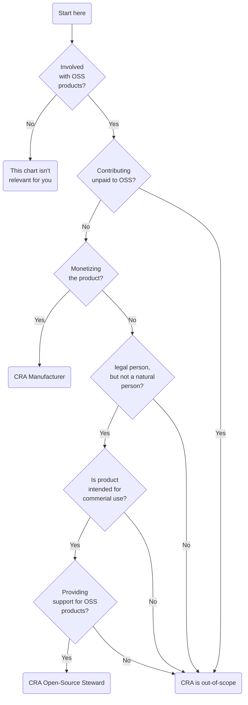

----

## Open Source project life-cycle stages

1. (default) – The project is maintained (bus factor is not 0 and does not need to change)
1. NEEDHELP – The project is understaffed, and requires additional co-maintainers for sustainable and continued development (bus factor is not 0, but too low)
1. HANDOFF – The project owner is looking for someone to take over the project (bus factor is 1 and about to become 0)
1. ADOPTME – The project is abandoned, or the owner has been confirmed to be unresponsive, so the project is now available for adoption (bus factor is 0)
1. NOXFER – The project is prevented from being transferred to new owners (bus factor is not relevant)
1. CUSTODY – This project is under custodianship (bus factor is 0 and may benefit from a new maintainer)
1. DONE – The project is considered "Done", and while it is maintained, no further development is needed or expected (bus factor is 1 or higher)
1. DEPRECATED – The project owner recommends that this project is not to be used (bus factor is 0)
1. UNMAINTAINED – This project is not actively maintained (bus factor is 1 or higher)
1. CASUAL – This project is only maintained on a casual basis (bus factor is 1 or higher)

### For consideration

1. FORK – This project claims to be an API-compatible fork of another project

## Are you… a Manufacturer, Steward or Author?

