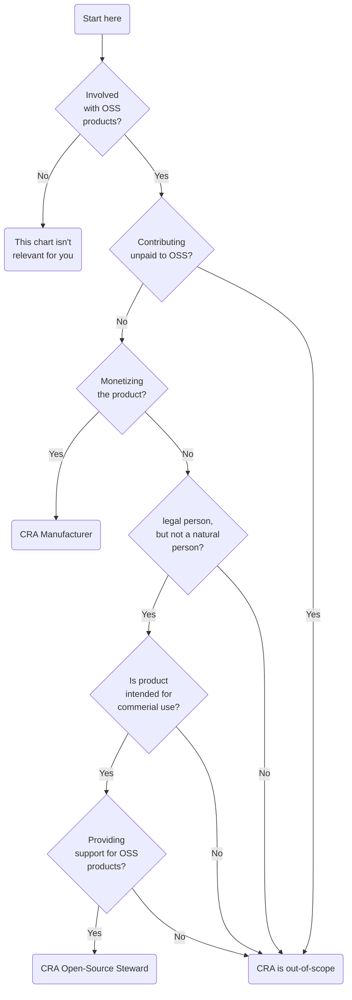

## Are you… a Manufacturer, Steward or Author?

```mermaid
graph TB
    start-here(Start here) --> involved{Involved<br>with OSS<br>products?}
    involved  -->|No| not-relevant-for-you(This chart isn't<br>relevant for you)
    involved -->|Yes| contributing{Contributing<br>unpaid to OSS?}
    contributing  -->|No| monetised{Monetizing<br>the product?}
    contributing -->|Yes| cra-is-out-of-scope(CRA is out-of-scope)
    monetised -->|Yes| cra-manufacturer(CRA Manufacturer)
    monetised -->|No| is-legal-entity{legal person,<br> but not a natural<br>person?}
    is-legal-entity -->|Yes| intended-commercial-use{Is product<br>intended for<br>commerial use?}
    is-legal-entity -->|No| cra-is-out-of-scope
    intended-commercial-use -->|No| cra-is-out-of-scope
    intended-commercial-use -->|Yes| product-supporter{Providing<br>support for OSS<br>products?}
    product-supporter -->|Yes| cra-oss-steward(CRA Open-Source Steward)
    product-supporter -->|No| cra-is-out-of-scope

    %% Based on the flowchart made by Maarten Aertsen (NLNetLabs) found at

    %% https://blog.nlnetlabs.nl/what-i-learned-in-brussels-the-cyber-resilience-act/

    %% Original flowchart © Maarten Aertsen <maarten@nlnetlabs.nl>
    %% License: CC0 1.0 Universal
    %% Adapted to Mermaid and modified by Salve J. Nilsen <sjn@oslo.pm>
```

