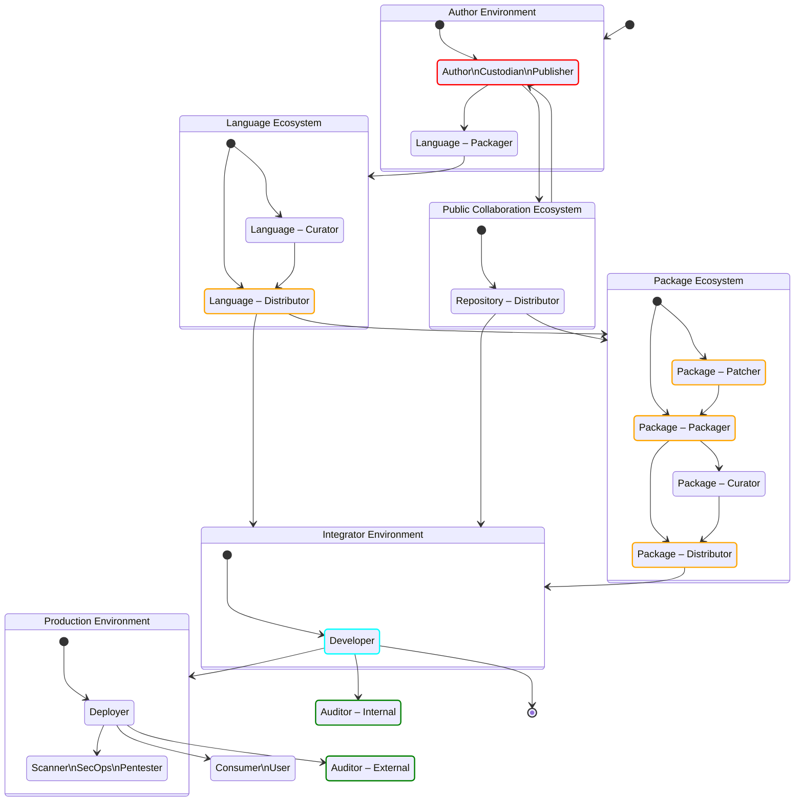

# A Simplified Open Source Supply Chain with SBOMs

> [!CAUTION]
> ## Document status: ⚠️  DRAFT
> What you see here is a DRAFT of the Supply Chain SBOM roles & responsibilities overview, used by the CPAN Security Group (CPANSec).
> As long as this document is in DRAFT, all of the points and ideas below are _suggestions_, and open to revision, deletion or amending – by you!
>
> - Contribute on Github: [https://github.com/CPAN-Security/security.metacpan.org/tree/sbom-draft/sbom](https://github.com/CPAN-Security/security.metacpan.org/tree/sbom-draft/sbom)
> - Discuss on IRC: [ircs://ssl.irc.perl.org:7063/#cpan-security](ircs://ssl.irc.perl.org:7063/#cpan-security)

## Roles in a supply chain

In all Open Source Software supply chains, we find people filling distinct roles that each care about some metadata or tasks in SBOMs.

With this diagram we'll attempt to offer an overview of these roles, how they are related, and what they do and care about.

### Basic assumptions

- Any single person may have one or more roles, and switch between them as needed.
- Tasks they may care about include…
    - Exists (create, sign)
    - Correctness (update, annotate, rename, delete)
    - Availability (distribute, assemble, index)
    - Matches the accompanying software component (verify).

# Supply-chain Ecosystems

## Author

    Publishes Open Source
    Has a project development lifecycle

## Integrator / Commercial

    Does NOT publish Open Source
    Has a project development lifecycle

## Language

    CPAN, PyPI, NPM, etc.
    May have upstream language ecosystems
    May have downstream language ecosystems
    May be Public or Private

## Package

    May have downstream package ecosystems
    May be Public or Private

## Repository / Collaboration

    Github, Codeberg,
    Bitbucket etc.

# Supply-chain Roles

## Owner

Has the legal ownership rights for the dist (e.g a business, or the Author).
May decide the name of the project, or other project parameters for (or on behalf of) the Author.

> [!IMPORTANT]
> | Field name          | Required | Data type | CycloneDX | SPDX | Legislation |
> | :------------------ | :------- | :-------- | --------- | ---- | ----------- |
> | Name                | Yes      | Text      |           |      | CRA AII.1   |
> | Licenses            | Yes      |           |           |      |
> | Code repo           | Yes      |           |           |      |
> | SBOM Type           | Yes      |           |           |      |

## Author

The initial and/or main creator of the component in question.
Typically works on all aspects of the code, including features, bug fixes, tests and security issues.
Has the final say on the original contents of the package.
The Author _can_ be a group of people, though a single point of responsibility is common.
If an Author has upstream (reverse) dependencies, the Author is also considered to be a Developer (as seen from the upstream Author's perspective.
See below).

> [!IMPORTANT]
> | Field name                  | Required | Data type    | CycloneDX | SPDX | Legislation          |
> | :-------------------------- | :------- | :----------- | --------- | ---- | -------------------- |
> | Manufacturer\nSupplier Name | Yes      | Text         |           |      | CRA AII.1, NTIA-SBOM |
> | Component Name              | Yes      | Text         |           |      | NTIA-SBOM            |
> | Version                     | Yes      | Text         |           |      | NTIA-SBOM            |
> | Dependencies                | Yes      |              |           |      | NTIA-SBOM            |
> | Security contact            | Yes      | URL          |           |      | CRA AII.2            |
> | Unique ID                   | Yes      | PURL         |           |      | CRA AII.3, NTIA-SBOM |
> | Purpose                     | Yes      | Text         |           |      | CRA AII.4            |
> | Intended Use                | Yes      | Text         |           |      | CRA AII.4            |
> | Licenses                    | Yes      | SPDX License |           |      | |
> | Code repo                   | Yes      |              |           |      | |
> | Code revision               | No       |              |           |      | |
> | SBOM Type                   | Yes      |              |           |      | |
> | CE Declaration              | No       | URL          |           |      | CRA AII.7            |
> | CE Support End Date         | No       | URL          |           |      | CRA AII.8            |
> | CE Instructions             | No       | URL          |           |      | CRA AII.9            |
> | SBOM Author                 | No       | Text         |           |      | NTIA-SBOM            |
> | SBOM Creation Timestamp     | No       | DateTime     |           |      | NTIA-SBOM            |
> | SBOM Location               | No       | URL          |           |      | CRA AII.10           |
> | Vuln. versions/locs         | No       |              |           |      | |

### Custodian

A type of Steward with reduced responsibilities.
Cares about the ongoing security of the code.
Typically only concerned with updating dependencies or applying security fixes.
Works with the Author primarily, and may take responsibility on their behalf when it comes to security concerns.

### Publisher

Places the component on an ecosystem publishing platform, on behalf of the Author, Steward or Custodian.
Typically this role is done by the same people, but in some cases a separate account may be used; e.g. a business or organization account.

### Contributor

Interacts with component with bug reports, feedback, quality assurance, testing, patches or pull requests.
May or may not have repository commit privileges.

## Patcher

Applies security and bug fixes to distributed native packages.
Works mainly with the Packager, and is downstream of the Author.
This role should only be necessary if upstream (Author or Custodian) roles are not responsive or available, or when downstream constraints requirements call for it (e.g. when backporting of fixes are needed due to downstream version pinning).

> [!NOTE]
> * Patchers (a role that often is held by the same person as the Packager), may select and apply patches before building.
> * These patches may include backports of features, security fixes or other accommodations necessary for distributing multiple releases of the same upstream project, but within publishing constraints decided by the Curator of the Ecosystem (e.g. LTS releases, support contracts, etc.).
> * A packager can both be found in-house (e.g. a business who uses a company-internal package mirror), for a Package Ecosystem provider (e.g. Debian), or a Language Ecosystem provider (e.g. a company-internal CPAN mirror that distributes patched packages).

## Builder - Packager

Builds and creates native packages from a dist received from upstream, optionally with patches applied from the Patcher.
Concerns themselves with correct package format and structure, and that package metadata is preserved and updated.

> [!NOTE]
> * Packagers take upstream components from an upstream source  and build and install them into a custom environment for producing system packages for their native packaging ecosystem (e.g. APT).
> * Upstream sources may be…
>     * Author's repository, or a Custodian's if a project is dormant (e.g. a repository on Codeberg).
>     * Language-specific packages distributed by a Language Ecosystem (e.g. CPAN).
> * E.g. someone in the #debian-perl group downloads, builds, tests and installs something from CPAN, but instead of doing a regular install, they us tooling like `dh-make-perl` to produce a custom installation directory that can be incorporated into a .deb archive.

> [!IMPORTANT]
> Packagers should add build environment metadata (including resolved dependencies) in an accompanying SBOM file.

## Curator

Selects or pins which releases are suitable for use within an organization.
Concerns themselves with both the stability and predictability of components, and how this is prioritized against the need for features, bug fixes and security updates.

> [!NOTE]
> * Curators may decide both whether and where the output of a Packager is distributed.
> * Curators may operate both in-house, in order to keep an eye on what is being automatically installed there, or they may make the decisions that happen on the Package or Language Ecosystem provider side.
> * Typically, a curator may consider LTS status, support contract terms or other reasons for distributing a package.

## Distributor

Ensures the availability of packages, that they are indexed correctly, and that any related metadata is up-to-date, correct and available.

> [!NOTE]
> * Distributors take what Packagers, Patchers and Curators produce, and ensure they are made available in a reliable way for downstream users (e.g. by setting up and managing a Debian APT repository, or a CPAN mirror, or whatever).
> If SBOM metadata is expected to accompany the packages in question, the Distributor makes sure this happens.

> [!IMPORTANT]
> | Field name          | Required | Data type | CycloneDX | SPDX |
> | :------------------ | :------- | :-------- | --------- | ---- |
> | Download location   | Yes      |           |           |      |

### Language Ecosystem

A language ecosystem hosts, indexes and distributes components specific for a programming language.
Examples include CPAN (Perl), PyPI (Python), NPM (Node/JS) and others.

### Collaboration Ecosystem

A website or tool that offers a public collaboration repository to Authors, so they may cooperate and share ongoing work in public.
Examples for this include github.com, gitlab.com, codeberg.org, gitea.com and others.

### Package Ecosystem

A service that makes components repackaged for a specific OS distribution available for easy download and use.
Examples include APT (Debian, Ubuntu), RPM (AlmaLinux, SuSE), Ports (FreeBSD, OpenBSD) and others.

## Integrator Environment

A business or institution that is responsible for developing and building the application that is required to have an accompanying SBOM document.
Management is expected to ensure that this assembled SBOM document describes the application as required by law.

> [!IMPORTANT]
> | Field name          | Required | Data type | CycloneDX | SPDX | Legislation |
> | :------------------ | :------- | :-------- | --------- | ---- | ----------- |
> | Name                | Yes      |           |           |      | CRA AII.1   |
> | Version             | Yes      |           |           |      | CRA AII.3   |
> | Licenses            | Yes      |           |           |      | 
> | Unique ID (pURL)    | Yes      |           |           |      | 
> | Code repo           | Yes      |           |           |      | 
> | Code revision       | No       |           |           |      | 
> | SBOM Type           | Yes      |           |           | N/A  | 
> | Vuln. versions/locs | No       |           |           |      | 

### Developer

Uses packages and components as dependencies in their own project or product.
A Developer is considered to be identical to an Author from the upstream (Author's) perspective.
The main difference from an Author is that a Developer doesn't publish their work as Open Source.

## Builder — Deployer

Final preparation and installation of the software into a CI/CD or Production Environment.

## Scanner

Runtime and static security checks; Vulnerability monitoring, etc.

## Consumer

The software in use in production, by a user.

## Auditor / Compliance

Verifies that all necessary metadata is available, up-to-date and made use of.

# Other terms

## Steward

~~A type of Author with reduced responsibilities.
Ensures the ongoing quality of the code.
Typically only works on security issues and bugfixes.
Usually doesn't work on new features.
Works with the Author primarily, and may take responsiblity on their behalf when security and bugs are concerned.~~

> NOTE: Steward gets a specific defined meaning in the Cyber Resilience Act, so until this definition is established, we'll avoid using the term.

## Manufacturer (CRA)

## Open Source Steward (CRA)

# References

* CRA AII: [Cyber Resilience Act, Annex II](https://data.consilium.europa.eu/doc/document/ST-17000-2023-INIT/EN/pdf#page=168), Draft dated 2023-12-20
* NTIA SBOM: [NTIA Minimum Elements for a Software Bill of Materials (SBOM)](https://www.ntia.doc.gov/files/ntia/publications/sbom_minimum_elements_report.pdf#page=9), Published 2021-07-12

# License

This document is © Salve J. Nilsen <sjn@cpan.org>.
Some rights reserved.
You may use, modify and share this file under the terms of the CC-BY-SA-4.0 license.
