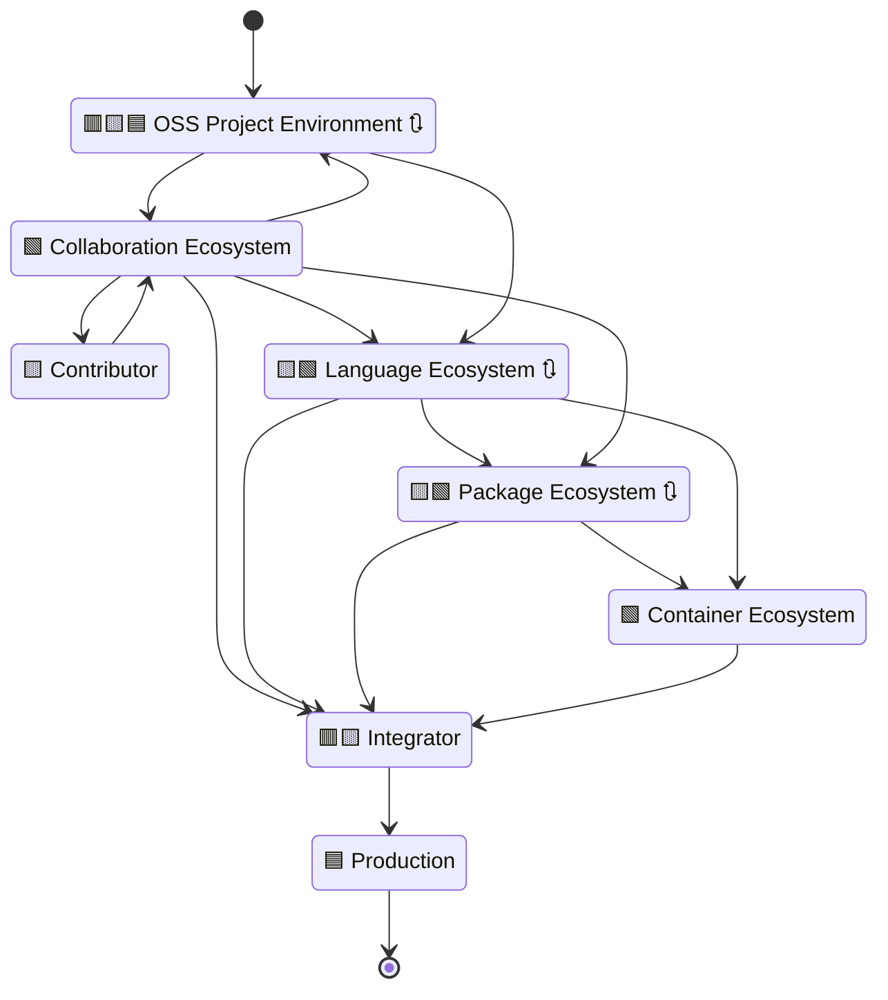
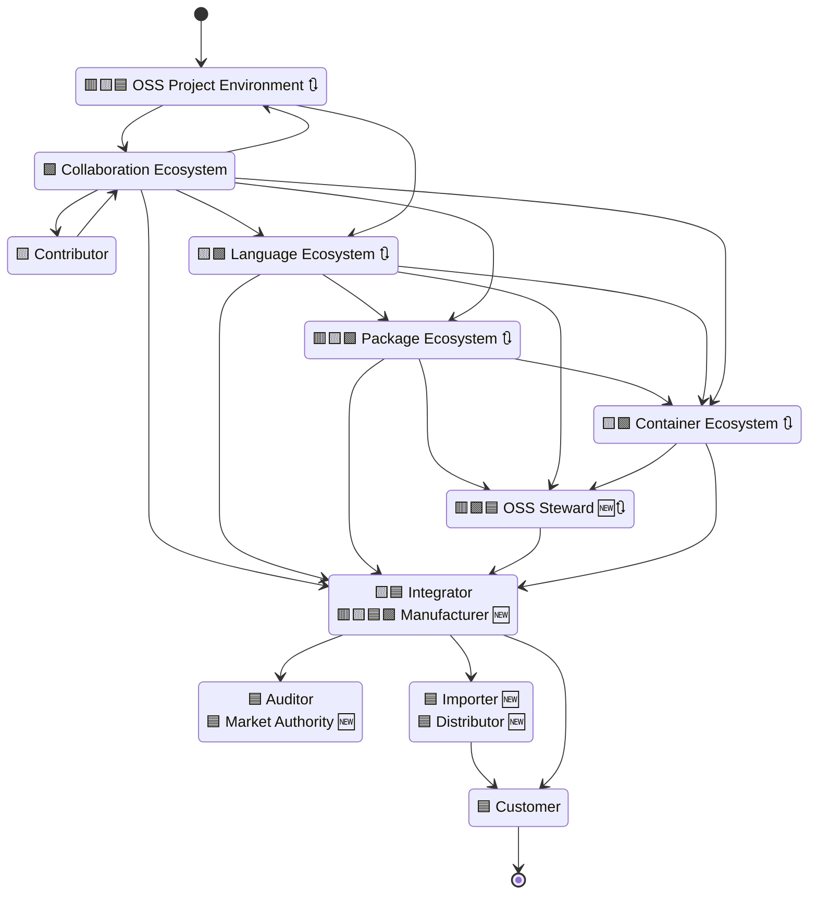
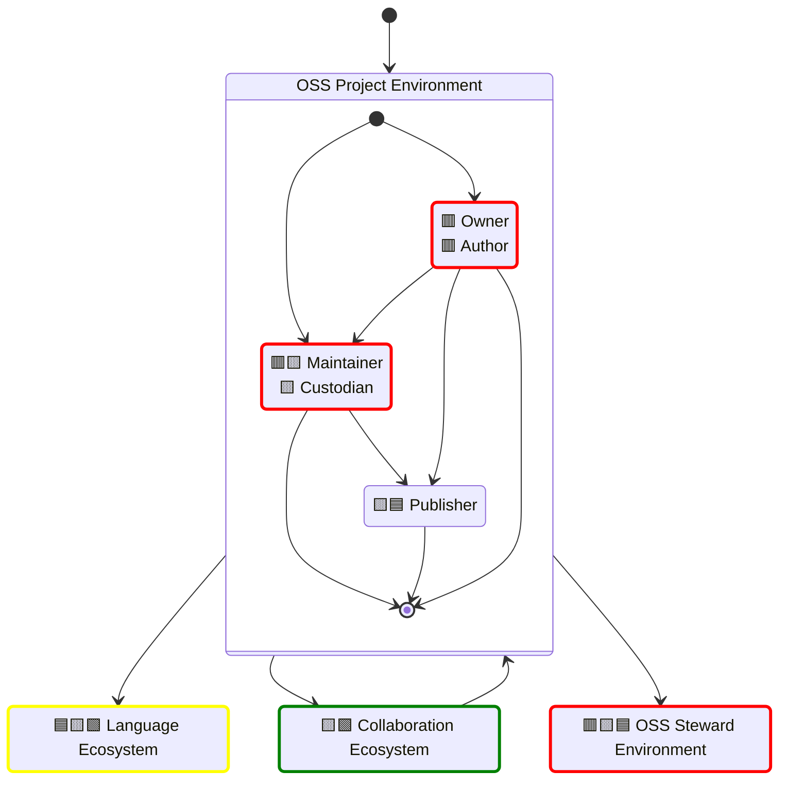
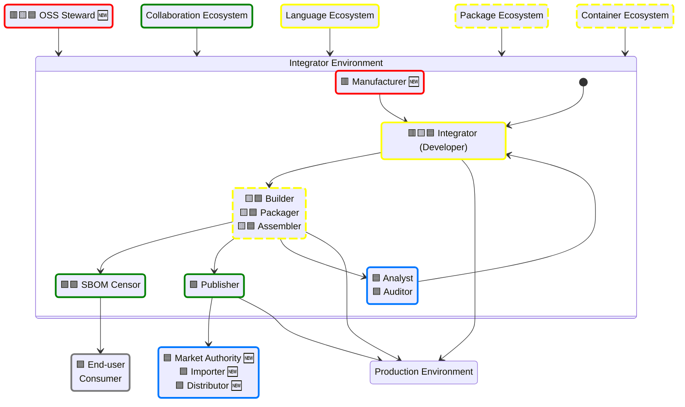

## Document status: ⚠️  DRAFT {#document-status}

> [!CAUTION]
> What you see here is a DRAFT of the supply-chain SBOM roles & responsibilities overview, by the CPAN Security Group (CPANSec).
> As long as this document is in DRAFT, all of the points and ideas below are _suggestions_, and open to revision, deletion or amending – by you!
>
> - Contribute on Github: [https://github.com/CPAN-Security/security.metacpan.org/tree/supplychain-sbom/docs/supplychain-sbom.md](https://github.com/CPAN-Security/security.metacpan.org/tree/supplychain-sbom/docs/supplychain-sbom.md)
> - Discuss on IRC: [ircs://ssl.irc.perl.org:7063/#cpan-security](ircs://ssl.irc.perl.org:7063/#cpan-security)
> - Discuss on Matrix: [https://matrix.to/#/#cpansec:matrix.org](https://matrix.to/#/#cpansec:matrix.org)

> [!NOTE]
> This document has two companion documents:
>
> * The CPANSec [Glossary](glossary.md)
> * The CPANSec [Reading List](readinglist.md)
> * A proposed overview of [Open Source project life-cycle states and indicators](foss-project-lifecycle.md)
>
> Please refer to them as needed.

## About this document (TL;DR) {#about}

This document offers **an overview of [Open Source Software](glossary.md#open-source-software) supply-chains**.

* Taking into account the following perspectives:
    1. Environments and Ecosystems,
    1. Roles,
    1. Metadata, and
    1. Industry [Terms and Concepts](glossary.md)
* …Enumerating and describing the Metadata Attributes these Roles typically care about.
* …Noting the ways each Role may operate on any given Metadata Attribute,
    * 🟥 Create (authoritative),
    * 🟨 Assemble or Update (contributing),
    * 🟩 Distribute,
    * 🟦 Verify, or
    * 🟪 Censor
* …Acknowledging that some ecosystems and environments may have interesting features
    * 🔃 Is upstream or downstream of own ecosystem type
    * 🆕 Is a new participant in OSS supply chains
* …Showing any relevant regulation or other requirements that impose expectations of the presence of specific Metadata Attributes.
* …So that people having a Role within the supply-chain can:
    1. Draw an overarching map of what other Roles may operate within their supply-chain
    1. Form a idea of what purpose each Role may have, and find out where they fit
    1. Get an idea where an Attribute is likely to come from, and which Roles care about these
    1. Become aware of both upstream and downstream Communities, Ecosystems and Environments are involved in their supply-chain, in order to interact with them in effective and sustainable ways
    1. Use this information to both live up to their new Regulatory Obligations and to help improve their Security Posture in general

### A Typical Open Source supply-chain (Simplified)

> [!NOTE]
>
> The graphs in this document do *not* include _Content Delivery Networks_, _Model Ecosystems_ or _Plugin Ecosystems_.
> If you know of other parts of an Open Source supply-chain that involves the managing of metadata somehow, then please [reach out](#document-status)!
> We'd love to add them – or at least to be aware of them.

This is a simplified "TL;DR" overview of a typical Open Source supply chain.

```mermaid
stateDiagram-v2
    direction TB

    state "🟥&zwj;🟨&zwj;🟦&nbsp;OSS&nbsp;Project&nbsp;Environment&nbsp;🔃" as environment_project
    state "🟨 Contributor" as environment_contributor
    state "🟩&nbsp;Collaboration&nbsp;Ecosystem" as ecosystem_forge
    state "🟨&zwj;🟩&nbsp;Language&nbsp;Ecosystem&nbsp;🔃" as ecosystem_lang
    state "🟨&zwj;🟩&nbsp;Package&nbsp;Ecosystem&nbsp;🔃" as ecosystem_package
    state "🟩 Container Ecosystem" as ecosystem_container
    state "🟥🟨 Integrator" as environment_integrator
    state "🟦 Production" as environment_prod

    [*]                      --> environment_project
    ecosystem_forge          --> environment_project
    ecosystem_forge          --> environment_contributor
    ecosystem_forge          --> ecosystem_lang
    environment_project      --> ecosystem_forge
    environment_project      --> ecosystem_lang
    environment_contributor  --> ecosystem_forge
    ecosystem_lang           --> ecosystem_package
    ecosystem_forge          --> ecosystem_package
    %%ecosystem_package        --> ecosystem_package
    %%ecosystem_lang           --> ecosystem_lang
    ecosystem_package        --> ecosystem_container
    %%ecosystem_container      --> ecosystem_container
    ecosystem_forge          --> environment_integrator
    ecosystem_lang           --> environment_integrator
    ecosystem_lang           --> ecosystem_container
    ecosystem_package        --> environment_integrator
    ecosystem_container      --> environment_integrator
    environment_integrator   --> environment_prod
    environment_prod         --> [*]

    %% Copyright © 2024 Salve J. Nilsen <sjn@oslo.pm>
    %% Some rights reserved. Licensed CC-BY-SA-4.0
```

### Intention

This document is intended for presenting an opinionated overview that includes aspects that are **visionary** and **proposed** – especially topics related to the role of Open Source Stewards and the role of OSS Attestations.

### Motivation

Originally, this document stems from the main author's frustration with the lack of a clear Open Source perspective in current SBOM documentation (as of 2023). This brought him to the SBOM devroom at FOSDEM 2024 to offer [a rant](https://fosdem.org/2024/schedule/event/fosdem-2024-3358-can-sboms-become-first-class-citizens-in-open-source-ecosystems-/) about what he perceived as a less-than-ideal state of affairs.

Furthermore, this document is also an attempt to explore and map out the consequences that the EU Cyber Resilience Act (CRA) is likely have for Open Source Ecosystems.
The CRA is the first regulation that has language that explicitly affects Open Source ecosystems.
This law introduces a new entity – the Open Source Software Steward – with obligations to them (and other Roles) to improve the state of Cybersecurity throughout Open Source supply-chains.
This shown us that there's a need to map out what Open Source supply-chains actually look like, and spell out what Roles can be found throughout it, and more.
This document therefore also represents the author's exploration of this topic, and could be considered as "public notes" on the matter.
Still, the author hopes this document also can be useful for others than himself and the CPAN Security Group.

Please take this document as it is – a public set of notes, intended as a source for illumination and as an ongoing conversation – taking incremental steps toward more transparent and accountable Open Source supply-chains.

For license information and acknowledgements, see the [end of this document](#license-and-use-of-this-document).

## Supply-chain Ecosystems, Environments & Roles and Attributes

In this section, we map out the different parts of typical Open Source supply-chains – the Environments and Ecosystems we use, the Roles that are operating within these, what Metadata Attributes they care about, and which Operations they are expected to execute when caring.
Additionally, you should get some indications of what regulations, standards or other requirements that call for the presence of a given Attribute.
And all this, with the goal of allowing downstream users to both live up to their regulatory obligations and to improve their security posture in general.
To improve by ensuring that the metadata they need is available, updated and authoritative, and can be helpful in both mitigating vulnerabilities and interacting with the maintainers of any Open Source projects that may be involved.

### A Post-CRA Open Source supply-chain (Simplified)

This diagram is equivalent to the simplified one above, but showing the new Roles implied and introduced by the EU Cyber Resilience Act (CRA).

```mermaid
stateDiagram-v2
    direction TB

    state "🟥&zwj;🟨&zwj;🟦&nbsp;OSS&nbsp;Project&nbsp;Environment&nbsp;🔃" as environment_project
    state "🟨 Contributor" as environment_contributor
    state "🟩&nbsp;Collaboration&nbsp;Ecosystem" as ecosystem_forge
    state "🟨&zwj;🟩&nbsp;Language&nbsp;Ecosystem&nbsp;🔃" as ecosystem_lang
    state "🟥&zwj;🟨&zwj;🟩&nbsp;Package&nbsp;Ecosystem&nbsp;🔃" as ecosystem_package
    state "🟨&zwj;🟩&nbsp;Container&nbsp;Ecosystem&nbsp;🔃" as ecosystem_container
    state "🟥🟩🟦 OSS Steward 🆕🔃" as ecosystem_steward
    state "🟨🟦 Integrator<br>🟥&zwj;🟨&zwj;🟦&zwj;🟪&nbsp;Manufacturer&nbsp;🆕" as environment_integrator
    state "🟦 Auditor<br>🟦 Market Authority 🆕" as authority_auditor
    state "🟦 Importer 🆕<br>🟦 Distributor 🆕" as environment_market
    state "🟦 Customer" as environment_customer

    [*]                      --> environment_project
    ecosystem_forge          --> environment_project
    ecosystem_forge          --> environment_contributor
    ecosystem_forge          --> ecosystem_lang
    environment_project      --> ecosystem_forge
    environment_project      --> ecosystem_lang
    environment_contributor  --> ecosystem_forge
    ecosystem_lang           --> ecosystem_package
    ecosystem_forge          --> ecosystem_package
    ecosystem_package        --> ecosystem_container
    ecosystem_forge          --> environment_integrator
    ecosystem_lang           --> environment_integrator
    ecosystem_lang           --> ecosystem_container
    ecosystem_forge          --> ecosystem_container
    ecosystem_package        --> environment_integrator
    ecosystem_package        --> ecosystem_steward
    ecosystem_lang           --> ecosystem_steward
    ecosystem_container      --> ecosystem_steward
    ecosystem_steward        --> environment_integrator
    ecosystem_container      --> environment_integrator
    environment_integrator   --> authority_auditor
    environment_integrator   --> environment_market
    environment_market       --> environment_customer
    environment_integrator   --> environment_customer
    environment_customer     --> [*]

    %% Copyright © 2025 Salve J. Nilsen <sjn@oslo.pm>
    %% Some rights reserved. Licensed CC-BY-SA-4.0
```

### Legend of Metadata Operations

In the graphs presented above and below, we color-code the different _metadata operations_ in order to quickly show what activities a supply-chain Role may be involved in.

We're also assuming that Metadata is stored in SBOMs, but this need not be the case.
To distinguish between Metadata roles and supply-chain roles, we have decided to refer to the former as "SBOM Roles".
This convention is also commonly used (or implied) in the referenced material.
This may change in later revisions of this document.

Some of the information here is based on CISA's "SBOM Sharing Roles and Considerations" recommendations ([CISA-2024](#references)) and other public documents, [referenced](#references) below.

We also distinguish between SBOM Authors that are _Authoritative_ sources for Attributes ("[SBOM Author](#sbom-author-role)") and _Non-authoritative_ sources ("[SBOM Contributor](#sbom-contributor-role)"), in addition SBOM Distributors and Consumers.
The Authoritative/Non-authoritative distinction is important so everyone is clear about where a given Metadata Attribute originally comes from.
This distinction is _not commonly used_ in the referenced material.

And finally, we acknowledge that some situations may call for an SBOM Censor, which is the time of writing is _not a commonly used term_ in the referenced material.

* 🟥 SBOM Author (Authoritative metadata provider) – **Creates**, defines, signs Metadata — _**Authoritative** roles make sure the metadata and related artifacts they are the author of, **Exist**_.
* 🟨 SBOM Contributor (Non-authoritative metadata provider) – **Assembles**, **updates**, merges, enriches, augments, refines, consolidates, maintains, attests, annotates Metadata — _**Non-authoritative** roles make sure the metadata and related artifacts they process, are **Updated** and **Corrected**_.
* 🟩 SBOM Distributor – **Distributes**, transports, curates, indexes Metadata — _**Distributing** roles make sure the metadata and related artifacts they have, are made **Available** to others_.
* 🟦 SBOM Consumer – **Verifies**, consumes, aggregates, validates, surveys, analyzes or reports Metadata — _**Consuming** roles makes sure the metadata and related artifacts they consume, are **Complete**, **Compliant** and **Used**_.
* 🟪 SBOM Censor – **Censors**, redacts, deletes, anonymizes or filters Metadata — _**Censoring** roles make sure that certain metadata about related artifacts are **Prevented** from being shared with others_.

## Graph: Open Source supply-chain {#open-source-supply-chain}

This is an attempt at a somewhat complete overview of the different Ecosystems, Roles and flow of metadata one can expect to see in an Open Source supply-chain.

```mermaid
stateDiagram-v2
    direction TB
    accTitle: An Idealized Open Source supply-chain Graph
    %%accDescr: This graph illustrates how different types of development environments and ecosystems interconnect, what kind of roles you may find in these, and what type of metadata operations they may care to do

    %% Role activities
    classDef createsSBOM stroke:red,stroke-width:3px;
    classDef updatesSBOM stroke:yellow,stroke-width:3px,stroke-dasharray:15 5;
    classDef assemblesSBOM stroke:yellow,stroke-width:3px;
    classDef distributesSBOM stroke:green,stroke-width:3px;
    classDef verifiesSBOM stroke:#07f,stroke-width:3px;
    classDef censorsSBOM stroke:#07f,stroke-width:3px;
    classDef ignoresSBOM stroke:#777,stroke-width:3px;

    %% Open Source Project Environment
    state "🟥 Owner<br>🟥 Author" as project_author
    state "🟥🟨 Maintainer<br>🟨 Custodian" as project_maintainer
    state "🟨🟦 Publisher (Project)" as project_publisher
    %%
    class project_author createsSBOM
    class project_maintainer createsSBOM
    class project_publisher updatesSBOM

    %%
    %%state "🟥 Attestation Authority 🆕" as authority_attester

    %% Language Ecosystem
    state "🟦 Ingester" as language_ingester
    %%state "🟥🟨🟦 Open Source Software Steward 🆕" as language_steward
    state "🟨 Curator" as language_curator
    state "🟩 Distributor" as language_distributor
    %% "🟩 Reservoir"
    %%
    class language_ingester verifiesSBOM
    class language_packager assemblesSBOM
    class language_steward createsSBOM
    class language_curator updatesSBOM
    class language_distributor distributesSBOM

    %% Collaboration Forge (Ecosystem)
    state "🟩 Distributor (Depositary)" as repository_distributor
    state "🟨 Contributor" as external_contributor
    %%
    class repository_distributor distributesSBOM
    class external_contributor updatesSBOM

    %% Package Ecosystem
    state "🟦 Ingester" as package_ingester
    state "🟨🟦 Patcher" as package_patcher
    state "🟥🟨🟦 Builder<br>🟥🟨🟦 Packager" as package_packager
    %% FIXME: package_steward not useful/necessary?
    state "🟨🟦 Attester 🆕" as package_steward
    state "🟨 Curator" as package_curator
    state "🟩 Distributor (Repository)" as package_distributor
    %%
    class package_ingester verifiesSBOM
    class package_patcher updatesSBOM
    class package_packager assemblesSBOM
    class package_steward createsSBOM
    class package_curator updatesSBOM
    class package_distributor distributesSBOM

    %% Container Ecosystem
    state "🟦 Ingester" as container_ingester
    state "🟨🟦 Assembler" as container_packager
    state "🟨🟦 Attester 🆕" as container_steward
    state "🟨 Curator" as container_curator
    state "🟩 Registry<br>🟩 Distributor" as container_distributor
    %%
    class container_ingester verifiesSBOM
    class container_packager assemblesSBOM
    class container_steward createsSBOM
    class container_curator updatesSBOM
    class container_distributor distributesSBOM

    %% OSS Steward Environment
    state "🟥🟨🟦 Attester 🆕" as steward_attester
    %%
    class steward_attester createsSBOM

    %% Integrator Environment
    state "🟥 Owner<br>🟥 Manufacturer 🆕" as integrator_owner
    state "🟦 Procurer" as integrator_procurer
    state "🟥🟨🟦 Integrator" as integrator_developer
    state "🟨🟦 Builder<br>🟨🟦 Packager<br>🟨🟦 Assembler" as integrator_builder
    state "🟩🟪 Censor" as integrator_censor
    state "🟩 Publisher<br>🟩 Distributor" as integrator_publisher
    state "🟦 Analyst<br>🟦 Auditor" as integrator_analyst
    %%
    class integrator_owner createsSBOM
    class integrator_procurer verifiesSBOM
    class integrator_developer assemblesSBOM
    class integrator_censor updatesSBOM
    class integrator_publisher distributesSBOM
    class integrator_builder assemblesSBOM
    class integrator_analyst verifiesSBOM

    %% Production Environment
    state "🟨 Deployer" as prod_deployer
    state "🟦 End-user<br>Consumer" as external_consumer
    state "🟦 Importer 🆕<br>🟦 Distributor 🆕" as prod_distributor
    %%
    class prod_deployer assemblesSBOM
    class external_consumer ignoresSBOM
    %%class authority_attester createsSBOM

    %% Market Surveillance Environment
    state "🟦 Auditor<br>🟦 Market Authority 🆕" as authority_auditor
    %%
    class authority_auditor verifiesSBOM

    %%
    state "OSS Project Environment 🔃" as environment_project {
        [*] --> project_author
        [*] --> project_maintainer
        project_author     --> project_maintainer
        project_maintainer --> project_publisher
        project_maintainer --> [*]
        project_publisher  --> [*]
    }

    [*] --> environment_project

    %%
    state "Language Ecosystem 🔃" as ecosystem_lang {
        [*]                    --> language_ingester
        language_ingester      --> language_distributor
        %%language_ingester      --> language_steward
        language_ingester      --> language_curator
        language_curator       --> language_distributor
        %%language_steward       --> language_distributor
        %%language_steward       --> language_curator
        language_distributor   --> [*]
    }

    %%language_packager --> ecosystem_lang
    environment_project --> ecosystem_lang

    %%
    state "Collaboration Ecosystem (Forge)" as ecosystem_forge {
        [*] --> repository_distributor
        external_contributor   --> repository_distributor
        repository_distributor --> external_contributor
        repository_distributor --> [*]
    }

    %%ecosystem_forge     --> maintainer_author
    %%maintainer_author   --> ecosystem_forge
    environment_project --> environment_steward
    environment_project --> ecosystem_forge
    ecosystem_forge     --> environment_project

    %%external_contributor   --> repository_distributor

    %%
    state "Package Ecosystem (Repository) 🔃" as ecosystem_package {
        [*] --> package_ingester
        package_ingester      --> package_patcher
        package_ingester      --> package_packager
        package_patcher       --> package_packager
        package_packager      --> package_curator
        package_steward       --> package_curator
        package_packager      --> package_distributor
        package_curator       --> package_distributor
        package_steward       --> package_distributor
        package_packager      --> package_steward
        package_distributor   --> [*]
    }

    %%
    state "Container Ecosystem (Registry) 🔃" as ecosystem_container {
        [*] --> container_ingester
        container_ingester      --> container_packager
        container_packager      --> container_curator
        container_steward       --> container_curator
        container_packager      --> container_distributor
        container_curator       --> container_distributor
        container_steward       --> container_distributor
        container_packager      --> container_steward
        container_distributor   --> [*]
    }

    ecosystem_package        --> ecosystem_container
    ecosystem_container      --> environment_integrator

    ecosystem_package        --> environment_integrator
    %%ecosystem_package        --> ecosystem_package

    %%repository_distributor   --> ecosystem_package
    %%language_distributor     --> ecosystem_package
    %%ecosystem_lang           --> ecosystem_lang
    ecosystem_lang           --> environment_integrator
    ecosystem_lang           --> ecosystem_package
    ecosystem_forge          --> ecosystem_package

    %%authority_attester --> language_steward
    %%authority_attester --> package_steward
    %%authority_attester --> environment_steward

    state "OSS Steward Environment 🆕🔃" as environment_steward {
      [*] --> steward_attester
      steward_attester    --> [*]
    }
    ecosystem_lang      --> environment_steward
    environment_steward --> environment_integrator
    environment_steward --> ecosystem_package

    %%
    state "Integrator Environment" as environment_integrator {
        [*]                  --> integrator_procurer
        [*]                  --> integrator_owner
        [*]                  --> integrator_developer
        integrator_procurer  --> integrator_developer
        integrator_procurer  --> integrator_owner
        integrator_owner     --> integrator_developer
        integrator_builder   --> integrator_publisher
        integrator_builder   --> integrator_censor
        integrator_builder   --> integrator_analyst
        integrator_analyst   --> integrator_developer
        integrator_censor    --> integrator_publisher
        integrator_developer --> integrator_builder
        integrator_analyst   --> [*]
        integrator_censor    --> [*]
        integrator_publisher --> [*]
    }

    %%repository_distributor   --> environment_integrator
    ecosystem_forge          --> environment_integrator
    %%language_distributor     --> environment_integrator

    %%
    state "Production Environment" as environment_prod {
        [*]              --> prod_deployer
        [*]              --> prod_distributor
        prod_distributor --> [*]
        prod_deployer    --> [*]
    }

    %%
    state "Market Surveillance 🆕" as environment_surveillance {
        [*]               --> authority_auditor
        authority_auditor --> [*]
    }

    environment_prod         --> environment_surveillance
    %%integrator_builder       --> environment_prod
    %%integrator_developer     --> environment_prod
    %%integrator_publisher     --> environment_prod
    environment_integrator   --> environment_surveillance
    environment_integrator   --> environment_prod
    environment_integrator   --> external_consumer
    environment_integrator   --> [*]
    environment_surveillance --> [*]

    %%
    environment_prod  --> external_consumer
    external_consumer --> [*]

    %% Copyright © 2024 Salve J. Nilsen <sjn@oslo.pm>
    %% Some rights reserved. Licensed CC-BY-SA-4.0
```

## Supply-chain Ecosystems, their Roles and Metadata

Which environments and Ecosystems are found throughout a supply-chain? Here's an overview.

Throughout Open Source supply-chains, we find different Roles that care about certain metadata, or are in possession of some authoritative information, or needs to verify these.
Here, you'll get an overview of the most important ones, which attributes they care about and how they care, and some information about why they do so (e.g. due to legal requirements).

* Ops: The type of operation that someone with a given Role is most likely to do on a given metadata attribute.
    * See the [Typical Metadata Operations](#typical-metadata-operations) section describing what the colors represent.
* Attribute name: The name of the metadata field in question.
    * These attributes may differ across relevant sources and regulations.
    * Equivalent to terms like "field name" "metadata field".
* Required: CPANSec interpretation on whether or not the attribute is required.
* Required by: Reference to relevant regulation, guides or standards where the attribute is mentioned.
    * See the [References](#references) section for links to the documents mentioned.
* Comment: CPANSec commentary on a attribute.
* FIXME: CPANSec Remaining work related to this attribute.

### Environment-independent Baseline Attributes

These are common across all roles, and considered to be _baseline_ because they are required independently of the Roles' needs.

| Ops | Attribute name           | Required | Required by                         | Comment | FIXME   |
| :-: | :----------------------- | :------: | ----------------------------------- | :------ | :------ |
| 🟥  | SBOM Author              | Yes      | NTIA-SBOM, CISA-2024-10, TR-03183   |         |         |
| 🟥  | SBOM Creation Time-stamp | Yes      | NTIA-SBOM, CISA-2024-10, TR-03183   |         |         |
| 🟥  | SBOM Format              | Yes      | CycloneDX 1.6, SPDX 2.3             |         |         |
| 🟥  | SBOM Generation Tool     | No       |                                     |         | Confirm req/spec |
| 🟥  | SBOM Location            | Yes      | CRA-AII(9), TR-03183                |         |         |
| 🟥  | SBOM Primary Component   | Yes      | CycloneDX 1.6, SPDX 3.0             |         |         |
| 🟥  | SBOM Release             | Yes      | CycloneDX 1.6, SPDX 2.3             |         |         |
| 🟥  | SBOM Serial Number       | Yes      | CycloneDX 1.6, SPDX 2.3             |         |         |
| 🟥  | SBOM Type                | Yes      | CISA-2023-4, CISA-2024-10           |         |         |

----------------------------------------------------------------------

### OSS Project Environment

```mermaid
stateDiagram-v2
    direction TB
    accTitle: An Idealized Open Source supply-chain Graph, OSS Project perspective
    %%accDescr: This graph illustrates how different types of development environments and ecosystems interconnect, what kind of roles you may find in these, and what type of metadata operations they may care to do

    %%
    classDef createsSBOM stroke:red,stroke-width:3px;
    classDef assemblesSBOM stroke:yellow,stroke-width:3px,stroke-dasharray:15 5;
    classDef updatesSBOM stroke:yellow,stroke-width:3px;
    classDef distributesSBOM stroke:green,stroke-width:3px;
    classDef verifiesSBOM stroke:#07f,stroke-width:3px;
    classDef censorsSBOM stroke:#07f,stroke-width:3px;
    classDef ignoresSBOM stroke:#777,stroke-width:3px;

    %% OSS Project Environment
    state "🟥 Owner<br>🟥 Author" as project_author
    state "🟥🟨 Maintainer<br>🟨 Custodian" as project_maintainer
    state "🟨🟦 Publisher" as language_publisher
    %%
    state "OSS Project Environment" as environment_project {
        [*]                --> project_author
        [*]                --> project_maintainer
        project_author     --> project_maintainer
        project_maintainer --> language_publisher
        project_author     --> language_publisher
        project_maintainer --> [*]
        language_publisher --> [*]
        project_author     --> [*]
    }
    %%
    class project_author createsSBOM
    class project_maintainer createsSBOM
    class ecosystem_forge distributesSBOM
    class ecosystem_lang updatesSBOM
    class environment_steward createsSBOM

    [*] --> environment_project

    %% Language Ecosystem
    state "🟦🟨🟩 Language Ecosystem" as ecosystem_lang
    environment_project --> ecosystem_lang

    %% Collaboration Ecosystem
    state "🟨🟩 Collaboration Ecosystem" as ecosystem_forge
    environment_project --> ecosystem_forge
    environment_project --> environment_steward
    ecosystem_forge     --> environment_project

    %% OSS Steward Environment
    state "🟥🟨🟦 OSS Steward Environment" as environment_steward

    %% Copyright © 2024 Salve J. Nilsen <sjn@oslo.pm>
    %% Some rights reserved. Licensed CC-BY-SA-4.0
```

This environment represents one or more developers that publish an Open Source component.

* Publishes [Open Source Software](glossary.md#open-source-software)
* May have a project development life-cycle
* May use a [Collaboration Ecosystem](#collaboration-ecosystem) to interact with [Contributors](#contributor)
* May publish their project through a [Language Ecosystem](#language-ecosystem)
* May have their project published through a [Package Ecosystem](#package-ecosystem)
* May be intended for commercial use

#### Author (Project Role) {#author}

The initial creator and main developer of an Open Source project or a product.

* Operates in an [OSS Project Environment](#oss-project-environment).
* Has the legal ownership rights and liabilities for the component.
    * May be equivalent to the [Copyright Holder](glossary.md#copyright-holder) metadata attribute.
* Is usually also considered a [Maintainer](#maintainer)
* May also be considered a [Manufacturer](#manufacturer), if they are somehow monetizing the component with the intention of earning a profit.
* May decide the name of the project and other project parameters for (or on behalf of) the [Maintainer](#maintainer) or [Integrator](#integrator).
* Not to be confused with the [SBOM Author](#sbom-author-role) role.

| Ops | Attribute name                  | Required | Required by                         | Comment | FIXME   |
| :-: | :------------------------------ | :------: | :---------------------------------- | :------ | :------ |
| 🟥  | Supplier Name (Author)          | Yes      | CRA-AII(1), NTIA-SBOM, TR-03183     |         |         |
| 🟥  | Copyright Holder (Author)       | Yes      | CISA-2024-10                        |         |         |
| 🟥  | License(s) (Primary)            | Yes      | CISA-2024-10                        |         |         |

* See also
  * [Author](glossary#author) in the Glossary
  * [Manufacturer](#manufacturer)

#### Maintainer (Project Role) {#maintainer}

A leading developer of an Open Source [Project](glossary#project), though not necessarily the original [Author](#author).

* Operates within an [OSS Project Environment](#oss-project-environment).
* Is often the initial and/or main creator ([Author](#author)) of the component in question.
* Typically works on all aspects of the code, including planning, design, features, bug fixes, tests and security issues.
* Has the final say on the original contents of the package, and it's name-spaces.
* The Maintainer _can_ be a group of people (having co-maintainers), though a single point of responsibility is common.
* If a Maintainer has upstream (reverse) dependencies, the Maintainer is also considered to be an [Developer](#developer) (as seen from the upstream Maintainer's perspective).
* Other common names for this role include Author, Developer, [Owner](#owner).
* Maintainers may be
  * Independent (Author or Maintainer is [Owner](#owner))
  * Managed by a public sector [Owner](#owner)
  * Managed by a commercial sector [Owner](#owner)
  * Managed by an academic sector [Owner](#owner)
  * Managed by an ideal/non-profit/NGO sector [Owner](#owner)

| Ops | Attribute name                     | Required | Required by                                 | Comment | FIXME   |
| :-: | :--------------------------------- | :------: | ------------------------------------------- | :------ | :------ |
| 🟥  | Primary Component Name             | Yes      | NTIA-SBOM, TR-03183, CRA-AV                 |         |         |
| 🟥  | Version                            | Yes      | NTIA-SBOM, TR-03183                         |         |         |
| 🟥  | Security contact (Primary)         | Yes      | CRA-AII(2)                                  |         |         |
| 🟥  | Unique Product Identifier          | Yes      | CRA-AII(3), NTIA-SBOM, CRA-AV               |         |         |
| 🟥  | Purpose, Intended Use              | Yes      | CRA-AII(4)                                  |         |         |
| 🟥  | Code Repository                    | No       |                                             |         | Consider recommendation |
| 🟥  | Contribution Instructions          | No       |                                             | CycloneDX 1.7 proposed | |
| 🟥  | Code Commit Revision               | No       |                                             |         | Consider recommendation |
| 🟥  | Intended for Commercial Use        | No       | CRA-Rec-15, CRA-Rec-19                      |         |         |
| 🟥  | Open Source Software Steward       | No       | CRA-Rec-19                                  |         |         |
| 🟥  | Security Attestation               | No       | CRA-Rec-21                                  |         |         |
| 🟨  | Supplier Name (Maintainer)         | Yes      | CRA-AII(1), NTIA-SBOM, TR-03183, CRA-AV     |         |         |
| 🟨  | Dependencies (Included)            | Yes      | CRA-AII(5), NTIA-SBOM                       |         |         |
| 🟨  | Security contact (Included)        | Yes      | CRA-AII(2)                                  |         |         |
| 🟨  | License(s) (Included)              | Yes      | CISA-2024-10                                |         |         |

* See also
  * [Owner](#owner)
  * [Integrator](#integrator)

#### Custodian

A role that operates as a temporary replacement of a [Maintainer](#maintainer), or [Owner](#owner), or works on their behalf in the case they are not available, or the project does not have any.

* Operates on behalf of a [Maintainer](#maintainer) in a [Language Ecosystem](#language-ecosystem) or [Package Ecosystem](#package-ecosystem).
* A type of low-effort [Maintainer](#maintainer) with reduced responsibilities, working as a stand-in of the actual Maintainer.
    * Cares about the continued security posture of the project.
    * Concerned mostly with updating dependencies or applying security fixes.
* May step in on behalf of the Maintainer on behalf of the [Language Ecosystem](#language-ecosystem) or [Package Ecosystem](#package-ecosystem) where the component is published.
* May step in on behalf of the Maintainer if they are unavailable or unresponsive.
* May have repository commit privileges for the [Maintainer](#maintainer)'s project.
* May publish updates on behalf of the [Maintainer](#maintainer).

| Ops | Attribute name                 | Required | Required by                                | Comment | FIXME   |
| :-: | :----------------------------- | :------: | ------------------------------------------ | :------ | :------ |
| 🟨  | Version                        | Yes      | NTIA-SBOM, TR-03183                        |         |         |
| 🟨  | Dependencies (Included)        | Yes      | CRA-AII(5), NTIA-SBOM                      |         |         |
| 🟨  | Unique Product Identifier      | Yes      | CRA-AII(3), NTIA-SBOM, CRA-AV              |         |         |
| 🟨  | Supplier Name (Custodian)      | Yes      | CRA-AII(1), NTIA-SBOM, TR-03183, CRA-AV    |         |         |
| 🟨  | Contribution Instructions      | No       |                                            | CycloneDX 1.7 proposed | |

#### Packager (Maintainer)

Prepares a Language ecosystem package for upload.
Can sometimes be called a "Release manager".

* See also
  * [Packager](#packager)

----------------------------------------------------------------------

### Collaboration Forge (Ecosystem)

A website or tool ("Forge") that offers a public collaboration repository to Authors, so they may cooperate and share ongoing work in public.

* Examples: Github, Codeberg, Bitbucket, Gitlab, Gitea and others.
* May be open for public use, or project specific use only

#### Depositary

> [!NOTE]
> * (CPANSec-2024) Proposed role name.

Takes care of the hosting of a project's public source code repository on behalf of it's [Maintainer](#maintainer).
Common responsibilities include ensuring availability, non-tampering and hosting supporting services like continuous integration (CI) pipelines.

* Operates within a [Collaboration Ecosystem](#collaboration-ecosystem).
* Ensures the integrity and availability of the public source code repository.
* Facilitates collaboration through the hosting of the server components used by git, bzr or similar tooling.
* May assist in updating some SBOM metadata attributes.
* May function as a distribution point for releases of a Maintainer's project.

* See also
   * [Distributor](glossary.md#distributor) in the Glossary

#### Contributor

* Operates independently, but through a [Collaboration Ecosystem](#collaboration-ecosystem).
* Interacts with a project by offering bug reports, feedback, documentation, quality assurance, testing, patches, pull requests or any number of other ways to assist.
* May or may not have repository commit privileges.
* May also have additional roles, including being a downstream [Integrator](#integrator), [Patcher](#patcher) or [Maintainer](#maintainer).

----------------------------------------------------------------------

### Language Ecosystem

A language ecosystem hosts, indexes and distributes components specific for a programming language.
Used for publishing Open Source components for use when writing software in the given programming language.
Typically, the Ecosystem has dedicated services and tooling for interacting with it.

* Examples: CPAN (Perl), PyPI (Python), NPM (Node/JS)
* May have upstream language ecosystems
* May have downstream language ecosystems
* May have automated Patcher
* May be Public
* May be Private

#### Ingester (Language, Package, Container ecosystem) {#ingester}

> [!CAUTION]
> * FIXME – Not done
> * FIXME – Find a better name

Ingesters ensure that only authorized Maintainers are allowed to publish their components to a [Language Ecosystem](#language-ecosystem), [Package Ecosystem](#package-ecosystem) or [Container ecosystem](#container-ecosystem).
Usually decides who gets access to which resources.

* Examples
    * (CPAN) Upload to the PAUSE web interface at `https://pause.perl.org`
    * (Debian) Upload using the `dput` tool, or manually to `sftp://ftp.eu.upload.debian.org/pub/UPLOAD` for regular packages
        * For security updates, upload a patch to the stable-proposed-updates and an accompanying explanation to the `stable-release-managers` list

#### Open Source Software Steward

> [!CAUTION]
> * FIXME – Not done

Within, or on behalf of a [Language Ecosystem](#language-ecosystem), a [Package Ecosystem](#package-ecosystem) or [Container Ecosystem], the OSS Steward has the task to ensure that their obligations in the EU Cyber Resilience Act are met.

| Ops | Attribute name                     | Required | Required by            | Comment | FIXME   |
| :-: | :--------------------------------- | :------: | ---------------------- | :------ | :------ |
| 🟦  | Open Source Software Steward       | Yes      | CRA-Rec-19             |         |         |
| 🟦  | Intended for Commercial Use        | Yes      | CRA-Rec-15, CRA-Rec-19 |         |         |
| 🟥  | Security Attestation               | Yes      | CRA-Rec-21             |         | Confirm with standardization body |

* See also
  * [Maintainer](#maintainer), and
  * [Open Source Software Steward](glossary.md#open-source-software-steward) in the Glossary

----------------------------------------------------------------------

### Package Ecosystem

A package ecosystem [patches](#patcher), [repackages](#packager), [curates](#curator), [indexes and hosts](#distributor) either components for a specific OS distributions, or [collections](#assembler) of components for use in container registries, made available (published) for easy download and use.
Package Ecosystems typically have their own tooling and services that are expected to be used when interacting with them.

* Examples of package systems: APT (Debian, Ubuntu), RPM (AlmaLinux, SuSE), Ports (FreeBSD)
* Examples of container systems: Docker Hub
* May have upstream package ecosystems
* May have downstream package ecosystems
* May be Public
* May be Private

#### Patcher (Package ecosystem) {#patcher}

> [!CAUTION]
> * FIXME – Not done

Patchers may select and apply updates to a component before building and/or packaging.

* Operates like a [Developer](#developer) within a [Package Ecosystem](#package-ecosystem).
* Vets and applies changes to a component, including…
    * Back-ports of features,
    * Security fixes,
    * Other accommodations necessary for distributing multiple parallel releases of the same upstream project,
    * Adopts a component to make it conform to build and execution environment demands.
* May work within publishing constraints decided by a [Curator](#curator) of the Ecosystem (e.g. LTS releases, support contracts, etc.).
* May work both with a downstream or their own Ecosystem [Packager](#packager).
* May have a [Maintainer](#maintainer)'s downstream ecosystems as their upstream.
* Is a role that often is held by the same person as the [Packager](#packager) or [Builder](#builder).
* May also be found in-house (e.g. a business or [Manufacturer](#manufacturer) who uses a company-internal package mirror)
* May work on preparing patches for a Package Ecosystem provider (e.g. applying back-ports of fixes in Debian packages), or a Language Ecosystem provider (e.g. a company-internal CPAN mirror that distributes patched packages).
* Some patches may contain substantial modifications and be based on the Packager's judgement and opinions.

This role is necessary when...

* Upstream Maintainer roles are not responsive or available, and thereby security fixes aren't applied there.
* When downstream constraints and requirements call for it – e.g. when back-porting of fixes are needed due to downstream LTS requirements.

| Ops | Attribute name                            | Required | Required by             | Comment | FIXME   |
| :-: | :---------------------------------------- | :------: | :---------------------- | :------ | :------ |
| 🟦  | Security contact (Upstream)               | Yes      | CRA-AII(2)              |         | Confirm Role need |
| 🟦  | Unique Product Identifier (Upstream)      | Yes      | CRA-AII(3), NTIA-SBOM   |         | Confirm Role need |
| 🟦  | Version (Upstream)                        | Yes      | NTIA-SBOM, TR-03183     |         | Confirm Role need |
| 🟦  | Download location (Upstream)              | No       |                         |         | Confirm Role need, req/spec |
| 🟦  | SBOM Location (Upstream)                  | No       | CRA-AII(9)              |         |         |
| 🟦  | License(s)                                | Yes      |                         |         |         |
| 🟦  | Dependencies (Upstream)                   | Yes      | CRA-AII(5), NTIA-SBOM   |         | Confirm if necessary |
| 🟨  | Dependencies (Included)                   | Yes      | CRA-AII(5), NTIA-SBOM   |         | Confirm if necessary |
| 🟨  | Version (Patched)                         | Yes      | NTIA-SBOM, TR-03183     |         |         |
| 🟨  | Unique Product Identifier (Patched)       | Yes      | CRA-AII(3), NTIA-SBOM   |         | Check if attribute is replaced or added |
| 🟨  | Contribution Instructions                 | No       |                         | CycloneDX 1.7 proposed | |

* Examples
    * In Debian, there is a concept of "Non-Maintainer Uploads", where contributors are allowed to do one-time uploads to fix bugs under certain conditions and following some guidelines. (Source: [Debian developers reference](https://www.debian.org/doc/manuals/developers-reference/pkgs.en.html#non-maintainer-uploads-nmus), [perl5-porters message on NMUs](https://www.nntp.perl.org/group/perl.perl5.porters/2024/08/msg268757.html))

#### Builder (Package ecosystem) {#builder}

> [!IMPORTANT]
> Builders should add build environment metadata (including resolved build dependencies) in an accompanying SBOM file.

| Ops | Attribute name                            | Required | Required by                        | Comment | FIXME   |
| :-: | :---------------------------------------- | :------: | ---------------------------------- | :------ | :------ |
| 🟥  | Cryptographic Hash                        | Yes      | CISA-2024-10, TR-03183             |         |         |

* See also
    * [Packager](#packager)
    * [Assembler](#assembler)
    * [Deployer](#deployer)

#### Packager (Package ecosystem) {#packager}

> [!NOTE]
> * Packagers take upstream components from an upstream source and build and install them into a custom environment for producing system packages for their native packaging ecosystem (e.g. APT).
> * Upstream sources may be…
>     * Author's repository, or a Custodian's if a project is dormant (e.g. a repository on Codeberg).
>     * Language-specific packages distributed by a Language Ecosystem (e.g. CPAN).
> * E.g. someone in the #debian-perl group downloads, builds, tests and installs something from CPAN, but instead of doing a regular install, they us tooling like `dh-make-perl` to produce a custom installation directory that can be incorporated into a .deb archive.
> * A Packager can both be found in-house (e.g. a business who uses a company-internal package mirror), for a Package Ecosystem Provider (e.g. Debian), or a Language Ecosystem Provider (e.g. a company-internal CPAN mirror that distributes patched packages).

* Operates within a [Package Ecosystem](#package-ecosystem) or an [OSS Project Environment](#oss-project-environment).
* Within a package ecosystem, builds and creates packages from components received from an upstream source, optionally with patches applied from the [Patcher](#patcher).
* Within an author environment, creates packages from their own project in preparation for publication in a downstream [Language Ecosystem](#language-ecosystem) (e.g. create a CPAN package for uploading to CPAN using the PAUSE interface).
* Concerns themselves with correct package format and structure, and that package metadata is preserved and updated.

| Ops | Attribute name                            | Required | Required by                        | Comment | FIXME   |
| :-: | :---------------------------------------- | :------: | ---------------------------------- | :------ | :------ |
| 🟦  | Security contact (Redistributed)          | Yes      | CRA-AII(2)                         |         | Confirm Role need |
| 🟦  | Unique Product Identifier (Redistributed) | Yes      | CRA-AII(3), NTIA-SBOM              |         | Confirm Role need |
| 🟦  | Version (Redistributed)                   | Yes      | NTIA-SBOM, TR-03183                |         | Confirm Role need |
| 🟥  | Dependencies (Resolved)                   | Yes      | CRA-AII(5), NTIA-SBOM              |         |         |

#### Curator (Package ecosystem) {#curator}

> [!NOTE]
> * Curators may decide both whether and where the output of a Packager is distributed.
> * Curators may operate both in-house, in order to keep an eye on what is being automatically installed there, or they may make the decisions that happen on the Package or Language Ecosystem Provider side.
> * Typically, a curator may consider LTS status, support contract terms or other reasons for distributing a package.

> [!CAUTION]
> * FIXME – Not done

* Operates within a [Package Ecosystem](#package-ecosystem) or a [Language Ecosystem](#language-ecosystem).
* Selects or pins which components are suitable for use downstream of the package ecosystem.
* Works mainly with the [Distributor](glossary.md#distributor) role (as defined in the Glossary).
* Concerns themselves with both the stability and predictability of components, and how this is prioritized against the need for features, bug fixes and security updates.

| Ops | Attribute name                 | Required | Required by           | Comment | FIXME   |
| :-: | :----------------------------- | :------: | --------------------- | :------ | :------ |
| 🟨  | Download location (Repackaged) | No       |                       |         |         |
| 🟨  | SBOM Location (Repackaged)     | No       | CRA-AII(9)            |         |         |

#### Provider

> [!CAUTION]
> * FIXME – Not done

Operates within a [Package Ecosystem](#package-ecosystem) or a [Language Ecosystem](#language-ecosystem).
Ensures the availability of packages or containers, that they are indexed correctly, and that any related metadata is up-to-date, correct and available.

* See also
   * [Provider](glossary.md#provider) in the Glossary
   * [Distributor](glossary.md#distributor) in the Glossary
   * [CISA SBOM Sharing Roles and Considerations](#references) (CISA-2024)
   * [CRA Article 20](#references) (CRA-Art-20)

| Ops | Attribute name                 | Required | Required by           | Comment | FIXME   |
| :-: | :----------------------------- | :------: | --------------------- | :------ | :------ |
| 🟩  | Download location (Repackaged) | No       |                       |         |         |
| 🟩  | SBOM Location (Repackaged)     | No       | CRA-AII(9)            |         |         |

#### Assembler (Container ecosystem) {#assembler}

> [!NOTE]
> * FIXME – "Assembler" probably isn't the best name for the role that creates container images. If you have suggestions for a better single-word name for this role, that isn't ambiguous or obscure, then please reach out!
> * FIXME – Flesh out details

* Operates within a [Package Ecosystem](#package-ecosystem), creating containers.
* Builds, installs package dependencies and creates container images from a base images.

| Ops | Attribute name          | Required | Required by            | Comment | FIXME   |
| :-: | :---------------------- | :------: | ---------------------- | :------ | :------ |
| 🟨  | Dependencies (Resolved) | Yes      | CRA-AII(5), NTIA-SBOM  |         |         |
| 🟥  | Cryptographic Hash      | Yes      | CISA-2024-10, TR-03183 |         |         |

----------------------------------------------------------------------

### Integrator Environment

```mermaid
stateDiagram-v2
    direction TB
    accTitle: An Idealized Open Source supply-chain Graph
    %%accDescr: This graph illustrates how different types of development environments and ecosystems interconnect, what kind of roles you may find in these, and what type of metadata operations they may care to do

    %% Role activities
    classDef createsSBOM stroke:red,stroke-width:3px;
    classDef assemblesSBOM stroke:yellow,stroke-width:3px,stroke-dasharray:15 5;
    classDef updatesSBOM stroke:yellow,stroke-width:3px;
    classDef distributesSBOM stroke:green,stroke-width:3px;
    classDef verifiesSBOM stroke:#07f,stroke-width:3px;
    classDef censorsSBOM stroke:green,stroke-width:3px;
    classDef ignoresSBOM stroke:#777,stroke-width:3px;

    %%
    state "🟥🟨🟦 OSS Steward 🆕" as language_steward
    %%
    class language_steward createsSBOM

    %% Language Ecosystem
    state "Language Ecosystem" as ecosystem_lang
    %%
    class ecosystem_lang updatesSBOM


    %% Collaboration Ecosystem
    state "Collaboration Ecosystem" as ecosystem_forge
    %%
    class ecosystem_forge distributesSBOM

    %% Package Ecosystem
    state "Package Ecosystem" as ecosystem_package
    %%
    class ecosystem_package assemblesSBOM

    %% Container Ecosystem
    state "Container Ecosystem" as ecosystem_container
    %%
    class ecosystem_container assemblesSBOM


    %% Integrator Environment
    state "🟥 Manufacturer 🆕" as integrator_owner
    state "🟥🟨🟦 Integrator (Developer)" as integrator_developer
    state "🟨🟦 Builder<br>🟨🟦 Packager<br>🟨🟦 Assembler" as integrator_builder
    state "🟩🟪 SBOM Censor" as integrator_censor
    state "🟩 Publisher" as integrator_publisher
    state "🟦 Analyst<br>🟦 Auditor" as integrator_analyst
    state "Integrator Environment" as environment_integrator {
        [*] --> integrator_developer
        integrator_owner     --> integrator_developer
        integrator_builder   --> integrator_censor
        integrator_builder   --> integrator_publisher
        integrator_developer --> integrator_builder
        integrator_analyst   --> integrator_developer
        integrator_builder   --> integrator_analyst
    }
    %%
    class integrator_owner createsSBOM
    class integrator_developer updatesSBOM
    class integrator_censor censorsSBOM
    class integrator_publisher distributesSBOM
    class integrator_builder assemblesSBOM
    class integrator_analyst verifiesSBOM

    %%
    state "🟦 End-user<br>Consumer" as external_consumer
    class external_consumer ignoresSBOM

    %% Market Authorities
    state "🟦 Market Authority 🆕<br>🟦 Importer 🆕<br>🟦 Distributor 🆕" as authority_auditor
    %%
    class authority_attester createsSBOM
    class authority_auditor verifiesSBOM

    %% Production Environment
    state "Production Environment" as environment_prod
    %%
    class prod_deployer assemblesSBOM

    %%
    language_steward     --> environment_integrator
    ecosystem_forge      --> environment_integrator
    ecosystem_lang       --> environment_integrator
    ecosystem_package    --> environment_integrator
    ecosystem_container  --> environment_integrator
    %%
    integrator_builder   --> environment_prod
    integrator_developer --> environment_prod
    integrator_publisher --> authority_auditor
    integrator_publisher --> environment_prod
    integrator_censor    --> external_consumer

    %% Copyright © 2024 Salve J. Nilsen <sjn@oslo.pm>
    %% Some rights reserved. Licensed CC-BY-SA-4.0
```

A business or institution that is responsible for developing and building the application that is required to have an accompanying SBOM document.

* Operates commercially
* May publish [Open Source Software](glossary.md#open-source-software)
* Has a project development life-cycle

* See also:
    * [Manufacturer Environment](#manufacturer-environment)

#### Manufacturer

> [!NOTE]
> Manufacturer has a specific defined meaning in the EU Cyber Resilience Act (CRA), so until this definition is established, be careful when using the term.
> These attributes are in addition to the attributes listed under [Owner](#owner).
> SPDX 2.3 doesn't support the CE attributes. SPDX 3.0 should be used at a future date.

* A role within an [Integrator Environment](#integrator-environment).
* When doing business within the European Economic Area (EEA), has the duty to ensure that the conformity obligations in the EU Cyber Resilience Act (CRA) are met.

| Ops | Attribute name                | Required | Required by                        | Comment | FIXME   |
| :-: | :---------------------------- | :------: | ---------------------------------- | :------ | :------ |
| 🟥  | Supplier Name (Manufacturer)  | Yes      | CRA-AII(1), NTIA-SBOM, TR-03183    |         |         |
| 🟥  | CE Declaration of Conformity  | Yes      | CRA-AII(6), CRA-AV                 |         |         |
| 🟥  | CE Support End Date           | Yes      | CRA-AII(7)                         |         |         |
| 🟥  | CE Technical Documentation    | Yes      | CRA-AII(8), CRA-AVII               |         |         |
| 🟥  | CE Conformity Assessment Body | Yes      | CRA Article 47.1, CRA-AV           |         |         |

* See also
  * [Owner](#owner)

#### Integrator

> [!NOTE]
> * Used in the EU Cyber Resilience Act Annex II to denote someone who integrates *a product with digital elements intended for integration* into other products with digital elements.

* Operates within an [Integrator Environment](#integrator-environment).
* Uses packages and components as dependencies in their own project, product or component.
* A Developer is in many ways identical to an [Maintainer](#maintainer) from the upstream Maintainer's perspective, with the main difference being that a Developer doesn't publish their work as [Open Source Software](glossary.md#open-source-software).
* A Developer that publishes their software as [Open Source Software](glossary.md#open-source-software), is called an [Maintainer](#maintainer).

* See also
  * [Maintainer](#maintainer)
  * [Developer](#developer)

| Ops | Attribute name                       | Required | Required by                                   | Comment | FIXME   |
| :-: | :----------------------------------- | :------: | --------------------------------------------- | :------ | :------ |
| 🟦  | Contribution Instructions (Upstream) | No       |                                               | CycloneDX 1.7 proposed | |
| 🟦  | License(s)                           | Yes      |                                               |         |         |
| 🟥  | Primary Component Name               | Yes      | NTIA-SBOM, TR-03183, CRA-AV                   |         |         |
| 🟥  | Version                              | Yes      | NTIA-SBOM, TR-03183                           |         |         |
| 🟥  | Component Dependencies               | Yes      | CRA-AII(5), NTIA-SBOM, TR-03183, CISA-2026-07 |         |         |
| 🟥  | Component Dependency Relationship    | Yes      | CISA-2026-07                                  |         |         |
| 🟥  | Security contact                     | Yes      | CRA-AII(2)                                    |         | Confirm attribute variations |
| 🟥  | Unique Product ID                    | Yes      | CRA-AII(3), NTIA-SBOM, CRA-AV                 |         |         |
| 🟥  | Purpose, Intended Use                | Yes      | CRA-AII(4)                                    |         |         |
| 🟥  | Code Repository                      | Yes      |                                               |         |         |
| 🟥  | Contribution Instructions            | No       |                                               | CycloneDX 1.7 proposed | |
| 🟥  | Code Commit Revision                 | No       |                                               |         | Consider recommendation |
| 🟥  | Cryptographic Hash                   | Yes      | CISA-2024-10, TR-03183                        |         |         |
| 🟥  | Primary Component Filename           | Yes      | TR-03183                                      |         |         |
| 🟥  | License (Primary)                    | Yes      | CISA-2024-10                                  |         |         |
| 🟨  | Supplier Name (Integrator)           | Yes      | CRA-AII(1), NTIA-SBOM, TR-03183, CRA-AV       |         |         |
| 🟨  | License(s) (Included, Dependency)    | Yes      | CISA-2024-10                                  |         |         |

#### Developer

> [!CAUTION]
> * FIXME – Not done

* Equivalent to an [Integrator](#integrator)
    * (CPANSec) Avoid using this term, since it doesn't distinguish between developers who publish their work as Open Source ([Maintainer](#maintainer)), Developers who work on behalf of a [Manufacturer](#manufacturer), [Integrating](#integrator) components into some product, service or application, or a [Patcher](#patcher) working on behalf of a Package Ecosystem figuring out how to backport a fix.

* See also
  * [Integrator](#integrator)

#### Publisher

* Operates within an [Integrator Environment](#integrator-environment) or a [Manufacturer Environment](#manufacturer-environment).
* Makes available a component or product on a market on behalf of the Integrator or Manufacturer.
* With regard to the EU Cyber Resilience Act, a Publisher is the same as a [Distributor](#distributor).

#### Analyst

> [!CAUTION]
> * FIXME – Check refs for CRA-Rec-34 and others
> * FIXME – Consider need for an Maintainer's list of known/addressed vulnerabilities, to check against public vulnerability databases.

* Security analyst, or vulnerability checker.
* Also knows as "SecOps" or "Pentester".
* May operate within a [Production Environment](#production-environment) or an [Integrator Environment](#integrator-environment).
* Responsible for security checks, including runtime, dynamic and static checks, vulnerability monitoring, etc.
* Communicates any issues or findings to any number of upstream roles, including the component [Deployer](#deployer), [Developer](#developer) or [Maintainer](#maintainer).

| Ops | Attribute name             | Required | Required by           | Comment | FIXME   |
| :-: | :------------------------- | :------: | --------------------- | :------ | :------ |
| 🟦  | Security contact           | Yes      | CRA-AII(2)            |         |         |
| 🟦  | Unique Product ID          | Yes      | CRA-AII(3), NTIA-SBOM |         |         |
| 🟦  | Security Attestation       | Yes      | CRA-Rec-21            |         |         |
| 🟦  | Contribution Instructions  | No       |                       | CycloneDX 1.7 proposed | |

----------------------------------------------------------------------

### Production Environment

> [!NOTE]
> * FIXME – Add examples of physical products, services that apply

The environment and systems where a product or service is executed on behalf of a customer, and thereby made available to their users.

#### Deployer

> [!CAUTION]
> * FIXME – Not done

* Operates within a [Production Environment](#production-environment).
* Final preparation and installation of the software into a CI/CD or other deployment method an [Integrator](#integrator-environment) or [Production Environment](#production-environment).

| Ops | Attribute name                 | Required | Required by           | Comment | FIXME   |
| :-: | :----------------------------- | :------: | --------------------- | :------ | :------ |
| 🟥  | Dependencies (Deployed)        | Yes      | CRA-AII(5), NTIA-SBOM |         |         |

#### Installer

> [!NOTE]
> Mentioned once in the EU Cyber Resilience Act.

* See
  * [Deployer](#deployer)

----------------------------------------------------------------------

### Non-Ecosystem Roles

#### Auditor

Verifies that all necessary metadata is available, up-to-date and made use of.
This role is required by the EU Cyber Resilience Act. FIXME – find specific article.

| Ops | Attribute name                      | Required | Required by           | Comment | FIXME   |
| :-: | :---------------------------------- | :------: | --------------------- | :------ | :------ |
| 🟦  | Security contact                    | Yes      | CRA-AII(2)            |         |         |
| 🟦  | Unique Product ID                   | Yes      | CRA-AII(3), NTIA-SBOM |         |         |
| 🟦  | Purpose, Intended Use               | Yes      | CRA-AII(4)            |         |         |
| 🟦  | Security Attestation                | Yes      | CRA-Rec-21            |         |         |
| 🟦  | License(s)                          | Yes      |                       |         |         |
| 🟦  | SBOM Location                       | No       | CRA-AII(9)            |         |         |
| 🟦  | CE Declaration of Conformity        | No       | CRA-AII(6), CRA-AV    |         |         |
| 🟦  | CE Support End Date                 | No       | CRA-AII(7)            |         |         |
| 🟦  | CE Technical Documentation          | No       | CRA-AII(8)            |         |         |
| 🟦  | CE Conformity Assessment Body       | No       | CRA-Art-47(1), CRA-AV |         |         |
| 🟦  | Download location                   | Yes      |                       |         |         |
| 🟦  | Contribution Instructions           | No       |                       | CycloneDX 1.7 proposed | |

#### Distributor

> [!CAUTION]
> * Confusion between EU CRA's idea of a Distributor, and an OSS Package Distributor,

* Distributor is a term commonly used throughout Open Source Ecosystems, but
    * (CISA-2024) Distributors have additional requirements and considerations laid out in CISA-2024.
    * (CRA-Art-20) Distributors have additional requirements around compliance, laid out in the EU Cyber Resilience Act Article 20.
* (CPANSec-2024) Use the term [Provider](#provider) for roles who make package artifacts available for downstream users.

> (Ref: [CISA-2024](#references), [CRA-Art-20](#references),([CPANSec-2024](#references))

* See also
   * [Provider](#provider)
   * [Distributor](glossary.md#distributor) in the Glossary

#### Importer

> [!CAUTION]
> * Not directly part of an Open Source supply-chain, but can be found downstream of Manufacturers that use these.
> * FIXME – Not done

* A role specific for the EU Cyber Resilience Act.
* Operate downstream of Manufacturers.
* A role specifically used when a EU entity makes available software on the EU market,
* Is required to verify that the imported software is compliant with the EU Cyber Resilience Act       according to it's Article 19.

| Ops | Attribute name                  | Required | Required by              | Comment | FIXME   |
| :-: | :------------------------------ | :------: | ------------------------ | :------ | :------ |
| 🟦  | Security contact                | Yes      | CRA-AII(2)               |         |         |
| 🟦  | Unique Product ID               | Yes      | CRA-AII(3), NTIA-SBOM    |         |         |
| 🟦  | Purpose, Intended Use           | Yes      | CRA-AII(4)               |         |         |
| 🟦  | SBOM Location                   | No       | CRA-AII(9)               |         |         |
| 🟦  | CE Declaration of Conformity    | No       | CRA-AII(6), CRA-AV       |         |         |
| 🟦  | CE Support End Date             | No       | CRA-AII(7)               |         |         |
| 🟦  | CE Instructions (Documentation) | No       | CRA-AII(8)               |         |         |
| 🟦  | CE Conformity Assessment Body   | No       | CRA Article 47.1, CRA-AV |         |         |
| 🟦  | Download location               | FIXME    |                          |         |         |

* See also
   * [Importer](glossary.md#importer) in the Glossary
   * [Distributor](glossary.md#distributor) in the Glossary

#### End-user

1. (CPANSec-2024) The software in use, in a production environment, by a user or customer.

(Ref: [CPANSec-2024](#references-and-terms))

* See also
    * [End-user](glossary.md#end-user) in the Glossary

----------------------------------------------------------------------

### Other common terms for Ecosystems and Roles

#### Repository Ecosystem

* See also
  * [Collaboration Ecosystem](#collaboration-ecosystem)

#### Author Environment

* See also
  * [OSS Project Environment](#oss-project-environment)

#### Manufacturer Environment

> [!NOTE]
> * FIXME – Much more to add!
>   * e.g. from https://blog.nlnetlabs.nl/what-i-learned-in-brussels-the-cyber-resilience-act/
>   * Check also out the work coming out of the Eclipse ORC Working Group
>   * Cover the CE mark requirements, the roles of downstream Importers and Distributors in verifying these,
>   * Cover the roles of upstream Roles in attesting the security of the components they use

* Used specifically in the context of the EU Cyber Resilience Act, to mean a commercial entity that places a product with digital elements on the EU market.
* Is expected to produce a complete SBOM document describing their application, including all dependencies.

* See also
  * [Integrator Environment](#integrator-environment)

#### Customer Environment

The environment and systems where a product or service is executed by a customer and thereby made available to their users.

* See also
  * [Production Environment](#production-environment)

#### Supplier

The Supplier is a term used throughout the supply-chain, but most often represents a Role within a [Maintainer](#maintainer-environment) or an [Integrator](#integrator-environment) Environment.

* This term is used within the NTIA "SBOM Minimum Elements" document as the legal source of a component.
* (CPANSec) This term is confusing, as it doesn't distinguish between the different types of "Suppliers" that may be involved in the creation of a product.
    * Please use a more precise term, like [Owner](#owner), [Author](#author), [Maintainer](#maintainer) or [Manufacturer](#manufacturer).

* See also
  * [Supplier](glossary.md#supplier) in the Glossary
  * [Author](#author)
  * [Owner](#owner)
  * [Maintainer](#maintainer)
  * [Custodian](#custodian)
  * [Manufacturer](#manufacturer)
  * [OSS Project Environment](#oss-project-environment)
  * [Integrator Environment](#integrator-environment)
  * [Open Source Software Steward](#open-source-software-steward)

#### Compliance

* See also
  * [Auditor](#auditor)

#### Consumer

* See also
  * [End-user](#end-user)

#### User

* See also
  * [End-user](#end-user)

#### Steward

> [!NOTE]
> * Possible synonym for [Custodian](#custodian).
> * "Steward" has a specific defined meaning in the EU Cyber Resilience Act, so it's better to avoid using the term as a synonym for "Custodian".

* See also
  * [Custodian](#custodian)
  * [Open Source Software Steward](#open-source-software-steward)

#### SecOps

* See
  * [Analyst](#analyst)

#### Pentester

* See
  * [Analyst](#analyst)

#### Janitor

* See
  * [Custodian](#custodian)

#### Owner

The legal owner of the component or project.

* May be a business or other entity, distinct from the component [Author](#author).
* An Owner may be
  * Independent ([Author](#author) or [Maintainer](#maintainer) is Owner)
  * Public sector entity (e.g. a city administration)
  * Commercial sector entity (e.g. a shareholder-owned business)
  * Academic sector (e.g. a university)
  * Ideal/non-profit/NGO sector
* Project needs, risks, predictability, sustainability and strategy may depend greatly on the Owner entity

* See also
  * [Author](#author)
  * [Copyright Holder](glossary.md#copyright-holder)

----------------------------------------------------------------------

## References

* (CISA-2023-4) [CISA Types of Software Bill of Materials (SBOM)](https://www.cisa.gov/resources-tools/resources/types-software-bill-materials-sbom), version 1.0, dated 2023-04-21
* (CISA-2024-10) [CISA Framing Software Component Transparency: Establishing a Common Software Bill of Materials (SBOM)](https://www.cisa.gov/sites/default/files/2024-10/SBOM%20Framing%20Software%20Component%20Transparency%202024.pdf), Third edition, sections 2.2.1.4, 2.2.2 and Appendix B; dated 2024-10-15
* (CISA-2026-07) [2026 Minimum Elements for a Software Bill of Materials (SBOM)](https://www.cisa.gov/sites/default/files/2026-07/2026_cisa_sbom_minimum_elements_508c.pdf), version 2.1, dated 2026-07-29
* (CPANSec-2024) CPAN Security Group commentary by Author. If you (dis)agree or have improvements, [share it with us](#document-status-%EF%B8%8F--draft)!
* (CRA-Art-3)  [Cyber Resilience Act, Article 3](https://eur-lex.europa.eu/legal-content/EN/TXT/HTML/?uri=OJ:L_202402847#art_3) Definitions, dated 2024-11-20
* (CRA-Art-18) [Cyber Resilience Act, Article 18](https://eur-lex.europa.eu/legal-content/EN/TXT/HTML/?uri=OJ:L_202402847#art_18) Obligations of Authorized Representatives, dated 2024-11-20
* (CRA-Art-20) [Cyber Resilience Act, Article 20](https://eur-lex.europa.eu/legal-content/EN/TXT/HTML/?uri=OJ:L_202402847#art_20) Obligations of distributors, dated 2024-11-20
* (CRA-Art-47) [Cyber Resilience Act, Article 47](https://eur-lex.europa.eu/legal-content/EN/TXT/HTML/?uri=OJ:L_202402847#art_47) Operational obligations of notified bodies, dated 2024-11-20
* (CRA-AII)    [Cyber Resilience Act, Annex II](https://eur-lex.europa.eu/legal-content/EN/TXT/HTML/?uri=OJ:L_202402847#anx_II) Information and Instructions to the User, dated 2024-11-20
* (CRA-AV)     [Cyber Resilience Act, Annex V](https://eur-lex.europa.eu/legal-content/EN/TXT/HTML/?uri=OJ:L_202402847#anx_V) EU Declaration of Conformity, dated 2024-11-20
* (CRA-AVII)   [Cyber Resilience Act, Annex VII](https://eur-lex.europa.eu/legal-content/EN/TXT/HTML/?uri=OJ:L_202402847#anx_VII) Contents of the Technical Documentation, dated 2024-11-20
* (CRA-Rec-15) [Cyber Resilience Act, Recital 15](https://eur-lex.europa.eu/legal-content/EN/TXT/HTML/?uri=OJ:L_202402847#rct_15) Economic operators, dated 2024-11-20
* (CRA-Rec-18) [Cyber Resilience Act, Recital 18](https://eur-lex.europa.eu/legal-content/EN/TXT/HTML/?uri=OJ:L_202402847#rct_18) Open Source Software Contributors, dated 2024-11-20
* (CRA-Rec-19) [Cyber Resilience Act, Recital 19](https://eur-lex.europa.eu/legal-content/EN/TXT/HTML/?uri=OJ:L_202402847#rct_19) Open Source Software Intended for Commercial Use, dated 2024-11-20
* (CRA-Rec-21) [Cyber Resilience Act, Recital 21](https://eur-lex.europa.eu/legal-content/EN/TXT/HTML/?uri=OJ:L_202402847#rct_21) Open Source Security Attestation, dated 2024-11-20
* (CSCRF) [Cybersecurity and Cyber Resilience Framework (CSCRF) for SEBI Regulated Entities (REs)](https://www.sebi.gov.in/legal/circulars/aug-2024/cybersecurity-and-cyber-resilience-framework-cscrf-for-sebi-regulated-entities-res-_85964.html), (GV.SC.S5, page 89), Securities and Exchange Board of India, Published 2024-08-20
* (EUBG-2022) [The ‘Blue Guide’ on the implementation of EU product rules](https://eur-lex.europa.eu/legal-content/EN/TXT/HTML/?uri=CELEX:52022XC0629(04))
* (IMDRF) [Principles and Practices for Software Bill of Materials for Medical Device Cybersecurity](https://www.imdrf.org/documents/principles-and-practices-software-bill-materials-medical-device-cybersecurity), International Medical Device Regulators Forum, dated 2023-04-13
* (METI-2023) [Guidance on Introduction of Software Bill of Materials (SBOM) for Software Management, version 1.0](https://www.meti.go.jp/policy/netsecurity/wg1/sbom_tebiki_en.pdf); Ministry of Economy, Trade and Industry Commerce (Japan); Published 2023-07-28
* (NTIA-2021-3) [SBOM Tool Classification Taxonomy](https://www.ntia.gov/files/ntia/publications/ntia_sbom_tooling_taxonomy-2021mar30.pdf), dated 2021-03-30.
* (NTIA-SBOM) [NTIA Minimum Elements for a Software Bill of Materials (SBOM)](https://www.ntia.doc.gov/files/ntia/publications/sbom_minimum_elements_report.pdf#page=9), dated 2021-07-12
* (PCI-SSF) [Payment Card Industry Secure Software Framework v1.2.1](https://docs-prv.pcisecuritystandards.org/Software%20Security/Standard/PCI-Secure-Software-Standard-v1_2_1.pdf), Control Objective C.1, Published May 2023
* (TR-03183  ) German Technical Requirement [TR-03183 Cyber Resilience Requirements for Manufacturers and Products](https://www.bsi.bund.de/dok/TR-03183-en), Part 2 "Software Bill of Materials (SBOM)", Section 5; Version 2.0.0 dated 2024-09-20

## Commentary and FIXMEs

1. Open Source in CRA... Maintainer -> Provider -> Supplier -> Steward -> Manufacturer -> Distributor
1. Open Source in CRA (simplified)... Hobbyist -> Maintainer -> Maintainer w/Steward -> Manufacturer
1. Add graph/description on build steps, to illustrate how different SBOM files may be found, sourced, generated, assembled, installed and shared for later verification or analysis.
1. Enumerate what distinguishes the different environments
    * Language: Not built, not deployed, Is source code, No execution environment
    * Distro/package: Built, Deployed, Is object code, No execution environment
    * Model/plugin: Built, Not deployed, Is data, No execution environment (FIXME – unsure)
    * Image/container: Built, Deployed, Is object code, Has execution environment
1. Enumerate the different dependencies
    * Stages; Author/develop, configure, build, test, install/deploy, packaging, container assembly, post-deploy (plugin/dynamic), runtime.
    * States; resolved, required/unresolved, embedded/included
    * Types; component, patch, system resource, environment, ecosystem, service
    * Descriptions; cross-ecosystem vs. in-ecosystem, up-river vs. down-river (within language ecosystem), upstream vs. downstream (outside language ecosystem), reverse, assumed/implied vs. stated/explicit, static vs. dynamic
1. Clearer distinction between Builder, Deployer, Packager, Assembler, Integrator
1. Add example of a chain of edits to an SBOM document, as it is passed down the supply-chain
1. Distinguish between Dependencies (as resolved by the Builder, Packager, Assembler or Integrator roles) and Requirements (unresolved, but as defined by the Author or Integrator roles).
1. Distinguish in which SBOM Types (or stages) different attributes are expected to be set, in order to help SBOM Authors produce and verify attributes as expected.
1. PCI-SSF v1.2.1 requires not only that component dependencies are listed, but also service dependencies ([download link](https://docs-prv.pcisecuritystandards.org/Software%20Security/Standard/PCI-Secure-Software-Standard-v1_2_1.pdf))
1. Use "Metadata" as the primary term, instead of "SBOM"
1. Add columns for attributes, describing downstream consumers and upstream producers
1. Add some text regarding an "Vulnerability report SBOM", since this is required in the Cyber Resilience Act Annex I, part II(1)
1. Make colors/boxes more colorblind-friendly
1. Describe the Supply Chain Roles section (intention, use, how to read, etc.), including why it has been split up into different roles
1. Add some words for each Role/section on what it can be used for
1. Add a Rosetta stone
1. Integrate better with the Glossary

## License and use of this document

* Version: 0.8.7
* License: [CC-BY-SA-4.0](https://creativecommons.org/licenses/by-sa/4.0/deed)
* Copyright: © Salve J. Nilsen <sjn@oslo.pm>, Some rights reserved.

You may use, modify and share this file under the terms of the [CC-BY-SA-4.0](https://creativecommons.org/licenses/by-sa/4.0/deed) license.

### Acknowledgements

Several people have been involved in the development of this document

* Salve J. Nilsen (main author)
* Stian Kristoffersen
* Josh Bressers
* Stig Palmquist
* Florian von Samson

## Appendix

### SBOM Metadata Attributes and obligation sources

| Attribute name                      | Required | Obligation References                                                              | Upstream Attribute Source                                               | Comment |
| :---------------------------------- | :------: | ---------------------------------------------------------------------------------: | :---------------------------------------------------------------------- | :------ |
| Primary Component Name              | Yes      | NTIA-SBOM, CISA-2024-10, CRA-AV, TR-03183, PCI-SSF, METI-2023                      | 🟥&nbsp;Author, 🟨&nbsp;Packager                                        |         |
| **Unique Product Identifier**       | Yes      | CRA-AII(3), CRA-AV, NTIA-SBOM, CISA-2024-10, METI-2023                             | 🟥&nbsp;Maintainer, 🟨&nbsp;Packager                                    |         |
| Version                             | Yes      | CISA-2024-10, CRA-AV, TR-03183, PCI-SSF                                            | 🟥&nbsp;Maintainer, 🟨&nbsp;Packager                                    |         |
| Purpose, Intended Use               | Yes      | CRA-AII(4)                                                                         | 🟥&nbsp;Maintainer                                                      |         |
| Supplier Name                       | Yes      | CRA-AII(1), CRA-AV, NTIA-SBOM, CISA-2024-10, CSCRF, TR-03183, PCI-SSF, METI-2024   | 🟥&nbsp;Author, 🟨&nbsp;Maintainer, 🟨&nbsp;Custodian, 🟨&nbsp;Builder  |         |
| **Security contact**                | Yes      | CRA-AII(2)                                                                         | 🟥&nbsp;Author, 🟨&nbsp;Maintainer, 🟨&nbsp;Custodian, 🟨&nbsp;Builder  |         |
| **Cryptographic Hash**              | Yes      | CISA-2024-10, CSCRF                                                                | 🟥&nbsp;Maintainer, 🟨&nbsp;Curator, 🟨&nbsp;Builder, 🟨&nbsp;Packager  |         |
| Copyright Notice                    | Yes      | CISA-2024-10                                                                       | 🟥&nbsp;Author                                                          |         |
| License(s)                          | Yes      | CISA-2024-10, CSCRF                                                                | 🟥&nbsp;Author                                                          |         |
| Dependencies                        | Yes      | CRA-AII(5), NTIA-SBOM, CISA-2024-10, CSCRF, PCI-SSF, METI-2023                     | 🟥&nbsp;Maintainer, 🟨&nbsp;Packager                                    |         |
| Dependencies (Known unknowns)       | Yes      | CSCRF                                                                              | 🟨&nbsp;Packager, 🟨&nbsp;Manufacturer                                  | 🙄 Write a bug report! |
| Dependency Relationships            | Yes      | CISA-2024-10, PCI-SSF                                                              | 🟥&nbsp;Maintainer, 🟨&nbsp;Packager                                    |         |
| Encryption used                     | Yes      | CSCRF                                                                              | 🟥&nbsp;Maintainer, 🟨&nbsp;Builder                                     |         |
| Frequency of updates                | Yes      | CSCRF                                                                              | 🟥&nbsp;Author, 🟨&nbsp;Maintainer, 🟨&nbsp;Custodian, 🟨&nbsp;Builder  | 😬 Start funding OSS! |
| Access control                      | Yes      | CSCRF                                                                              | 🟥&nbsp;Manufacturer                                                    | 😑      |
| Methods for accommodating errors    | Yes      | CSCRF                                                                              | 🟥&nbsp;Manufacturer                                                    | 🤨 Write a bug report! |
| Executable Property                 | Yes      | TR-03183                                                                           | 🟥&nbsp;Manufacturer                                                    | 😑      |
| Archive Property                    | Yes      | TR-03183                                                                           | 🟥&nbsp;Manufacturer                                                    | 😑      |
| Structured Property                 | Yes      | TR-03183                                                                           | 🟥&nbsp;Manufacturer                                                    | 😑      |
| Download location                   | No       |                                                                                    | 🟥&nbsp;Maintainer, 🟨&nbsp;Curator                                     |         |
| **Code Commit Revision**            | No       |                                                                                    | 🟥&nbsp;Maintainer                                                      |         |
| Code Repository                     | No       |                                                                                    | 🟥&nbsp;Maintainer                                                      |         |
| **Intended for Commercial Use**     | No       | CRA-Rec-15, CRA-Rec-19                                                             | 🟥&nbsp;Author                                                          |         |
| **Open Source Software Steward**    | No       | CRA-Rec-19                                                                         | 🟥&nbsp;Author                                                          |         |
| **Security Attestation**            | No       | CRA-Rec-21                                                                         | 🟥&nbsp;Open Source Software Steward                                    |         |
| CE Conformity Assessment Body       | No       | CRA-Art-47(1), CRA-AV                                                              | 🟥&nbsp;Manufacturer                                                    |         |
| CE Declaration of Conformity        | No       | CRA-AII(6), CRA-AV                                                                 | 🟥&nbsp;Manufacturer                                                    |         |
| CE Support End Date                 | No       | CRA-AII(7)                                                                         | 🟥&nbsp;Manufacturer                                                    |         |
| CE Technical Documentation          | No       | CRA-AII(8)                                                                         | 🟥&nbsp;Manufacturer                                                    |         |
| CE Authorised Representative        | No       | CRA-Art-18                                                                         | 🟥&nbsp;Manufacturer                                                    |         |
| SBOM Author                         | Yes      | NTIA-SBOM, CISA-2024-10, TR-03183, METI-2023                                       |                                                                         |         |
| SBOM Creation Time-stamp            | Yes      | NTIA-SBOM, CISA-2024-10, TR-03183, METI-2023                                       |                                                                         |         |
| SBOM Format                         | Yes      | CycloneDX 1.6, SPDX 2.3                                                            |                                                                         |         |
| SBOM Generation Tool                | No       |                                                                                    |                                                                         |         |
| **SBOM Location**                   | Yes      | CRA-AII(9), TR-03183                                                               | 🟨&nbsp;Curator                                                         |         |
| SBOM Primary Component              | No       | CycloneDX 1.6, SPDX 3.0                                                            | 🟥&nbsp;Author, 🟨&nbsp;Packager                                        |         |
| SBOM Release                        | Yes      | CycloneDX 1.6, SPDX 2.3                                                            |                                                                         |         |
| SBOM Serial Number                  | Yes      | CycloneDX 1.6  SPDX 2.3                                                            |                                                                         |         |
| SBOM Type                           | No       | CISA-2023, CISA-2024-10                                                            |                                                                         |         |

### SBOM JSON Paths and data types

| Attribute name                      | Data type    | CycloneDX 1.6 (ECMA-424)                                              | SPDX 2.3                | SPDX 3.0 | Comment  |
| :---------------------------------- | :----------: | :-------------------------------------------------------------------- | :---------------------- | -------- | :------- |
| Primary Component Name              | Text         | bom.components[].name                                                 | packages[].name         | Software.Package.name | |
| Security contact (Integrator)       | URL          | bom.components[].externalReferences[].security-contact                |                         |          |          |
| Security contact (Manufacturer)     | URL          | bom.metadata[manufacturer].contact.email, bom.externalReferences[].security-contact |           |          |          |
| Security contact (Maintainer)       | URL          | bom.metadata[supplier].contact.email, bom.externalReferences[].security-contact |               |          |          |
| Supplier Name (Author)              | Text, URL    | bom.metadata[supplier], bom.components[].authors[]                    | creationInfo.creators[] | Software.Package.suppliedBy | |
| Supplier Name (Manufacturer)        | Text, URL    | bom.metadata[manufacturer], bom.components[].manufacturer             | creationInfo.creators[], packages[].originator, packages[].supplier | Software.Package.suppliedBy | |
| Unique Product Identifier           | PURL         | bom.components[].purl | packages[].externalRefs.referenceCategory = "PACKAGE-MANAGER", packages[].externalRefs.referenceType = "purl", packages[].externalRefs.referenceLocator | |
| Version                             | Text         | bom.components[].version                                              | packages[].versionInfo  | Software.Package.packageVersion | |
| Version (Redistributed)             | Text         | bom.metadata.version                                                  | packages[].versionInfo  | Software.Package.packageVersion | FIXME – confirm |
| Code Commit Revision                | SHA1         |                                                                       |                         |          |          |
| Code Repository                     | URL          | bom.metadata.component.externalReferences[].vcs                       | packages[].externalRefs.referenceCategory = "PERSISTENT_ID", packages[].externalRefs.referenceType = "gitoid", packages[].externalRefs.referenceLocator | |
| Dependencies                        | List         | bom.components[], bom.dependencies[]                                  | relationships[].[spdxElementId,relatedSpdxElement] | |
| Download location                   | URL          |                                                                       |                         |          | URL/pURL of where the component artifact was downloaded from |
| Cryptographic Hash                  | SHA256       | components[].hashes[]                                                 |                         | Software.Package.verifiedUsing | |
| License(s)                          | SPDX License | bom.metadata.licenses[], bom.components[].licenses[], components[].licenses[].acknowledgement[declared], components[].licenses[].acknowledgement[concluded], components[].licenses[].licensing (proprietary) | packages[].licenseConcluded, packages[].licenseDeclared | Core.Relationship hasConcludedLicense hasDeclaredLicense | |
| Copyright Holder                    | Text         | bom.components[].copyright, bom.components[].evidence.copyright       |                         | Software.SoftwareArtifact.copyrightText | |
| Purpose, Intended Use               | Text         | bom.components[].description                                          | packages[].comment      |          |          |
| Open Source Software Steward        | URL          |                                                                       |                         |          |          |
| Security Attestation                | URL          |                                                                       |                         |          |          |
| Intended for Commercial Use         | Boolean      |                                                                       |                         |          |          |
| SBOM Author                         | Text         | bom.metadata.authors                                                  | creationInfo.creators[] |          |          |
| SBOM Creation Time-stamp            | DateTime     | bom.metadata.timestamp                                                | creationInfo.created    |          |          |
| SBOM Format                         | Enum         | bom.properties.bomFormat                                              | SPDXVersion             |          |          |
| SBOM Generation Tool                | List         | bom.metadata.tools[]                                                  | creationInfo.creators[] |          |          |
| SBOM Location                       | URL          | bom.externalReferences[].bom, bom.components.externalReferences[].bom |                         |          |          |
| SBOM Primary Component              | Text         | bom.metadata.component                                                |                         | Software.Sbom.rootElement | |
| SBOM Release                        | Int          | bom.properties.specVersion                                            | SPDXVersion             |          |          |
| SBOM Serial Number                  | UUID         | bom.metadata.serialNumber                                             | SPDXID                  |          |          |
| SBOM Type (Maintainer)              | Text         | bom.metadata.lifecycles[pre-build]                                    |                         |          |  Produces a CISA 'Source' Type SBOM; FIXME – confirm   |
| SBOM Type (Builder)                 | Text         | bom.metadata.lifecycles[build]                                        |                         |          |  Produces a CISA 'Build' Type SBOM; FIXME – confirm    |
| SBOM Type (Packager)                | Text         | bom.metadata.lifecycles[post-build]                                   |                         |          |  Produces a CISA 'Deployed' Type SBOM; FIXME – confirm |
| SBOM Type (Deployer)                | Text         | bom.metadata.lifecycles[operations]                                   |                         |          |  Produces a CISA 'Runtime' Type SBOM; FIXME – confirm  |
| CE Conformity Assessment Body       | URL          | bom.externalReferences[?(@.conformity-body)]                          |                         |          |          |
| CE Declaration of Conformity        | URL          | bom.externalReferences[?(@.conformity-declaration)]                   |                         |          |          |
| CE Support End Date                 | DateTime     | bom.externalReferences[?(@.support-horizon)]                          |                         |          |          |
| CE Technical Documentation          | URL          | bom.externalReferences[?(@.documentation)]                            |                         |          |          |
| CE Authorised Representative        | URL          |                                                                       |                         |          |          |
| Executable Property                 | Bool         |                                                                       |                         |          | TR-03183 |
| Archive Property                    | Bool         |                                                                       |                         |          | TR-03183 |
| Structured Property                 | Bool         |                                                                       |                         |          | TR-03183 |
