# A Simplified Open Source Supply Chain with SBOMs

> [!CAUTION]
> ## Document status: ⚠️  DRAFT
> What you see here is a DRAFT of the Supply Chain SBOM roles & responsibilities overview, by the CPAN Security Group (CPANSec).
> As long as this document is in DRAFT, all of the points and ideas below are _suggestions_, and open to revision, deletion or amending – by you!
>
> - Contribute on Github: [https://github.com/CPAN-Security/security.metacpan.org/tree/main/docs/supplychain-sbom.md](https://github.com/CPAN-Security/security.metacpan.org/tree/main/docs/supplychain-sbom.md)
> - Discuss on IRC: [ircs://ssl.irc.perl.org:7063/#cpan-security](ircs://ssl.irc.perl.org:7063/#cpan-security)

## Roles in a supply chain

In Open Source Software supply chains, we find people filling distinct roles that each care about some metadata or tasks in SBOMs.

With this diagram we'll attempt to offer an overview of these roles, how they are related, and what they do and care about.

### SBOM Role activities

- Any single person may have one or more roles, and switch between them as needed.
- Each role cares about some specific SBOM metadata and their accompanying artifacts…
    - 🟥 Create, define, sign (Metadata **Exists**)
    - 🟨 Assemble, update, annotate (Metadata is **Complete**)
    - 🟩 Index, curate, distribute (Metadata is made **Available**)
    - 🟦 Verify (Metadata is **Correct** or **Compliant**)

```mermaid
stateDiagram-v2
    direction TB
    accTitle: An idealized Open Source supply chain

    %%
    state "🟥 Owner\n🟨 Open Source Steward" as author_owner
    state "🟥🟨 Author\n🟨 Custodian" as author
    state "🟩 Distributor" as repository_distributor
    state "🟨🟦 Packager" as language_packager
    state "🟨 Curator" as language_curator
    state "🟩 Distributor" as language_distributor
    state "🟦 Contributor" as contributor
    state "🟨 Patcher" as package_patcher
    state "🟨🟦 Builder\n🟨 Packager" as package_packager
    state "🟨 Curator" as package_curator
    state "🟩 Distributor" as package_distributor
    state "🟥 Owner\n🟥 Manufacturer" as integrator_owner
    state "🟥🟨🟦 Developer" as integrator_developer
    state "🟩 Publisher" as integrator_publisher
    state "🟨🟦 Builder" as integrator_builder
    state "🟨 Deployer" as deployer
    state "🟦 Vuln. Checker" as integrator_checker
    state "🟦 Consumer\n🟦 User" as consumer
    state "🟦 Auditor" as auditor_internal
    state "🟦 Auditor" as auditor_external

    %% 
    classDef createsSBOM stroke:red,stroke-width:3px;
    classDef updatesSBOM stroke:yellow,stroke-width:3px;
    classDef assemblesSBOM stroke:yellow,stroke-width:3px;
    classDef distributesSBOM stroke:green,stroke-width:3px;
    classDef verifiesSBOM stroke:#07f,stroke-width:3px;

    %% 
    class author_owner createsSBOM
    class manufacturer_owner createsSBOM
    class author assemblesSBOM
    class package_patcher updatesSBOM
    class package_packager assemblesSBOM
    class package_curator distributesSBOM
    class package_distributor distributesSBOM
    class language_packager assemblesSBOM
    class language_curator distributesSBOM
    class language_distributor distributesSBOM
    class repository_distributor distributesSBOM
    class integrator_owner createsSBOM
    class integrator_developer assemblesSBOM
    class integrator_publisher distributesSBOM
    class integrator_builder assemblesSBOM
    class integrator_checker verifiesSBOM
    class deployer assemblesSBOM
    class auditor_internal verifiesSBOM
    class auditor_external verifiesSBOM

    state "Author Environment" as ecosystem_author {
        [*] --> author
        author_owner --> author
        author       --> language_packager
    }

    [*] --> ecosystem_author

    state "Language Ecosystem" as ecosystem_lang {
        [*] --> language_distributor
        [*] --> language_curator
        language_curator --> language_distributor
    }

    language_packager --> ecosystem_lang
    ecosystem_lang    --> ecosystem_lang

    state "Public Collaboration Ecosystem" as ecosystem_repo {
        [*] --> repository_distributor
    }

    author         --> ecosystem_repo
    ecosystem_repo --> author

    repository_distributor --> contributor
    contributor            --> repository_distributor

    state "Package Ecosystem" as ecosystem_package {
        [*] --> package_patcher
        [*] --> package_packager
        package_patcher  --> package_packager
        package_packager --> package_curator
        package_packager --> package_distributor
        package_curator  --> package_distributor
    }

    repository_distributor --> ecosystem_package
    language_distributor   --> ecosystem_package
    ecosystem_package      --> ecosystem_package

    state "Integrator Environment" as ecosystem_integrator {
        [*] --> integrator_developer
        integrator_owner     --> integrator_developer
        integrator_builder   --> integrator_publisher
        integrator_developer --> integrator_checker
        integrator_checker   --> integrator_developer
        auditor_internal     --> integrator_developer
        integrator_developer --> integrator_builder
        integrator_developer --> auditor_internal
    }

    repository_distributor --> ecosystem_integrator
    language_distributor   --> ecosystem_integrator
    package_distributor    --> ecosystem_integrator

    state "Production Environment" as ecosystem_prod {
        [*] --> deployer
    }

    integrator_publisher --> [*]
    integrator_developer --> ecosystem_prod
    integrator_builder   --> ecosystem_prod
    integrator_publisher --> ecosystem_prod

    deployer --> consumer
    deployer --> auditor_external

    %% Copyright 2024 Salve J. Nilsen <sjn@oslo.pm>
    %% Some rights reserved. Licenced CC-BY-SA-4.0
```

# Supply-chain Ecosystems and Environments

## Author Environment

One or more developers that publish an Open Source component.

* Publishes Open Source
* May have a project development life-cycle

## Integrator Environment

A business or institution that is responsible for developing and building the application that is required to have an accompanying SBOM document.
Management is expected to ensure that this assembled SBOM document describes the application as required by law.

* Operates commercially
* May publish Open Source
* Has a project development life-cycle

### Manufacturer Environment

* See [Integrator Environment](#integrator-environment).

## Language Ecosystem

A language ecosystem hosts, indexes and distributes components specific for a programming language

* Examples: CPAN (Perl), PyPI (Python), NPM (Node/JS)
* May have upstream language ecosystems
* May have downstream language ecosystems
* May have automated Patcher
* May be Public or Private

## Package Ecosystem

A package ecosystem [patches](#patcher), [repackages](#packager), [curates](#curator), [indexes and hosts](#distributor) components for a specific OS distribution making packages available for easy download and use.

* Examples: APT (Debian, Ubuntu), RPM (AlmaLinux, SuSE), Ports (FreeBSD, OpenBSD)
* May have upstream package ecosystems
* May have downstream package ecosystems
* May be Public or Private

## Public Collaboration Ecosystem

A website or tool that offers a public collaboration repository to Authors, so they may cooperate and share ongoing work in public.

* Examples: Github, Codeberg, Bitbucket, Gitlab, Gitea and others.

### Repository Ecosystem

* See [Public Collaboration Ecosystem](#public-collaboration-ecosystem).

## Production Environment

The environment and systems where a product or service is executed on behalf of a customer, and thereby made available to their users.

* See also [Customer Environment](#customer-environment).

### Customer Environment

The environment and systems where a product or service is executed by a customer and thereby made available to their users.

* See also [Production Environment](#production-environment)

# Supply-chain Roles

## Owner

Operates in an [Author Environment](#author-environment) or [Integrator Environment](#integrator-environment).
Has the legal ownership rights and liabilities for the component.
Is usually the [Author](#author), a business or some other type of legal entity.
May decide the name of the project and other project parameters for (or on behalf of) the [Author](#author) or [Developer](#developer).

| Field name                             | Required   | Data type    | CycloneDX                                        | SPDX | Required by                        |
| :------------------------------------- | :--------- | :----------- | :----------------------------------------------- | ---- | :--------------------------------- |
| Manufacturer, Supplier Name            | Yes        | Email, URL   | bom.metadata.supplier, bom.components[].supplier |      | CRA-AII(1), NTIA-SBOM, DE-TR.5.2.2 |
| SBOM Type                              | Yes        |              |                                                  |      | |
| SBOM Author                            | Yes        | Text         |                                                  |      | NTIA-SBOM, DE-TR.5.2.1             |
| SBOM Creation Time-stamp               | Yes        | DateTime     |                                                  |      | NTIA-SBOM, DE-TR.5.2.1             |

* See also [Manufacturer](#manufacturer), [Open Source Steward](#open-source-steward).

### Open Source Steward

Within an [Author Environment](#author-environment), has the duty to ensure that the obligations in the EU Cyber Resilience Act are met.

| Field name                                       | Required | Data type    | CycloneDX | SPDX | Required by                       |
| :----------------------------------------------- | :------- | :----------- | --------- | ---- | --------------------------------- |
| | | | | | Required by

* See also [Owner](#owner)

### Manufacturer

Is a role within an [Integrator Environment](#integrator-environment).
When doing business within the European Economic Area (EEA), has the duty to ensure that the obligations in the EU Cyber Resilience Act are met.

* See also [Owner](#owner)

| Field name                    | Required | Data type    | CycloneDX | SPDX | Required by          |
| :---------------------------- | :------- | :----------- | --------- | ---- | -------------------- |
| CE Declaration of Conformity  | No       | URL          |           |      | CRA-AII(6)           |
| CE Support End Date           | No       | URL          |           |      | CRA-AII(7)           |
| CE Instructions               | No       | URL          |           |      | CRA-AII(8)           |
| CE Conformity Assessment Body | No       | URL          |           |      | CRA Article 47.1     |

> [!NOTE]
> Manufacturer has a specific defined meaning in the Cyber Resilience Act, so until this definition is established, be careful when using the term.
> These fields are in addition to the fields listed under [Owner](#owner).

### Supplier

Is a role within an [Integrator Environment](#integrator-environment).
The term is used within the NTIA "SBOM Minimum Elements" document as the legal source of a component.

* See also [Manufacturer](#manufacturer), [Owner](#owner).

## Author

Operates within an [Author Environment](#author-environment).
The initial and/or main creator of the component in question.
Typically works on all aspects of the code, including features, bug fixes, tests and security issues.
Has the final say on the original contents of the package.
The Author _can_ be a group of people, though a single point of responsibility is common.
If an Author has upstream (reverse) dependencies, the Author is also considered to be a Developer (as seen from the upstream Author's perspective; See below).

* See also [Author](glossary#author) in the Glossary.

| Field name                    | Required | Data type    | CycloneDX                                              | SPDX | Required by            |
| :---------------------------- | :------- | :----------- | :----------------------------------------------------- | ---- | ---------------------- |
| Component Name                | Yes      | Text         | bom.components[].name                                  |      | NTIA-SBOM, DE-TR.5.2.2 |
| Version                       | Yes      | Text         | bom.components[].version                               |      | NTIA-SBOM, DE-TR.5.2.2 |
| Dependencies                  | Yes      | List         | bom.dependencies[]                                     |      | NTIA-SBOM              |
| Security contact              | Yes      | URL          | bom.components[].externalReferences[].security-contact |      | CRA-AII(2)             |
| Unique ID, Product ID         | Yes      | PURL         | bom.components[].purl                                  |      | CRA-AII(3), NTIA-SBOM  |
| Purpose, Intended Use         | Yes      | Text         |                                                        |      | CRA-AII(4)             |
| Licenses                      | Yes      | SPDX License | bom.components[].licenses[]                            |      | |
| Public Code Repository        | Yes      |              |                                                        |      | |
| Code Commit Revision          | No       |              |                                                        |      | |
| Code Repository               | Yes      |              | bom.components[].externalReferences[].vcs              |      | |
| SBOM Type                     | Yes      |              |                                                        |      | |
| SBOM Serial Number            | Yes      | UUID         | bom.metadata.serialNumber                              |      | |
| SBOM Author                   | No       | Text         | bom.metadata.author                                    |      | NTIA-SBOM              |
| SBOM Creation Time-stamp      | No       | DateTime     | bom.metadata.timestamp                                 |      | NTIA-SBOM              |
| SBOM Location                 | No       | URL          |                                                        |      | CRA-AII(9)             |
| SBOM Generation Tools         | No       | List         | bom.metadata.tools[]                                   |      | |
| Vulnerable versions/locations | No       |              |                                                        |      | |

### Custodian

Operates within an [Author Environment](#author-environment).
A type of [Author](#author) with reduced responsibilities, working on behalf of the actual author.
Cares about the ongoing security of the code.
Typically only concerned with updating dependencies or applying security fixes.
Works with the Author primarily, and may take responsibility on their behalf when it comes to security concerns.
May work on behalf of the author if they are unavailable or unresponsive.

### Contributor

Operates independently, but through a [Public Collaboration Ecosystem](#public-collaboration-ecosystem).
Interacts with component with bug reports, feedback, quality assurance, testing, patches or pull requests.
May or may not have repository commit privileges.
May also have additional roles, including being a downstream [Developer](#developer), [Patcher](#patcher) or [Author](#author).

### Steward

> [!NOTE]
> Steward has a specific defined meaning in the Cyber Resilience Act, so it's better to avoid using the term.

## Patcher

Operates within a [Package Ecosystem](#package-ecosystem).
Applies security and/or bug fixes to packages before building and packaging.
Works mainly with a downstream [Packager](#packager), and has [Author](#author)'s downstream ecosystems as upstream.

This role is necessary when...

* Upstream Author roles are not responsive or available, and thereby security fixes aren't applied there.
* When downstream constraints and requirements call for it – e.g. when back-porting of fixes are needed due to downstream LTS requirements.

> [!NOTE]
> * Patchers (a role that often is held by the same person as the Packager), may select and apply patches before building.
> * These patches may include back-ports of features, security fixes or other accommodations necessary for distributing multiple releases of the same upstream project, but within publishing constraints decided by the Curator of the Ecosystem (e.g. LTS releases, support contracts, etc.).
> * A Packager can both be found in-house (e.g. a business who uses a company-internal package mirror), for a Package Ecosystem provider (e.g. Debian), or a Language Ecosystem provider (e.g. a company-internal CPAN mirror that distributes patched packages).

## Builder

> [!IMPORTANT]
> Builders should add build environment metadata (including resolved dependencies) in an accompanying SBOM file.

* See also [Packager](#packager), [Deployer](#packager).

### Packager

Operates within a [Package Ecosystem](#package-ecosystem) or an [Author Environment](#author-environment).
Within a package ecosystem, builds and creates packages from components received from an upstream source, optionally with patches applied from the [Patcher](#patcher).
Within an author environment, creates packages from their own project in preparation for publication in a downstream [Language Ecosystem](#language-ecosystem) (e.g. create a CPAN package for uploading to CPAN using the PAUSE interface).
Concerns themselves with correct package format and structure, and that package metadata is preserved and updated.

> [!NOTE]
> * Packagers take upstream components from an upstream source  and build and install them into a custom environment for producing system packages for their native packaging ecosystem (e.g. APT).
> * Upstream sources may be…
>     * Author's repository, or a Custodian's if a project is dormant (e.g. a repository on Codeberg).
>     * Language-specific packages distributed by a Language Ecosystem (e.g. CPAN).
> * E.g. someone in the #debian-perl group downloads, builds, tests and installs something from CPAN, but instead of doing a regular install, they us tooling like `dh-make-perl` to produce a custom installation directory that can be incorporated into a .deb archive.

### Deployer

Operates within a [Production Environment](#production-environment).
Final preparation and installation of the software into a CI/CD or [Production Environment](#production-environment).

## Curator

Operates within a [Package Ecosystem](#package-ecosystem) or a [Language Ecosystem](#language-ecosystem).
Selects or pins which components are suitable for use downstream of the package ecosystem.
Works mainly with the [Distributor](#distributor) role.
Concerns themselves with both the stability and predictability of components, and how this is prioritized against the need for features, bug fixes and security updates.

> [!NOTE]
> * Curators may decide both whether and where the output of a Packager is distributed.
> * Curators may operate both in-house, in order to keep an eye on what is being automatically installed there, or they may make the decisions that happen on the Package or Language Ecosystem provider side.
> * Typically, a curator may consider LTS status, support contract terms or other reasons for distributing a package.

## Distributor

Operates within a [Package Ecosystem](#package-ecosystem) or a [Language Ecosystem](#language-ecosystem).
Ensures the availability of packages, that they are indexed correctly, and that any related metadata is up-to-date, correct and available.

> [!NOTE]
> * Distributors take packages that Patchers and Packagers produce, and ensure these are made available in a reliable way for downstream users according to the Curator's requirements. (e.g. by setting up and managing a Debian APT repository, or a CPAN mirror, or similar).
> If SBOM metadata is expected to accompany the packages in question, the Distributor makes sure this happens.

| Field name                    | Required | Data type    | CycloneDX | SPDX | Required by          |
| :---------------------------- | :------- | :----------- | --------- | ---- | -------------------- |
| Download location             | Yes      |              |           |      |                      |

## Developer

Operates within an [Integrator Environment](#integrator-environment).
Uses packages and components as dependencies in their own project, product or component.
A Developer is in many ways identical to an [Author](#author) from the upstream Author's perspective, with the main difference being that a Developer doesn't publish their work as Open Source.
A Developer that publishes their software as Open Source, is called an [Author](#author).

* See also [Author](#Author).

## Vuln. Checker

Vulnerability checker.
May operate within a [Production Environment](#production-environment) or an [Integrator Environment](#integrator-environment).
Responsible for security checks, including runtime, dynamic and static checks, vulnerability monitoring, etc.
Communicates any issues or findings to any number of upstream roles, including the component [Deployer](#deployer), [Developer](#developer) or [Author](#author).

### SecOps

* See [checker](#checker).

### Pentester

* See [checker](#checker).

### Scanner

* See [checker](#checker).

## Consumer

The software in use, in production, by a user.

### User

* See [Consumer](#consumer).

## Auditor

Verifies that all necessary metadata is available, up-to-date and made use of.

### Compliance

* See [Auditor](#auditor).

# Other terms

## ~~Publisher~~

~~Operates within an [Author Environment](#author-environment).~~
~~Places the component on an ecosystem publishing platform, on behalf of the Author or Custodian.~~
~~Typically this role is done by the same people, but in some cases a separate account may be used; e.g. a business or organization account.~~

# References

* CRA-AII: [Cyber Resilience Act, Annex II](https://www.europarl.europa.eu/doceo/document/TA-9-2024-0130_EN.pdf#page=303), Dated 2024-03-12
* NTIA-SBOM: [NTIA Minimum Elements for a Software Bill of Materials (SBOM)](https://www.ntia.doc.gov/files/ntia/publications/sbom_minimum_elements_report.pdf#page=9), Published 2021-07-12
* DE-TR: German Technical Requirement [TR-03183 Cyber Resilience Requirements for
Manufacturers and Products (part 2)](https://bsi.bund.de/dok/TR-03183), Version 1.1, published 2023-11-28.

# License

This document is © Salve J. Nilsen <sjn@cpan.org>.
Some rights reserved.
You may use, modify and share this file under the terms of the CC-BY-SA-4.0 license.
