## Document status: ⚠️  DRAFT

> [!CAUTION]
> What you see here is a DRAFT of the Supply Chain SBOM roles & responsibilities overview, by the CPAN Security Group (CPANSec).
> As long as this document is in DRAFT, all of the points and ideas below are _suggestions_, and open to revision, deletion or amending – by you!
>
> - Contribute on Github: [https://github.com/CPAN-Security/security.metacpan.org/tree/supplychain-sbom/docs/supplychain-sbom.md](https://github.com/CPAN-Security/security.metacpan.org/tree/supplychain-sbom/docs/supplychain-sbom.md)
> - Discuss on IRC: [ircs://ssl.irc.perl.org:7063/#cpan-security](ircs://ssl.irc.perl.org:7063/#cpan-security)

## A Simplified Open Source Supply-chain Graph

```mermaid
stateDiagram-v2
    direction TB

    state "🟥🟨🟦 Maintainer Environment" as environment_maintainer
    state "🟩 Collaboration Ecosystem" as ecosystem_repo
    state "🟨🟩 Language Ecosystem" as ecosystem_lang
    state "🟨🟩 Package Ecosystem" as ecosystem_package
    state "🟥 Attestation Authority" as authority_attestation
    state "🟥🟨🟩🟦 OSS Steward" as ecosystem_steward
    %%state "🟩 Delivery Network" as network_distributor
    state "🟥🟨 Integrator Environment" as environment_integrator
    state "🟥🟨🟦🟪 Manufacturer Environment" as environment_manufacturer
    state "🟦 Production Environment" as environment_prod
    state "🟦 Auditor" as authority_auditor

    [*]                      --> environment_maintainer
    ecosystem_repo           --> environment_maintainer
    environment_maintainer   --> ecosystem_repo
    environment_maintainer   --> ecosystem_lang
    ecosystem_lang           --> ecosystem_lang
    ecosystem_repo           --> ecosystem_lang
    %%environment_maintainer   --> network_distributor
    %%ecosystem_lang           --> network_distributor
    %%ecosystem_package        --> network_distributor
    ecosystem_lang           --> ecosystem_package
    ecosystem_repo           --> ecosystem_package
    ecosystem_package        --> ecosystem_package
    ecosystem_package        --> ecosystem_steward
    ecosystem_lang           --> ecosystem_steward
    authority_attestation    --> ecosystem_steward
    ecosystem_repo           --> environment_integrator
    ecosystem_lang           --> environment_integrator
    %%network_distributor      --> environment_integrator
    ecosystem_package        --> environment_integrator
    %%network_distributor      --> environment_manufacturer
    ecosystem_steward        --> environment_manufacturer
    environment_integrator   --> environment_prod
    environment_manufacturer --> environment_prod
    environment_prod         --> authority_auditor
    environment_manufacturer --> authority_auditor
    authority_auditor        --> [*]

    %% Copyright © 2024 Salve J. Nilsen <sjn@oslo.pm>
    %% Some rights reserved. Licenced CC-BY-SA-4.0
```

## About this document

This document offers an overview of [Open-Source Software](glossary#open-source-software) supply chains, taking into account the following perspectives:

* The different Roles found throughout the supply-chain.
* Enumerate the metadata fields these Roles typically care about.
* List the ways each Role may operate on any given metadata field,
    * 🟥 Create,
    * 🟨 Assemble,
    * 🟩 Distribute,
    * 🟦 Consume, and
    * 🟪 Censor
* Show any relevant legislation, regulation or other rules or guides that require the presence of specific metadata fields.
* TODO: Show how metadata may be communicated along these open source supply-chains.

### Motivation

Originally, this document stems from the author's frustration with the lack of a clear Open Source perspective in current SBOM documentation. This brought the author to the SBOM devroom at FOSDEM 2024 to offer [a rant](https://fosdem.org/2024/schedule/event/fosdem-2024-3358-can-sboms-become-first-class-citizens-in-open-source-ecosystems-/) about what he perceived as a less-than-ideal state of affairs.

Please take this document as it is – a public set of notes, intended as a source for illumination and as an ongoing conversation, taking incremental steps toward more transparent and accountable Open Source supply-chains.

For license information and acknowledgements, see the [end of this document](#license-and-use-of-this-document).

### TL;DR

* This document identifies and maps out places – in Open Source supply chains:
    1. Environments,
    2. Roles, and
    3. Metadata
* …Where a Role operates on these data,
* …So that downstream Roles can:
    1. Detect and mitigate vulnerabilities,
    2. Identify second- and third party component projects, so they
    3. Interact with their upstream communities in a effective and sustainable way.

## Supply-chain Ecosystems and Environments and Roles

### An idealized Open Source supply-chain graph

```mermaid
stateDiagram-v2
    direction TB
    accTitle: An idealized Open Source supply-chain graph
    %%accDescr: This graph illustrates how different types of development environments and ecosystems interconnect, what kind of roles you may find in these, and what type of metadata operations they may care to do

    %%
    %%state "🟦 Importer" as maintainer_importer
    state "🟥 Owner (Supplier)" as maintainer_owner
    state "🟥🟨 Maintainer, Author\n🟨 Custodian" as maintainer_author
    state "🟨🟦 Packager" as language_packager

    %%
    state "🟥 Attestation Authority" as authority_attester

    %%
    %%state "🟦 Importer" as language_importer
    state "🟨 Authenticator" as language_authenticator
    state "🟥🟨🟦 OSS Steward" as language_steward
    state "🟨 Curator" as language_curator
    state "🟩 Distributor" as language_distributor

    %%
    state "🟩 Distributor" as repository_distributor
    state "🟦 Contributor" as external_contributor

    %%
    %%state "🟩 Delivery Network" as network_distributor

    %%
    %%state "🟦 Importer" as package_importer
    state "🟨 Patcher" as package_patcher
    state "🟨🟦 Builder\n🟨🟦 Packager\n🟨🟦 Assembler" as package_packager
    state "🟥🟨🟦 OSS Steward" as package_steward
    state "🟨 Curator" as package_curator
    state "🟩 Distributor" as package_distributor

    %%
    %%state "🟦 Importer" as integrator_importer
    state "🟥 Manufacturer (Supplier)" as integrator_owner
    state "🟥🟨🟦 Integrator, Developer" as integrator_developer
    state "🟨🟦 Builder\n🟨🟦 Packager\n🟨🟦 Assembler" as integrator_builder
    state "🟨🟩🟪 SBOM Censor" as integrator_censor
    state "🟩 Publisher" as integrator_publisher
    state "🟦 Analyst\n🟦 Auditor" as integrator_analyst

    %%
    state "🟨 Deployer" as prod_deployer
    state "🟦 Consumer" as external_consumer
    state "🟦 Auditor" as authority_auditor

    %%
    classDef createsSBOM stroke:red,stroke-width:3px;
    classDef updatesSBOM stroke:yellow,stroke-width:3px;
    classDef assemblesSBOM stroke:yellow,stroke-width:3px;
    classDef distributesSBOM stroke:green,stroke-width:3px;
    classDef verifiesSBOM stroke:#07f,stroke-width:3px;
    classDef censorsSBOM stroke:#07f,stroke-width:3px;
    classDef ignoresSBOM stroke:#777,stroke-width:3px;

    %%
    %%class maintainer_importer verifiesSBOM
    class maintainer_owner createsSBOM
    class maintainer_author createsSBOM

    %%
    class repository_distributor distributesSBOM
    class external_contributor ignoresSBOM

    %%
    %%class language_importer verifiesSBOM
    class language_authenticator updatesSBOM
    class language_packager assemblesSBOM
    class language_steward createsSBOM
    class language_curator updatesSBOM
    class language_distributor distributesSBOM

    %%
    %%class network_distributor ignoresSBOM

    %%class package_importer verifiesSBOM
    class package_patcher updatesSBOM
    class package_packager assemblesSBOM
    class package_steward createsSBOM
    class package_curator updatesSBOM
    class package_distributor distributesSBOM

    %%
    %%class integrator_importer verifiesSBOM
    class integrator_owner createsSBOM
    class integrator_developer assemblesSBOM
    class integrator_censor updatesSBOM
    class integrator_publisher distributesSBOM
    class integrator_builder assemblesSBOM
    class integrator_analyst verifiesSBOM

    %%
    class prod_deployer assemblesSBOM
    class external_consumer ignoresSBOM

    %%
    class authority_attester createsSBOM
    class authority_auditor verifiesSBOM


    %%
    state "Maintainer Environment" as environment_maintainer {
        [*] --> maintainer_author
        %%[*] --> maintainer_importer
        %%maintainer_importer   --> maintainer_author
        maintainer_owner      --> maintainer_author
        maintainer_author --> language_packager
    }

    [*] --> environment_maintainer

    %%
    state "Language Ecosystem" as ecosystem_lang {
        %%[*] --> language_importer
        [*] --> language_authenticator
        language_authenticator --> language_distributor
        language_authenticator --> language_steward
        language_authenticator --> language_curator
        %%language_importer --> language_distributor
        %%language_importer --> language_curator
        language_curator --> language_distributor
        language_steward --> language_distributor
        language_steward --> language_curator
    }

    language_packager --> ecosystem_lang
    ecosystem_lang    --> ecosystem_lang

    state "Collaboration Ecosystem" as ecosystem_repo {
        [*] --> repository_distributor
    }

    ecosystem_repo    --> maintainer_author
    maintainer_author --> ecosystem_repo

    %%maintainer_author    --> network_distributor
    %%language_distributor --> network_distributor
    %%network_distributor  --> environment_integrator

    external_contributor   --> repository_distributor
    repository_distributor --> external_contributor

    state "Package Ecosystem" as ecosystem_package {
        %%[*] --> package_importer
        [*] --> package_packager
        [*] --> package_patcher
        %%package_importer --> package_patcher
        %%package_importer --> package_packager
        package_patcher  --> package_packager
        package_packager --> package_curator
        package_steward  --> package_curator
        package_packager --> package_distributor
        package_curator  --> package_distributor
        package_steward  --> package_distributor
        package_packager --> package_steward
    }

    repository_distributor --> ecosystem_package
    language_distributor   --> ecosystem_package
    ecosystem_package      --> ecosystem_package


    authority_attester --> language_steward
    authority_attester --> package_steward

    state "Integrator Environment" as environment_integrator {
        %%[*] --> integrator_importer
        [*] --> integrator_developer
        integrator_owner     --> integrator_developer
        %%integrator_importer  --> integrator_developer
        integrator_builder   --> integrator_censor
        integrator_builder   --> integrator_publisher
        integrator_builder   --> integrator_analyst
        integrator_developer --> integrator_builder
        integrator_analyst   --> integrator_developer
    }

    repository_distributor --> environment_integrator
    language_distributor   --> environment_integrator
    package_distributor    --> environment_integrator

    state "Production Environment" as environment_prod {
        [*] --> prod_deployer
    }

    prod_deployer --> authority_auditor
    integrator_builder   --> environment_prod
    integrator_developer --> environment_prod
    integrator_publisher --> authority_auditor
    integrator_publisher --> environment_prod
    integrator_censor    --> external_consumer
    %%external_consumer    --> [*]
    authority_auditor    --> [*]

    %%
    prod_deployer --> external_consumer

    %% Copyright © 2024 Salve J. Nilsen <sjn@oslo.pm>
    %% Some rights reserved. Licenced CC-BY-SA-4.0
```

## SBOM Metadata Operations

Let's color-code the different _metadata operations_ so that we can quickly see what activities a Supply-chain Role is involved in.
We're also assuming that metadata is stored in SBOMs, but this need not be the case.
Some of the information here, is based on CISA's "SBOM Sharing Roles and Considerations" recommendations ([CISA-2024](#references)).
But i this document, we also distinguish between SBOM Authors that are _Authoritative_ sources for one or more fields, from _Non-authoritative_ SBOM Authors, in addition SBOM Distributors and SBOM Consumers.
We also acknowledge that some situation may call for an SBOM Censor.

* 🟥 SBOM Author (Authoritative) – Creates, defines, signs metadata — _**Authoritative** roles make sure the metadata and related artifacts they are the author of, **Exist**_.
* 🟨 SBOM Author (Non-authoritative) – Assembles, updates, refines, maintains, attests, annotates metadata — _**Non-authoritative** roles make sure the metadata and related artifacts they process, are **Updated** and **Correct**_.
* 🟩 SBOM Distributor – Distributes, curates, indexes metadata — _**Distributing** roles make sure the metadata and related artifacts they have, are made **Available** to others_.
* 🟦 SBOM Consumer – Consumes, aggregates, verifies, validates, surveys, analyzes or reports metadata — _**Consuming** roles makes sure the metadata and related artifacts they consume, are **Complete**, **Compliant** and **Used**_.
* 🟪 SBOM Censor – Censors, redacts, deletes, anonymizes metadata — _**Censoring** roles make sure that certain metadata about related artifacts are **Prevented** from being shared with others_.

## Ecosystems and Environments

### Maintainer Environment

One or more developers that publish an Open-Source component.

* Publishes [Open-Source Software](glossary.md#open-source-software)
* May have a project development life-cycle
* May use a [Collaboration Ecosystem](#collaboration-ecosystem) to interact with [Contributors](#contributor)
* May publish their project through a [Language Ecosystem](#language-ecosystem)
* May have their project published through a [Package Ecosystem](#package-ecosystem)
* May be intended for commercial use

#### Author Environment

* See [Maintainer Environment](#maintainer-environment).

### Integrator Environment

A business or institution that is responsible for developing and building the application that is required to have an accompanying SBOM document.

* Operates commercially
* May publish [Open-Source Software](glossary.md#open-source-software)
* Has a project development life-cycle

#### Manufacturer Environment

* Used specifically in the context of the EU Cyber Resilience Act, to mean a commercial entity that places a product with digital elements on the EU market.
* Is expected to produce a complete SBOM document describing their application, including all dependencies.
* See [Integrator Environment](#integrator-environment).

> [!WARNING]
>
> * FIXME - Much more to add!
>   * e.g. from https://blog.nlnetlabs.nl/what-i-learned-in-brussels-the-cyber-resilience-act/
>   * Check also out the work coming out of the Eclipse ORC Working Group

### Language Ecosystem

A language ecosystem hosts, indexes and distributes components specific for a programming language

* Examples: CPAN (Perl), PyPI (Python), NPM (Node/JS)
* May have upstream language ecosystems
* May have downstream language ecosystems
* May have automated Patcher
* May be Public
* May be Private

### Package Ecosystem

A package ecosystem [patches](#patcher), [repackages](#packager), [curates](#curator), [indexes and hosts](#distributor) either components for a specific OS distributions, or [collections](#assembler) of components for use in container registries, made available (published) for easy download and use.

* Examples of package systems: APT (Debian, Ubuntu), RPM (AlmaLinux, SuSE), Ports (FreeBSD, OpenBSD)
* Examples of container systems: Docker
* May have upstream package ecosystems
* May have downstream package ecosystems
* May be Public
* May be Private

### Production Environment

The environment and systems where a product or service is executed on behalf of a customer, and thereby made available to their users.

#### Customer Environment

The environment and systems where a product or service is executed by a customer and thereby made available to their users.

* See also [Production Environment](#production-environment)

### Collaboration Ecosystem

A website or tool that offers a public collaboration repository to Authors, so they may cooperate and share ongoing work in public.

* Examples: Github, Codeberg, Bitbucket, Gitlab, Gitea and others.

#### Repository Ecosystem

* See [Collaboration Ecosystem](#collaboration-ecosystem).

## Supply-chain Roles

### Common metadata

| Do | Field name               | Required | Data type | CycloneDX 1.6              | SPDX 2.3                | Required by             |
| -- | :----------------------- | :------- | :-------- | -------------------------- | ----------------------- | ----------------------- |
| 🟥 | SBOM Type                | No       |           |                            |                         |                         |
| 🟥 | SBOM Author              | Yes      | Text      | bom.metadata.author        | creationInfo.creators[] | NTIA-SBOM, DE-TR.5.2.1  |
| 🟥 | SBOM Creation Time-stamp | Yes      | DateTime  | bom.metadata.timestamp     | creationInfo.created    | NTIA-SBOM, DE-TR.5.2.1  |
| 🟥 | SBOM Generation Tool     | No       | List      | bom.metadata.tools[]       | creationInfo.creators[] |                         |
| 🟥 | SBOM Serial Number       | Yes      | UUID      | bom.metadata.serialNumber  | SPDXID                  |                         |
| 🟥 | SBOM Format              | Yes      | Enum      | bom.properties.bomFormat   | SPDXVersion             | CycloneDX 1.6, SPDX 2.3 |
| 🟥 | SBOM Release             | Yes      | Int       | bom.properties.specVersion | SPDXVersion             | CycloneDX 1.6, SPDX 2.3 |

### Supplier

Is a role within an [Integrator Environment](#integrator-environment).
The term is used within the NTIA "SBOM Minimum Elements" document as the legal source of a component.

* The name of an entity that creates, defines, and identifies components. (CycloneDX-1.6)
* See [Manufacturer](#manufacturer), [Owner](#owner--supplier-), [Open-Source Software Steward](#open-source-software-steward), [Supplier](glossary.md#supplier) in the glossary.

#### Owner (Supplier)

Operates in an [Maintainer Environment](#maintainer-environment) or [Integrator Environment](#integrator-environment).
Has the legal ownership rights and liabilities for the component.
Is usually the [Author](#author), a business or some other type of legal entity.
May decide the name of the project and other project parameters for (or on behalf of) the [Author](#author) or [Developer](#developer).

| Do | Field name            | Required | Data type    | CycloneDX 1.6                                                         | SPDX 2.3                                                             | Required by                        |
| -- | :-------------------- | :------- | :----------- | :-------------------------------------------------------------------- | -------------------------------------------------------------------- | :--------------------------------- |
| 🟥 | Supplier Name (Owner) | Yes      | Text, URL    | bom.metadata[supplier,manufacturer,author], bom.components[].supplier | creationInfo.creators[], packages[].originator, packages[].s-upplier | CRA-AII(1), NTIA-SBOM, DE-TR.5.2.2 |
| 🟥 | Licenses              | Yes      | SPDX License | bom.components[].licenses[]                                           | packages[].licenseConcluded, packages[].licenseDeclared              |                                    |

* See also [Manufacturer](#manufacturer)

#### Manufacturer (Supplier)

A role within an [Integrator Environment](#integrator-environment).
When doing business within the European Economic Area (EEA), has the duty to ensure that the conformity obligations in the EU Cyber Resilience Act are met. (CRA-AV)

| Do | Field name                    | Required | Data type | CycloneDX (PRE-PROPOSAL; UNSUPPORTED)                          | SPDX 2.3                                                            | Required by                        |
| -- | :---------------------------- | :------- | :-------- | :------------------------------------------------------------- | ------------------------------------------------------------------- | ---------------------------------- |
| 🟥 | Supplier Name (Manufacturer)  | Yes      | Text, URL | bom.metadata[supplier,manufacturer], bom.components[].supplier | creationInfo.creators[], packages[].originator, packages[].supplier | CRA-AII(1), NTIA-SBOM, DE-TR.5.2.2 |
| 🟥 | CE Declaration of Conformity  | Yes      | URL       | bom.externalReferences[?(@.conformity-declaration)]            |                                                                     | CRA-AII(6), CRA-AV                 |
| 🟥 | CE Support End Date           | Yes      | DateTime  | bom.externalReferences[?(@.support-horizon)]                   |                                                                     | CRA-AII(7)                         |
| 🟥 | CE Technical Documentation    | Yes      | URL       | bom.externalReferences[?(@.documentation)]                     |                                                                     | CRA-AII(8), CRA-AVII               |
| 🟥 | CE Conformity Assessment Body | Yes      | URL       | bom.externalReferences[?(@.conformity-body)]                   |                                                                     | CRA Article 47.1, CRA-AV           |

> [!NOTE]
> Manufacturer has a specific defined meaning in the Cyber Resilience Act, so until this definition is established, be careful when using the term.
> These fields are in addition to the fields listed under [Owner](#owner--supplier-).
> SPDX 2.3 doesn't support the CE fields. SPDX 3.0 should be used at a future date.

* See [Owner](#owner--supplier-)

### Author (SBOM)

* See [SBOM Author](#sbom-author)

### Maintainer

An author or developer of an Open Source component project.

* Operates within an [Maintainer Environment](#maintainer-environment).
* The initial and/or main creator of the component in question.
* Typically works on all aspects of the code, including features, bug fixes, tests and security issues.
* Has the final say on the original contents of the package.
* The Maintainer _can_ be a group of people (having co-maintainers), though a single point of responsibility is common.
* If a Maintainer has upstream (reverse) dependencies, the Maintainer is also considered to be an [Developer](#developer) (as seen from the upstream Maintainer's perspective).
* Not to be confused with the [SBOM Author](#sbom-author--role-) role.
* Other common names for this role include Author, Developer, [Owner](#owner--supplier-).

| Do | Field name                     | Required | Data type    | CycloneDX 1.6                                                         | SPDX 2.3                                                | Required by                                |
| -- | :----------------------------- | :------- | :----------- | :-------------------------------------------------------------------- | ------------------------------------------------------- | ------------------------------------------ |
| 🟥 | Component Name                 | Yes      | Text         | bom.components[].name                                                 | packages[].name                                         | NTIA-SBOM, DE-TR.5.2.2, CRA-AV             |
| 🟥 | Version                        | Yes      | Text         | bom.components[].version                                              | packages[].versionInfo                                  | NTIA-SBOM, DE-TR.5.2.2                     |
| 🟥 | Dependencies                   | Yes      | List         | bom.components[], bom.dependencies[]                                  | relationships[].[spdxElementId,relatedSpdxElement]      | CRA-AII(5), NTIA-SBOM                      |
| 🟥 | Security contact               | Yes      | URL          | bom.externalReferences[].security-contact                             |                                                         | CRA-AII(2)                                 |
| 🟥 | Unique Product ID              | Yes      | PURL         | bom.components[].purl                                                 | packages[].externalRefs.referenceCategory = "PACKAGE-MANAGER", packages[].externalRefs.referenceType = "purl", packages[].externalRefs.referenceLocator | CRA-AII(3), NTIA-SBOM, CRA-AV |
| 🟥 | Purpose, Intended Use          | Yes      | Text         | bom.components[].description                                          | packages[].comment                                      | CRA-AII(4)                                 |
| 🟨 | Licenses                       | Yes      | SPDX License | bom.components[].licenses[]                                           | packages[].licenseConcluded, packages[].licenseDeclared |                                            |
| 🟥 | Public Code Repository         | Yes      |              | bom.metadata.component.externalReferences[].vcs                       | packages[].externalRefs.referenceCategory = "PERSISTENT_ID", packages[].externalRefs.referenceType = "gitoid", packages[].externalRefs.referenceLocator |  |
| 🟥 | Intended for Commercial Use    | No       | Boolean      |                                                                       |                                                         | CRA-Rec-15                                 |
| 🟥 | Open-Source Software Steward   | No       | URL          |                                                                       |                                                         | CRA                                        |
| 🟥 | Code Commit Revision           | No       |              |                                                                       |                                                         |                                            |
| 🟨 | Code Repository                | Yes      |              | bom.metadata.component.externalReferences[].vcs                       | packages[].externalRefs.referenceCategory = "PERSISTENT_ID", packages[].externalRefs.referenceType = "gitoid", packages[].externalRefs.referenceLocator |  |
| 🟨 | Supplier Name (Maintainer)     | Yes      | Text, URL    | bom.components[].supplier                                             | creationInfo.creators[]                                 | CRA-AII(1), NTIA-SBOM, DE-TR.5.2.2, CRA-AV |
| 🟨 | SBOM Location                  | No       | URL          | bom.externalReferences[].bom, bom.components.externalReferences[].bom |                                                         | CRA-AII(9)                                 |
| 🟨 | SBOM Type                      | FIXME    |              |                                                                       |                                                         |                                            |
| 🟨 | SBOM Author                    | Yes      | Text         | bom.metadata.author                                                   | creationInfo.creators[]                                 | NTIA-SBOM, DE-TR.5.2.1                     |
| 🟨 | SBOM Creation Time-stamp       | Yes      | DateTime     | bom.metadata.timestamp                                                | creationInfo.created                                    | NTIA-SBOM, DE-TR.5.2.1                     |
| 🟨 | SBOM Generation Tool           | No       | List         | bom.metadata.tools[]                                                  | creationInfo.creators[]                                 |                                            |
| 🟨 | SBOM Serial Number             | Yes      | UUID         | bom.metadata.serialNumber                                             | SPDXID                                                  |                                            |

* See also [Maintainer](glossary#maintainer) in the Glossary.

#### Custodian

A role that operates as a temporary replacement of a [Maintainer](#maintainer), or works on their behalf in the case the Maintainer is not available, or the project does not have an Maintainer.

* Operates within an [Maintainer Environment](#maintainer-environment).
* A type of [Maintainer](#maintainer) with reduced responsibilities, working on behalf of the actual Maintainer.
* Cares about the ongoing security of the code.
* Typically only concerned with updating dependencies or applying security fixes.
* Works with the Maintainer primarily, and may take responsibility on their behalf when it comes to security concerns.
* May work on behalf of the Maintainer if they are unavailable or unresponsive.

#### Contributor

* Operates independently, but through a [Collaboration Ecosystem](#collaboration-ecosystem).
* Interacts with component with bug reports, feedback, documentation, quality assurance, testing, patches or pull requests.
* May or may not have repository commit privileges.
* May also have additional roles, including being a downstream [Developer](#developer), [Patcher](#patcher) or [Maintainer](#maintainer).

#### Steward

> [!NOTE]
> * Possible synonym for [Custodian](#custodian).
> * Steward has a specific defined meaning in the EU Cyber Resilience Act, so it's better to avoid using the term in this manner.
> * See also [Open Source Software Steward](#open-source-software-steward)

#### Author

* See [Maintainer](#maintainer)

### Importer

* Proposed role, though it's unclear if it is relevant for this document. (CPANSec-2024)
* May operate in any ecosystem or environment.
* A role specifically used when a EU entity makes available software on the EU market,
* Is required to verify that the imported software is compliant with the EU Cyber Resilience Act according to it's Article 19.

| Do | Field name                      | Required | Data type    | CycloneDX 1.6                                                         | SPDX 2.3 | Required by              |
| -- | :------------------------------ | :------- | :----------- | --------------------------------------------------------------------- | -------- | ------------------------ |
| 🟦 | Security contact                | Yes      | URL          | bom.metadata.[supplier,manufacturer,author].contact.email             |          | CRA-AII(2)               |
| 🟦 | Unique Product ID               | Yes      | PURL         | bom.components[].purl                                                 | packages[].externalRefs.referenceCategory = "PACKAGE-MANAGER", packages[].externalRefs.referenceType = "purl", packages[].externalRefs.referenceLocator | CRA-AII(3), NTIA-SBOM |
| 🟦 | Purpose, Intended Use           | Yes      | Text         |                                                                       |          | CRA-AII(4)               |
| 🟦 | SBOM Location                   | No       | URL          | bom.externalReferences[].bom, bom.components.externalReferences[].bom |          | CRA-AII(9)               |
| 🟦 | Licenses                        | Yes      | SPDX License | bom.metadata.licenses[], bom.components[].licenses[]                  | packages[].licenseConcluded, packages[].licenseDeclared |  |
| 🟦 | CE Declaration of Conformity    | No       | URL          | (unsupported)                                                         |          | CRA-AII(6), CRA-AV       |
| 🟦 | CE Support End Date             | No       | URL          | (unsupported)                                                         |          | CRA-AII(7)               |
| 🟦 | CE Instructions (Documentation) | No       | URL          | (unsupported)                                                         |          | CRA-AII(8)               |
| 🟦 | CE Conformity Assessment Body   | No       | URL          | (unsupported)                                                         |          | CRA Article 47.1, CRA-AV |
| 🟦 | Download location               | FIXME    |              |                                                                       |          |                          |

* See also [Importer](#glossary.md#importer).

### Patcher

Operates within a [Package Ecosystem](#package-ecosystem).
Applies security and/or bug fixes to packages before building and packaging.
Works mainly with a downstream [Packager](#packager), and has [Maintainer](#maintainer)'s downstream ecosystems as upstream.

This role is necessary when...

* Upstream Maintainer roles are not responsive or available, and thereby security fixes aren't applied there.
* When downstream constraints and requirements call for it – e.g. when back-porting of fixes are needed due to downstream LTS requirements.

> [!NOTE]
> * Patchers (a role that often is held by the same person as the Packager), may select and apply patches before building.
> * These patches may include back-ports of features, security fixes or other accommodations necessary for distributing multiple releases of the same upstream project, but within publishing constraints decided by the Curator of the Ecosystem (e.g. LTS releases, support contracts, etc.).
> * A Patcher can both be found in-house (e.g. a business who uses a company-internal package mirror), working for a Package Ecosystem provider (e.g. applying backports of fixes in Debian packages), or a Language Ecosystem provider (e.g. a company-internal CPAN mirror that distributes patched packages).

| Do | Field name            | Required | Data type | CycloneDX 1.6            | SPDX 2.3               | Required by                        |
| -- | :-------------------- | :------- | :-------- | ------------------------ | ---------------------- | ---------------------------------- |
| 🟨 | Version               | Yes      | Text      | bom.components[].version | packages[].versionInfo | NTIA-SBOM, DE-TR.5.2.2             |
| 🟨 | Unique Product ID     | Yes      | PURL      | bom.components[].purl    | packages[].externalRefs.referenceCategory = "PACKAGE-MANAGER", packages[].externalRefs.referenceType = "purl", packages[].externalRefs.referenceLocator | CRA-AII(3), NTIA-SBOM |

> [!WARNING]
> FIXME – Not done

### Builder

> [!IMPORTANT]
> Builders should add build environment metadata (including resolved dependencies) in an accompanying SBOM file.

* See also [Packager](#packager), [Assembler](#assembler), [Deployer](#packager).

#### Packager

Operates within a [Package Ecosystem](#package-ecosystem) or an [Maintainer Environment](#maintainer-environment).
Within a package ecosystem, builds and creates packages from components received from an upstream source, optionally with patches applied from the [Patcher](#patcher).
Within an author environment, creates packages from their own project in preparation for publication in a downstream [Language Ecosystem](#language-ecosystem) (e.g. create a CPAN package for uploading to CPAN using the PAUSE interface).
Concerns themselves with correct package format and structure, and that package metadata is preserved and updated.

> [!NOTE]
> * Packagers take upstream components from an upstream source and build and install them into a custom environment for producing system packages for their native packaging ecosystem (e.g. APT).
> * Upstream sources may be…
>     * Author's repository, or a Custodian's if a project is dormant (e.g. a repository on Codeberg).
>     * Language-specific packages distributed by a Language Ecosystem (e.g. CPAN).
> * E.g. someone in the #debian-perl group downloads, builds, tests and installs something from CPAN, but instead of doing a regular install, they us tooling like `dh-make-perl` to produce a custom installation directory that can be incorporated into a .deb archive.
> * A Packager can both be found in-house (e.g. a business who uses a company-internal package mirror), for a Package Ecosystem provider (e.g. Debian), or a Language Ecosystem provider (e.g. a company-internal CPAN mirror that distributes patched packages).

| Do | Field name         | Required | Data type | CycloneDX 1.6                           | SPDX 2.3                                           | Required by                        |
| -- | :----------------- | :------- | :-------- | --------------------------------------- | -------------------------------------------------- | ---------------------------------- |
| 🟥 | Dependencies       | Yes      | List      | bom.components[], bom.dependencies[]    | relationships[].[spdxElementId,relatedSpdxElement] | CRA-AII(5), NTIA-SBOM              |
| 🟥 | Download location  | No       | URL       |                                         |                                                    |                                    |
| 🟨 | SBOM Location      | No       | URL       | bom.components.externalReferences[].bom |                                                    | CRA-AII(9)                         |

#### Assembler

Operates within a [Package Ecosystem](#package-ecosystem), creating containers.
Builds, installs package dependencies and creates container images from a base images.

> [!NOTE]
> * FIXME – "Assembler" probably isn't the best name for the role that creates container images. If you have suggestions for a better single-word name for this role, that isn't ambiguous or obscure, then please reach out!
> * FIXME – Flesh out details

| Do | Field name        | Required | Data type | CycloneDX 1.6                           | SPDX                                               | Required by           |
| -- | :---------------- | :------- | :-------- | --------------------------------------- | -------------------------------------------------- | --------------------- |
| 🟥 | Dependencies      | Yes      | List      | bom.components[], bom.dependencies[]    | relationships[].[spdxElementId,relatedSpdxElement] | CRA-AII(5), NTIA-SBOM |
| 🟥 | Download location | No       | URL       |                                         |                                                    |                       |
| 🟨 | SBOM Location     | No       | URL       | bom.components.externalReferences[].bom |                                                    | CRA-AII(9)            |

#### Deployer

Operates within a [Production Environment](#production-environment).
Final preparation and installation of the software into a CI/CD or other deployment method an [Integrator](#integrator-environment) or [Production Environment](#production-environment).

| Do | Field name                     | Required | Data type    | CycloneDX 1.6                                          | SPDX 2.3 | Required by           |
| -- | :----------------------------- | :------- | :----------- | ------------------------------------------------------ | -------- | --------------------- |
| 🟥 |                                |          |              |                                                        |          |                       |

> [!WARNING]
> FIXME – Not done

#### Installer

> [!NOTE]
> Mentioned once in the EU Cyber Resilience Act.

* See [Deployer](#deployer)

### Open-Source Software Steward

Within a [Language Ecosystem](#language-ecosystem) or a [Package Ecosystem](#package-ecosystem) the OSS Steward has the duty to ensure that the obligations in the EU Cyber Resilience Act are met.

| Do | Field name                     | Required | Data type    | CycloneDX 1.6                                          | SPDX 2.3 | Required by            |
| -- | :----------------------------- | :------- | :----------- | ------------------------------------------------------ | -------- | ---------------------- |
| 🟦 | Open-Source Software Steward   | Yes      | URL          |                                                        |          | CRA-Rec-19             |
| 🟦 | Intended for Commercial Use    | Yes      | Boolean      |                                                        |          | CRA-Rec-15, CRA-Rec-18 |
| 🟥 | Security Attestation           | Yes      | URL          |                                                        |          | CRA-Rec-21             |

> [!NOTE]
> FIXME – Not done

* See also [Maintainer](#maintainer), and [Open-Source Software Steward](glossary.md#open-source-software-steward-) in the glossary.

### Curator

Operates within a [Package Ecosystem](#package-ecosystem) or a [Language Ecosystem](#language-ecosystem).
Selects or pins which components are suitable for use downstream of the package ecosystem.
Works mainly with the [Distributor](#distributor) role.
Concerns themselves with both the stability and predictability of components, and how this is prioritized against the need for features, bug fixes and security updates.

> [!NOTE]
> * Curators may decide both whether and where the output of a Packager is distributed.
> * Curators may operate both in-house, in order to keep an eye on what is being automatically installed there, or they may make the decisions that happen on the Package or Language Ecosystem provider side.
> * Typically, a curator may consider LTS status, support contract terms or other reasons for distributing a package.

| Do | Field name                     | Required | Data type    | CycloneDX 1.6                                                     | SPDX 2.3 | Required by           |
| -- | :----------------------------- | :------- | :----------- | ----------------------------------------------------------------- | -------- | --------------------- |
| 🟥 | Download location              | No       | URL          |                                                                   |          |                       |
| 🟥 | SBOM Location                  | No       | URL          | bom.externalReferences[].bom                                      |          | CRA-AII(9)            |

> [!WARNING]
> FIXME – Not done

### Distributor

Operates within a [Package Ecosystem](#package-ecosystem) or a [Language Ecosystem](#language-ecosystem).
Ensures the availability of packages or containers, that they are indexed correctly, and that any related metadata is up-to-date, correct and available.

> [!NOTE]
> * Distributors take packages or containers that Patchers and Packagers produce, and ensure these are made available in a reliable way for downstream users according to the Curator's requirements. (e.g. by setting up and managing a Debian APT repository, or a CPAN mirror, or a Docker container registry, or similar).
> * If SBOM metadata is expected to accompany the packages or containers in question, the Distributor makes sure this happens.
> * Distributors have additional requirements and considerations laid out in CISA-2024.
> * Distributors have additional requirements around compliance, laid out in the EU Cyber Resilience Act Article 20.

* See also
    * [CISA SBOM Sharing Roles and Considerations](#references) (CISA-2024)
    * [CRA Article 20](#references) (CRA-Art-20)

| Do | Field name                     | Required | Data type    | CycloneDX 1.6                                                         | SPDX 2.3 | Required by           |
| -- | :----------------------------- | :------- | :----------- | --------------------------------------------------------------------- | -------- | --------------------- |
| 🟨 | Download location              | Yes      | URL          |                                                                       |          |                       |
| 🟨 | SBOM Location                  | No       | URL          | bom.externalReferences[].bom, bom.components.externalReferences[].bom |          | CRA-AII(9)            |

> [!WARNING]
> FIXME – Not done

### Developer

Operates within an [Integrator Environment](#integrator-environment).
Uses packages and components as dependencies in their own project, product or component.
A Developer is in many ways identical to an [Maintainer](#maintainer) from the upstream Maintainer's perspective, with the main difference being that a Developer doesn't publish their work as [Open-Source Software](glossary.md#open-source-software).
A Developer that publishes their software as [Open-Source Software](glossary.md#open-source-software), is called an [Maintainer](#maintainer).

* See also [Maintainer](#maintainer).

| Do | Field name                     | Required | Data type    | CycloneDX 1.6                                          | SPDX 2.3 | Required by           |
| -- | :----------------------------- | :------- | :----------- | ------------------------------------------------------ | -------- | --------------------- |
|    |                                |          |              |                                                        |          |                       |

> [!WARNING]
> FIXME – Not done

#### Integrator

Used in the EU Cyber Resilience Act Annex II to denote someone who integrates *a product with digital elements intended for integration* into other products with digital elements.

* See [Developer](#developer).

### Publisher

Operates within an [Integrator Environment](#integrator-environment) or a [Manufacturer Environment](#manufacturer-environment).
Makes available a component or product on a market on behalf of the Integrator or Manufacturer.
With regard to the EU Cyber Resilience Act, a Publisher is the same as a [Distributor](#distributor).

### Analyst

Security analyst, or vulnerability checker.
Also knows as "SecOps" or "Pentester".
May operate within a [Production Environment](#production-environment) or an [Integrator Environment](#integrator-environment).
Responsible for security checks, including runtime, dynamic and static checks, vulnerability monitoring, etc.
Communicates any issues or findings to any number of upstream roles, including the component [Deployer](#deployer), [Developer](#developer) or [Maintainer](#maintainer).

| Do | Field name            | Required | Data type | CycloneDX 1.6         | SPDX 2.3 | Required by           |
| -- | :-------------------- | :------- | :-------- | --------------------- | -------- | --------------------- |
| 🟦 | Unique Product ID     | Yes      | PURL      | bom.components[].purl | packages[].externalRefs.referenceCategory = "PACKAGE-MANAGER", packages[].externalRefs.referenceType = "purl", packages[].externalRefs.referenceLocator | CRA-AII(3), NTIA-SBOM |

> [!WARNING]
> FIXME – Check refs for CRA-Rec-34 and others
> FIXME – Consider need for an Maintainer's list of known/addressed vulnerabilities, to check against public vulnerability databases.

#### SecOps

* See [Analyst](#analyst).

#### Pentester

* See [Analyst](#analyst).

### Consumer

The software in use, in production, by a user.

#### User

* See [Consumer](#consumer).

### Auditor

Verifies that all necessary metadata is available, up-to-date and made use of.

| Do | Field name                     | Required | Data type | CycloneDX 1.6                                          | SPDX 2.3 | Required by           |
| -- | :----------------------------- | :------- | :-------- | ------------------------------------------------------ | -------- | --------------------- |
| 🟦 | Security contact               | Yes      | URL       | bom.components[].externalReferences[].security-contact |          | CRA-AII(2)            |
| 🟦 | Unique Product ID              | Yes      | PURL      | bom.components[].purl                                  | packages[].externalRefs.referenceCategory = "PACKAGE-MANAGER", packages[].externalRefs.referenceType = "purl", packages[].externalRefs.referenceLocator | CRA-AII(3), NTIA-SBOM |
| 🟦 | Purpose, Intended Use          | Yes      | Text      |                                                        |          | CRA-AII(4)            |
| 🟦 | SBOM Location                  | No       | URL       |                                                        |          | CRA-AII(9)            |
| 🟦 | CE Declaration of Conformity   | No       | URL       |                                                        |          | CRA-AII(6), CRA-AV    |
| 🟦 | CE Support End Date            | No       | URL       |                                                        |          | CRA-AII(7)            |
| 🟦 | CE Instructions                | No       | URL       |                                                        |          | CRA-AII(8)            |
| 🟦 | CE Conformity Assessment Body  | No       | URL       |                                                        |          | CRA-Art-47(1), CRA-AV |
| 🟦 | Download location              | Yes      |           |                                                        |          |                       |

#### Compliance

* See [Auditor](#auditor).

## References

* (CISA-2024)  [CISA SBOM Sharing Roles and Considerations](https://www.cisa.gov/resources-tools/resources/sbom-sharing-roles-and-considerations), published 2024-03-28.
* (CRA-AII)    [Cyber Resilience Act, Annex II](https://www.europarl.europa.eu/doceo/document/TA-9-2024-0130_EN.pdf#page=303) Information and Instructions to the User, Dated 2024-03-12
* (CRA-AV)     [Cyber Resilience Act, Annex V](https://www.europarl.europa.eu/doceo/document/TA-9-2024-0130_EN.pdf#page=311) EU Declaration of Conformity, Dated 2024-03-12
* (CRA-AVII)   [Cyber Resilience Act, Annex VII](https://www.europarl.europa.eu/doceo/document/TA-9-2024-0130_EN.pdf#page=314) Contents of the Technical Documentation, Dated 2024-03-12
* (CRA-Art-3)  [Cyber Resilience Act, Article 3](https://www.europarl.europa.eu/doceo/document/TA-9-2024-0130_EN.pdf#page=136) Definitions, Dated 2024-03-12
* (CRA-Art-20) [Cyber Resilience Act, Article 20](https://www.europarl.europa.eu/doceo/document/TA-9-2024-0130_EN.pdf#page=202) Obligations of distributors, Dated 2024-03-12
* (CRA-Art-47) [Cyber Resilience Act, Article 47](https://www.europarl.europa.eu/doceo/document/TA-9-2024-0130_EN.pdf#page=249) Operational obligations of notified bodies, Dated 2024-03-12
* (CRA-Rec-15) [Cyber Resilience Act, Recital 15](https://www.europarl.europa.eu/doceo/document/TA-9-2024-0130_EN.pdf#page=17) Economic operators, Dated 2024-03-12
* (CRA-Rec-18) [Cyber Resilience Act, Recital 18](https://www.europarl.europa.eu/doceo/document/TA-9-2024-0130_EN.pdf#page=20) Open Source Software Contributors, Dated 2024-03-12
* (CRA-Rec-19) [Cyber Resilience Act, Recital 19](https://www.europarl.europa.eu/doceo/document/TA-9-2024-0130_EN.pdf#page=22) Open Source Software Stewards, Dated 2024-03-12
* (DE-TR)      German Technical Requirement [TR-03183 Cyber Resilience Requirements for Manufacturers and Products (part 2)](https://bsi.bund.de/dok/TR-03183), Version 1.1, published 2023-11-28.
* (NTIA-2021)  [SBOM Tool Classification Taxonomy](https://www.ntia.gov/files/ntia/publications/ntia_sbom_tooling_taxonomy-2021mar30.pdf), published 2021-03-30.
* (NTIA-SBOM)  [NTIA Minimum Elements for a Software Bill of Materials (SBOM)](https://www.ntia.doc.gov/files/ntia/publications/sbom_minimum_elements_report.pdf#page=9), Published 2021-07-12

* (CPANSec-2024) CPAN Security Group commentary by Author.

## Commentary and FIXME points (FIXME: remove when done)

1. Open Source in CRA... Maintainer -> Provider -> Supplier -> Steward -> Manufacturer -> Distributor
2. Open Source in CRA (simplified)... Hobbyist -> Maintainer -> Maintainer w/Steward -> Manufacturer
3. Add graph/description on build steps, to illustrate how different SBOM files may be found, sourced, generated, assembled, installed and shared for later verification or analysis.
6. Enumerate what distinguishes the different environments
    * Language: Not built, not deployed, Is source code, No execution environment
    * Distro/package: Built, Deployed, Is object code, No execution environment
    * Model/plugin: Built, Not deployed, Is data, No execution environment (FIXME: unsure)
    * Image/container: Built, Deployed, Is object code, Has execution environment
7. Enumerate the different dependencies
    * Stages; Author/develop, configure, build, test, install/deploy, packaging, container assembly, post-deploy (plugin/dynamic), runtime.
    * States; resolved, required/unresolved, embedded/included
    * Types; component, patch, system resource, environment, ecosystem, service
    * Descriptions; cross-ecosystem vs. in-ecosystem, up-river vs. down-river (within language ecosystem), upstream vs. downstream (outside language ecosystem), reverse, assumed/implied vs. stated/explicit
8. Clearer distinction between Builder, Deployer, Packager, Assembler, Integrator
9. Add example of a chain of edits to an SBOM document, as it is passed down the supply-chain
10. Distinguish between Dependencies (as resolved by the Builder, Packager, Assembler or Integrator roles) and Requirements (unresolved, but as defined by the Author or Integrator roles).
11. Distinguish in which SBOM Types (or stages) different fields are expected to be set, in order to help SBOM Authors produce and verify fields as expected.
12. PCI-SSF v1.2.1 requires not only that component dependencies are listed, but also service dependencies. ([download link](https://docs-prv.pcisecuritystandards.org/Software%20Security/Standard/PCI-Secure-Software-Standard-v1_2_1.pdf]
13. Use "Metadata" as the primary term, instead of "SBOM"

## License and use of this document

* Version: 0.6.0
* License: [CC-BY-SA-4.0](https://creativecommons.org/licenses/by-sa/4.0/deed)
* Copyright: © Salve J. Nilsen <sjn@oslo.pm>, Some rights reserved.

You may use, modify and share this file under the terms of the [CC-BY-SA-4.0](https://creativecommons.org/licenses/by-sa/4.0/deed) license.

### Acknowledgements

Several people have been involved in the development of this document

* Salve J. Nilsen (main author)
* Stian Kristoffersen
* Josh Bressers
