## Document status: ⚠️  DRAFT

> [!CAUTION]
> What you see here is a DRAFT of the Supply Chain SBOM roles & responsibilities overview, by the CPAN Security Group (CPANSec).
> As long as this document is in DRAFT, all of the points and ideas below are _suggestions_, and open to revision, deletion or amending – by you!
>
> - Contribute on Github: [https://github.com/CPAN-Security/security.metacpan.org/tree/supplychain-sbom/docs/supplychain-sbom.md](https://github.com/CPAN-Security/security.metacpan.org/tree/supplychain-sbom/docs/supplychain-sbom.md)
> - Discuss on IRC: [ircs://ssl.irc.perl.org:7063/#cpan-security](ircs://ssl.irc.perl.org:7063/#cpan-security)

## About this document

* In [Open-Source Software](glossary.md#open-source-software) supply chains, we find people filling distinct roles that each care about some metadata or tasks in SBOMs.
* This document attempts to offer an overview of these roles, how they are related, and what each role cares about.
* The rationale behind this document lays in the document author's perceiving that there were no good sources that described how SBOMs should (or could!) be used throughout an Open Source Software supply-chain.
    * Much of existing documentation focused heavily on SBOMs from the perspective of a software suppliers (businesses) or consumers.
    * Frustration with the lack of a clear Open Source perspective brought the author to the SBOM devroom at FOSDEM 2024 to offer [a rant](https://fosdem.org/2024/schedule/event/fosdem-2024-3358-can-sboms-become-first-class-citizens-in-open-source-ecosystems-/) about what he perceived as a less-than-ideal state of affairs.
* This document exists in large part due to the author's attempt at taking notes while figuring out what the state of the art in SBOM.
* Please take this document as it is – a public set of notes, intended as a source for illumination and as an ongoing conversation, taking incremental steps toward more transparent and accountable Open Source supply-chains.

For license information and acknowledgements, see the [end of this document](#license-and-use-of-this-document).

## The relation between Supply-chain Roles and SBOM Roles

* Any single person working within a supply-chain may have one or more roles, and switch between them as needed.
* Each supply-chain role described in this document _MAY_ care about some specific SBOM metadata and their accompanying artifacts.
* Each SBOM role described in this document _MUST_ also have a supply-chain role.
* If a supply-chain role cares about some SBOM metadata, they have one or more of the following SBOM roles.
    * When a Supply-chain Role creates or updates an SBOM, we call them an [SBOM Author](glossary#sbom-author--role-).
    * When a Supply-chain Role distributes an SBOM, we call them an [SBOM Distributor](glossary#sbom-distributor--role-).
    * When a Supply-chain Role consumes an SBOM, we call them an [SBOM Consumer](glossary#sbom-consumer--role-)
* SBOM Authors may also be differentiated by the fact that they produce original (authoritative) metadata fields, or just assemble or update existing ones.
    * When an SBOM Role is the authoritative source of some metadata, they are an [SBOM Author](glossary#sbom-author--role-).
    * When an SBOM Role is gathering SBOM metadata from different dependencies, they are an [SBOM Assembler](glossary#sbom-assembler--role---).

## SBOM Roles

It may be useful to distinguish between roles that are focused on the SBOM documents themselves, from roles that are involved in a supply-chain activity.
For further reading, please see CISA's "SBOM Sharing Roles and Considerations" recommendations ([CISA-2024](#references)).

## Color-coding legend for SBOM Roles

The color-coding is used in this document to help illustrate different SBOM activities.

* 🟥 Create, define, sign SBOM metadata — _**SBOM Author** makes sure it and related artifacts **Exist**_.
* 🟨 Assemble, update, annotate SBOM metadata — _**SBOM Assembler** makes sure it and related artifacts are **Current**_.
* 🟩 Distribute, curate, attest, index SBOM metadata — _**SBOM Distributor** makes sure it and related artifacts are made **Available** to others_.
* 🟦 Consume, aggregate, verify SBOM metadata — _**SBOM Consumer** makes sure it and related artifacts are **Complete**, **Correct** or **Compliant**_.

### SBOM Author

> [!NOTE]
> FIXME – Check if this is sane.

* SBOM Authors create, define or sign SBOM metadata — _They make sure the fields and related artifacts **Exist**_. (CPANSec-2024)
    * This mostly means authoritative metadata fields as laid out in the different [Supply-chain Roles](#supply-chain-roles-and-metadata) below.
    * In addition to fields encountered throughout the supply-chain, they care about the fields listed in the table below.
* They may edit SBOM files manually or use tooling for analyzing artifacts, or ideally – use have SBOMs generated automatically as part of a build process. (NTIA-2021, "Produce" category)
* Creates an SBOM. (CISA-2024)
    *  This document assumes that each SBOM created is available for sharing. 

| Do | Field name                             | Required   | Data type    | CycloneDX 1.6                                                     | SPDX | Required by             |
| -- | :------------------------------------- | :--------- | :----------- | ----------------------------------------------------------------- | ---- | ----------------------- |
| 🟥 | SBOM Type                              | No         |              |                                                                   |      |                         |
| 🟥 | SBOM Author                            | Yes        | Text         | $.metadata.author                                                 |      | NTIA-SBOM, DE-TR.5.2.1  |
| 🟥 | SBOM Creation Time-stamp               | Yes        | DateTime     | $.metadata.timestamp                                              |      | NTIA-SBOM, DE-TR.5.2.1  |
| 🟥 | SBOM Generation Tool                   | No         | List         | $.metadata.tools[]                                                |      |                         |
| 🟥 | SBOM Serial Number                     | Yes        | UUID         | $.metadata.serialNumber                                           |      |                         |
| 🟥 | CycloneDX bomFormat                    | Yes        | Enum         | $.properties.bomFormat                                            | N/A  | CycloneDX 1.6           |
| 🟥 | CycloneDX specVersion                  | Yes        | Int          | $.properties.specVersion                                          | N/A  | CycloneDX 1.6           |

(Ref: [CISA-2024](#references), [NTIA-2021](#references), [CPANSec-2024](#references))

### SBOM Assembler

> [!NOTE]
> FIXME – Check if this is sane.

* SBOM Assemblers collect, assemble, update, or annotate SBOM metadata — _They make sure the metadata and related artifacts are **Current**_. (CPANSec-2024)
    * This role is very similar to SBOM Author roles, but while an SBOM Author mainly concerns themselves with the creation of authoritative meta fields, the SBOM Assembler ensures they are complete and correct.
* They may for example collect SBOMs throughout build dependency resolution, and assemble (merge), translate (transform), to produce SBOMs for analysis or audit purposes. (NTIA-2021, "Transform" category, paraphrased)

| Do | Field name                             | Required   | Data type    | CycloneDX 1.6                                                     | SPDX | Required by             |
| -- | :------------------------------------- | :--------- | :----------- | ----------------------------------------------------------------- | ---- | ----------------------- |
| 🟨 | SBOM Type                              | No         |              |                                                                   |      |                         |
| 🟥 | SBOM Author                            | Yes        | Text         | $.metadata.author                                                 |      | NTIA-SBOM, DE-TR.5.2.1  |
| 🟥 | SBOM Creation Time-stamp               | Yes        | DateTime     | $.metadata.timestamp                                              |      | NTIA-SBOM, DE-TR.5.2.1  |
| 🟨 | SBOM Generation Tool                   | No         | List         | $.metadata.tools[]                                                |      |                         |
| 🟥 | SBOM Serial Number                     | Yes        | UUID         | $.metadata.serialNumber                                           |      |                         |
| 🟨 | CycloneDX bomFormat                    | Yes        | Enum         | $.properties.bomFormat                                            | N/A  | CycloneDX 1.6           |
| 🟨 | CycloneDX specVersion                  | Yes        | Int          | $.properties.specVersion                                          | N/A  | CycloneDX 1.6           |

(Ref: [NTIA-2021](#references), [CPANSec-2024](#references))

### SBOM Distributor

> [!NOTE]
> FIXME – Check if this is sane.

* SBOM Distributor roles distribute, curate, or index SBOM metadata — _They make sure the metadata and related artifacts are made **Available** to others_. (CPANSec-2024)
    * They don't have any specific metadata fields that are commonly used across the different supply-chain consumer roles, beyond ensuring that SBOMs are available for others to use and refer to.
* Receives SBOMs for the purpose of sharing them with SBOM Consumers or other Distributors. (CISA-2024)
* Additionally, an SBOM Distributor may care about the following activities. (CISA-2023)
    * Discovery: Mechanism used by the consumer to know the SBOM exists and how to access it.
    * Access: Access control mechanisms used by the author or provider to regulate who can view or use an SBOM.
    * Transport: Mechanism provided by the author or distributor to transfer an SBOM.  Also, the action of the consumer receiving an SBOM.

(Ref: [CISA-2023](#references), [CISA-2024](#references), [CPANSec-2024](#references))

### SBOM Consumer

> [!NOTE]
> FIXME – Check if this is sane.

* SBOM Consumer roles gather, inspect, analyze, aggregate or verify SBOM metadata — _They make sure metadata and related artifacts are **Useful**, **Complete**, **Correct** or **Compliant**_. (CPANSec-2024)
    * They don't have any specific metadata fields that are commonly used across the different supply-chain consumer roles.
* They may view SBOM files to understand the contents, and use this information to support decision making & business processes, or to compare and contrast SBOMs to discover significant changes or vulnerabilities. (NTIA-2021, "Consume" category)
* Receives the transferred SBOM. (CISA-2024)
    * This could include roles such as third parties, authors, integrators, and end users.

(Ref: [CISA-2024](#references), [NTIA-2021](#references), [CPANSec-2024](#references))

## An idealized Open Source supply-chain graph

```mermaid
stateDiagram-v2
    direction TB
    accTitle: An idealized Open Source supply-chain graph

    %%
    state "🟦 Importer" as author_importer
    state "🟥 Owner\n🟨🟩 Open-Source Software Steward" as author_owner
    state "🟥🟨 Author\n🟨 Custodian" as author
    state "🟩 Distributor" as repository_distributor
    state "🟦 Importer" as language_importer
    state "🟨🟦 Packager" as language_packager
    state "🟨 Curator" as language_curator
    state "🟩 Distributor" as language_distributor
    state "🟦 Contributor" as contributor
    state "🟦 Importer" as package_importer
    state "🟨 Patcher" as package_patcher
    state "🟨🟦 Builder\n🟨 Packager" as package_packager
    state "🟨 Curator" as package_curator
    state "🟩 Distributor" as package_distributor
    state "🟦 Importer" as integrator_importer
    state "🟥 Owner\n🟥 Manufacturer" as integrator_owner
    state "🟥🟨🟦 Integrator\n🟥🟨🟦 Developer" as integrator_developer
    state "🟩 Publisher" as integrator_publisher
    state "🟨🟦 Builder" as integrator_builder
    state "🟨 Deployer" as deployer
    state "🟦 Vuln. Checker" as integrator_checker
    state "🟦 Consumer\n🟦 User" as consumer
    state "🟦 Auditor" as auditor_internal
    state "🟦 Auditor" as auditor_external

    %% 
    classDef createsSBOM stroke:red,stroke-width:3px;
    classDef updatesSBOM stroke:yellow,stroke-width:3px;
    classDef assemblesSBOM stroke:yellow,stroke-width:3px;
    classDef distributesSBOM stroke:green,stroke-width:3px;
    classDef verifiesSBOM stroke:#07f,stroke-width:3px;

    %% 
    class author_importer verifiesSBOM
    class author_owner createsSBOM
    class manufacturer_owner createsSBOM
    class author assemblesSBOM
    class package_importer verifiesSBOM
    class package_patcher updatesSBOM
    class package_packager assemblesSBOM
    class package_curator distributesSBOM
    class package_distributor distributesSBOM
    class language_importer verifiesSBOM
    class language_packager assemblesSBOM
    class language_curator distributesSBOM
    class language_distributor distributesSBOM
    class repository_distributor distributesSBOM
    class integrator_importer verifiesSBOM
    class integrator_owner createsSBOM
    class integrator_developer assemblesSBOM
    class integrator_publisher distributesSBOM
    class integrator_builder assemblesSBOM
    class integrator_checker verifiesSBOM
    class deployer assemblesSBOM
    class auditor_internal verifiesSBOM
    class auditor_external verifiesSBOM

    state "Author Environment" as ecosystem_author {
        [*] --> author_importer
        [*] --> author
        author_importer --> author
        author_owner --> author
        author       --> language_packager
    }

    [*] --> ecosystem_author

    state "Language Ecosystem" as ecosystem_lang {
        [*] --> language_importer
        [*] --> language_curator
        [*] --> language_distributor
        language_importer --> language_distributor
        language_importer --> language_curator
        language_curator --> language_distributor
    }

    language_packager --> ecosystem_lang
    ecosystem_lang    --> ecosystem_lang

    state "Public Collaboration Ecosystem" as ecosystem_repo {
        [*] --> repository_distributor
    }

    author         --> ecosystem_repo
    ecosystem_repo --> author

    repository_distributor --> contributor
    contributor            --> repository_distributor

    state "Package Ecosystem" as ecosystem_package {
        [*] --> package_importer
        [*] --> package_packager
        [*] --> package_patcher
        package_importer --> package_patcher
        package_importer --> package_packager
        package_patcher  --> package_packager
        package_packager --> package_curator
        package_packager --> package_distributor
        package_curator  --> package_distributor
    }

    repository_distributor --> ecosystem_package
    language_distributor   --> ecosystem_package
    ecosystem_package      --> ecosystem_package

    state "Integrator Environment" as ecosystem_integrator {
        [*] --> integrator_importer
        [*] --> integrator_developer
        integrator_importer  --> integrator_developer
        integrator_owner     --> integrator_developer
        integrator_builder   --> integrator_publisher
        integrator_developer --> integrator_checker
        integrator_checker   --> integrator_developer
        auditor_internal     --> integrator_developer
        integrator_developer --> integrator_builder
        integrator_developer --> auditor_internal
    }

    repository_distributor --> ecosystem_integrator
    language_distributor   --> ecosystem_integrator
    package_distributor    --> ecosystem_integrator

    state "Production Environment" as ecosystem_prod {
        [*] --> deployer
    }

    integrator_publisher --> [*]
    integrator_developer --> ecosystem_prod
    integrator_builder   --> ecosystem_prod
    integrator_publisher --> ecosystem_prod

    deployer --> consumer
    deployer --> auditor_external

    %% Copyright © 2024 Salve J. Nilsen <sjn@oslo.pm>
    %% Some rights reserved. Licenced CC-BY-SA-4.0
```

## Supply-chain Ecosystems and Environments

### Author Environment

One or more developers that publish an Open-Source component.

* Publishes [Open-Source Software](glossary.md#open-source-software)
* May have a project development life-cycle

### Integrator Environment

A business or institution that is responsible for developing and building the application that is required to have an accompanying SBOM document.
Management is expected to ensure that this assembled SBOM document describes the application as required by law.

* Operates commercially
* May publish [Open-Source Software](glossary.md#open-source-software)
* Has a project development life-cycle

#### Manufacturer Environment

* Used specifically in the context of the EU Cyber Resilience Act, to mean a commercial entity that places a product with digital elements on the EU market.
* See [Integrator Environment](#integrator-environment).

> [!WARNING]
>
> * FIXME - Much more to add!
>   * e.g. from https://blog.nlnetlabs.nl/what-i-learned-in-brussels-the-cyber-resilience-act/

### Language Ecosystem

A language ecosystem hosts, indexes and distributes components specific for a programming language

* Examples: CPAN (Perl), PyPI (Python), NPM (Node/JS)
* May have upstream language ecosystems
* May have downstream language ecosystems
* May have automated Patcher
* May be Public or Private

### Package Ecosystem

A package ecosystem [patches](#patcher), [repackages](#packager), [curates](#curator), [indexes and hosts](#distributor) components for a specific OS distribution making packages available for easy download and use.

* Examples: APT (Debian, Ubuntu), RPM (AlmaLinux, SuSE), Ports (FreeBSD, OpenBSD)
* May have upstream package ecosystems
* May have downstream package ecosystems
* May be Public or Private

### Production Environment

The environment and systems where a product or service is executed on behalf of a customer, and thereby made available to their users.

* See also [Customer Environment](#customer-environment).

#### Customer Environment

The environment and systems where a product or service is executed by a customer and thereby made available to their users.

* See also [Production Environment](#production-environment)

### Public Collaboration Ecosystem

A website or tool that offers a public collaboration repository to Authors, so they may cooperate and share ongoing work in public.

* Examples: Github, Codeberg, Bitbucket, Gitlab, Gitea and others.

#### Repository Ecosystem

* See [Public Collaboration Ecosystem](#public-collaboration-ecosystem).

## Supply-chain roles and metadata

### Owner

Operates in an [Author Environment](#author-environment) or [Integrator Environment](#integrator-environment).
Has the legal ownership rights and liabilities for the component.
Is usually the [Author](#author), a business or some other type of legal entity.
May decide the name of the project and other project parameters for (or on behalf of) the [Author](#author) or [Developer](#developer).

| Do | Field name                     | Required   | Data type | CycloneDX 1.6                                                     | SPDX | Required by                        |
| -- | :----------------------------- | :--------- | :-------- | :---------------------------------------------------------------- | ---- | :--------------------------------- |
| 🟥 | Owner Name                     | Yes        | Text, URL | $.metadata[supplier,manufacturer,author], $.components[].supplier |      | CRA-AII(1), NTIA-SBOM, DE-TR.5.2.2 |

* See also [Manufacturer](#manufacturer), [Open-Source Software Steward](glossary.md#open-source-software-steward-) in the glossary.

#### Open-Source Software Steward

Within an [Author Environment](#author-environment), has the duty to ensure that the obligations in the EU Cyber Resilience Act Articles 14, 15 and  are met.

| Do | Field name                     | Required | Data type    | CycloneDX 1.6                                          | SPDX | Required by            |
| -- | :----------------------------- | :------- | :----------- | ------------------------------------------------------ | ---- | ---------------------- |
| 🟦 | Open Source Steward            | Yes      | URL          |                                                        |      | CRA-Rec-19             |
| 🟦 | Intended for Commercial Use    | Yes      | Boolean      |                                                        |      | CRA-Rec-15, CRA-Rec-18 |
| 🟥 | Security Attestation           | Yes      | URL          |                                                        |      | CRA-Rec-21             |

> [!NOTE]
> FIXME – Not done

* See also [Owner](#owner), [Open-Source Software Steward](glossary.md#open-source-software-steward-) in the glossary.

#### Manufacturer

Is a role within an [Integrator Environment](#integrator-environment).
When doing business within the European Economic Area (EEA), has the duty to ensure that the conformity obligations in the EU Cyber Resilience Act are met. (CRA-AV)

* See also [Owner](#owner)

| Do | Field name                    | Required | Data type | CycloneDX (PRE-PROPOSAL; UNSUPPORTED)                      | SPDX | Required by                        |
| -- | :---------------------------- | :------- | :-------- | :--------------------------------------------------------- | ---- | ---------------------------------- |
| 🟥 | Owner Name (Manufacturer)     | Yes      | Text, URL | \$.metadata[supplier,manufacturer], \$.components[].supplier |      | CRA-AII(1), NTIA-SBOM, DE-TR.5.2.2 |
| 🟥 | CE Declaration of Conformity  | Yes      | URL       | $.externalReferences[?(@.conformity-declaration)]          |      | CRA-AII(6), CRA-AV                 |
| 🟥 | CE Support End Date           | Yes      | DateTime  | $.externalReferences[?(@.support-horizon)]                 |      | CRA-AII(7)                         |
| 🟥 | CE Technical Documentation    | Yes      | URL       | $.externalReferences[?(@.documentation)]                   |      | CRA-AII(8), CRA-AVII               |
| 🟥 | CE Conformity Assessment Body | Yes      | URL       | $.externalReferences[?(@.conformity-body)]                 |      | CRA Article 47.1, CRA-AV           |

> [!NOTE]
> Manufacturer has a specific defined meaning in the Cyber Resilience Act, so until this definition is established, be careful when using the term.
> These fields are in addition to the fields listed under [Owner](#owner).

#### Supplier

Is a role within an [Integrator Environment](#integrator-environment).
The term is used within the NTIA "SBOM Minimum Elements" document as the legal source of a component.

* See also [Manufacturer](#manufacturer), [Owner](#owner), [Open-Source Software Steward](#open-source-software-steward), [Supplier](glossary.md#supplier) in the glossary.

### Author (SBOM)

See [SBOM Author](#sbom-author)

### Author

Operates within an [Author Environment](#author-environment).
The initial and/or main creator of the component in question.
Typically works on all aspects of the code, including features, bug fixes, tests and security issues.
Has the final say on the original contents of the package.
The Author _can_ be a group of people, though a single point of responsibility is common.
If an Author has upstream (reverse) dependencies, the Author is also considered to be a Developer (as seen from the upstream Author's perspective; See below).
Not to be confused with the [SBOM Author](#sbom-author--role-) role.

* See also [Author](glossary#author) in the Glossary.

| Do | Field name                     | Required | Data type    | CycloneDX 1.6                                                     | SPDX | Required by                                |
| -- | :----------------------------- | :------- | :----------- | :---------------------------------------------------------------- | ---- | ------------------------------------------ |
| 🟥 | Component Name                 | Yes      | Text         | $.components[].name                                               |      | NTIA-SBOM, DE-TR.5.2.2, CRA-AV             |
| 🟥 | Version                        | Yes      | Text         | $.components[].version                                            |      | NTIA-SBOM, DE-TR.5.2.2                     |
| 🟥 | Dependencies                   | Yes      | List         | $.components[], $.dependencies[]                                  |      | CRA-AII(5), NTIA-SBOM                      |
| 🟥 | Security contact               | Yes      | URL          | $.externalReferences[].security-contact                           |      | CRA-AII(2)                                 |
| 🟥 | Unique ID, Product ID          | Yes      | PURL         | $.components[].purl                                               |      | CRA-AII(3), NTIA-SBOM, CRA-AV              |
| 🟥 | Purpose, Intended Use          | Yes      | Text         | $.components[].description                                        |      | CRA-AII(4)                                 |
| 🟨 | Licenses                       | Yes      | SPDX License | $.components[].licenses[]                                         |      |                                            |
| 🟥 | Public Code Repository         | Yes      |              | $.metadata.component.externalReferences[].vcs                     |      |                                            |
| 🟥 | Intended for Commercial Use    | No       | Boolean      |                                                                   |      | CRA-Rec-15                                 |
| 🟥 | Open Source Steward            | No       | URL          |                                                                   |      | CRA                                        |
| 🟥 | Code Commit Revision           | No       |              |                                                                   |      |                                            |
| 🟨 | Code Repository                | Yes      |              | $.components[].externalReferences[].vcs                           |      |                                            |
| 🟨 | Owner Name (Author)            | Yes      | Text, URL    | $.components[].supplier                                           |      | CRA-AII(1), NTIA-SBOM, DE-TR.5.2.2, CRA-AV |
| 🟨 | SBOM Location                  | No       | URL          | $.externalReferences[].bom, $.components.externalReferences[].bom |      | CRA-AII(9)                                 |
| 🟨 | SBOM Type                      | Yes      |              |                                                                   |      |                                            |
| 🟨 | SBOM Author                    | Yes      | Text         | $.metadata.author                                                 |      | NTIA-SBOM, DE-TR.5.2.1                     |
| 🟨 | SBOM Creation Time-stamp       | Yes      | DateTime     | $.metadata.timestamp                                              |      | NTIA-SBOM, DE-TR.5.2.1                     |
| 🟨 | SBOM Generation Tool           | No       | List         | $.metadata.tools[]                                                |      |                                            |
| 🟨 | SBOM Serial Number             | Yes      | UUID         | $.metadata.serialNumber                                           |      |                                            |

#### Custodian

Operates within an [Author Environment](#author-environment).
A type of [Author](#author) with reduced responsibilities, working on behalf of the actual author.
Cares about the ongoing security of the code.
Typically only concerned with updating dependencies or applying security fixes.
Works with the Author primarily, and may take responsibility on their behalf when it comes to security concerns.
May work on behalf of the author if they are unavailable or unresponsive.

#### Contributor

Operates independently, but through a [Public Collaboration Ecosystem](#public-collaboration-ecosystem).
Interacts with component with bug reports, feedback, quality assurance, testing, patches or pull requests.
May or may not have repository commit privileges.
May also have additional roles, including being a downstream [Developer](#developer), [Patcher](#patcher) or [Author](#author).

#### Steward

> [!NOTE]
> Steward has a specific defined meaning in the EU Cyber Resilience Act, so it's better to avoid using the term as a synonym for [Custodian](#custodian).

### Importer

May operate in any ecosystem or environment.
A role specifically used when a EU entity makes available software on the EU market,
Is required to verify that the imported software is compliant with the EU Cyber Resilience Act according to it's Article 19.

See also [Importer](#glossary.md#importer) definition in the glossary.

| Do | Field name                      | Required | Data type    | CycloneDX 1.6                                                     | SPDX | Required by           |
| -- | :------------------------------ | :------- | :----------- | ----------------------------------------------------------------- | ---- | --------------------- |
| 🟦 | Security contact                | Yes      | URL          | $.metadata.[supplier,manufacturer,author].contact.email           |      | CRA-AII(2)            |
| 🟦 | Unique ID, Product ID           | Yes      | PURL         | $.components[].purl                                               |      | CRA-AII(3), NTIA-SBOM |
| 🟦 | Purpose, Intended Use           | Yes      | Text         |                                                                   |      | CRA-AII(4)            |
| 🟦 | SBOM Location                   | No       | URL          | $.externalReferences[].bom, $.components.externalReferences[].bom |      | CRA-AII(9)            |
| 🟦 | Licenses                        | Yes      | SPDX License | $.metadata.licenses[], $.components[].licenses[]                  |      |                       |
| 🟦 | CE Declaration of Conformity    | No       | URL          | (unsupported)                                                     |      | CRA-AII(6)            |
| 🟦 | CE Support End Date             | No       | URL          | (unsupported)                                                     |      | CRA-AII(7)            |
| 🟦 | CE Instructions (Documentation) | No       | URL          | (unsupported)                                                     |      | CRA-AII(8)            |
| 🟦 | CE Conformity Assessment Body   | No       | URL          | (unsupported)                                                     |      | CRA Article 47.1      |
| 🟦 | Download location               | Yes      |              |                                                                   |      |                       |

### Patcher

Operates within a [Package Ecosystem](#package-ecosystem).
Applies security and/or bug fixes to packages before building and packaging.
Works mainly with a downstream [Packager](#packager), and has [Author](#author)'s downstream ecosystems as upstream.

This role is necessary when...

* Upstream Author roles are not responsive or available, and thereby security fixes aren't applied there.
* When downstream constraints and requirements call for it – e.g. when back-porting of fixes are needed due to downstream LTS requirements.

> [!NOTE]
> * Patchers (a role that often is held by the same person as the Packager), may select and apply patches before building.
> * These patches may include back-ports of features, security fixes or other accommodations necessary for distributing multiple releases of the same upstream project, but within publishing constraints decided by the Curator of the Ecosystem (e.g. LTS releases, support contracts, etc.).
> * A Packager can both be found in-house (e.g. a business who uses a company-internal package mirror), for a Package Ecosystem provider (e.g. Debian), or a Language Ecosystem provider (e.g. a company-internal CPAN mirror that distributes patched packages).

| Do | Field name                     | Required | Data type    | CycloneDX 1.6                                          | SPDX | Required by                        |
| -- | :----------------------------- | :------- | :----------- | ------------------------------------------------------ | ---- | ---------------------------------- |
| 🟨 | Version                        | Yes      | Text         | $.components[].version                                 |      | NTIA-SBOM, DE-TR.5.2.2             |
| 🟨 | Unique ID, Product ID          | Yes      | PURL         | $.components[].purl                                    |      | CRA-AII(3), NTIA-SBOM              |

> [!WARNING]
> FIXME – Not done

### Builder

> [!IMPORTANT]
> Builders should add build environment metadata (including resolved dependencies) in an accompanying SBOM file.

* See also [Packager](#packager), [Deployer](#packager).

#### Packager

Operates within a [Package Ecosystem](#package-ecosystem) or an [Author Environment](#author-environment).
Within a package ecosystem, builds and creates packages from components received from an upstream source, optionally with patches applied from the [Patcher](#patcher).
Within an author environment, creates packages from their own project in preparation for publication in a downstream [Language Ecosystem](#language-ecosystem) (e.g. create a CPAN package for uploading to CPAN using the PAUSE interface).
Concerns themselves with correct package format and structure, and that package metadata is preserved and updated.

> [!NOTE]
> * Packagers take upstream components from an upstream source  and build and install them into a custom environment for producing system packages for their native packaging ecosystem (e.g. APT).
> * Upstream sources may be…
>     * Author's repository, or a Custodian's if a project is dormant (e.g. a repository on Codeberg).
>     * Language-specific packages distributed by a Language Ecosystem (e.g. CPAN).
> * E.g. someone in the #debian-perl group downloads, builds, tests and installs something from CPAN, but instead of doing a regular install, they us tooling like `dh-make-perl` to produce a custom installation directory that can be incorporated into a .deb archive.

| Do | Field name                     | Required | Data type    | CycloneDX 1.6                                          | SPDX | Required by                        |
| -- | :----------------------------- | :------- | :----------- | ------------------------------------------------------ | ---- | ---------------------------------- |
| 🟨 | Dependencies                   | Yes      | List         | $.components[], $.dependencies[]                       |      | CRA-AII(5), NTIA-SBOM              |
| 🟨 | Download location              | No       | URL          |                                                        |      |                                    |
| 🟨 | SBOM Location                  | No       | URL          | $.components.externalReferences[].bom                  |      | CRA-AII(9)                         |

#### Deployer

Operates within a [Production Environment](#production-environment).
Final preparation and installation of the software into a CI/CD or other deployment method an [Integrator](#integrator-environment) or [Production Environment](#production-environment).

| Do | Field name                     | Required | Data type    | CycloneDX 1.6                                          | SPDX | Required by           |
| -- | :----------------------------- | :------- | :----------- | ------------------------------------------------------ | ---- | --------------------- |
| 🟥 |                                |          |              |                                                        |      |                       |

> [!WARNING]
> FIXME – Not done

### Curator

Operates within a [Package Ecosystem](#package-ecosystem) or a [Language Ecosystem](#language-ecosystem).
Selects or pins which components are suitable for use downstream of the package ecosystem.
Works mainly with the [Distributor](#distributor) role.
Concerns themselves with both the stability and predictability of components, and how this is prioritized against the need for features, bug fixes and security updates.

> [!NOTE]
> * Curators may decide both whether and where the output of a Packager is distributed.
> * Curators may operate both in-house, in order to keep an eye on what is being automatically installed there, or they may make the decisions that happen on the Package or Language Ecosystem provider side.
> * Typically, a curator may consider LTS status, support contract terms or other reasons for distributing a package.

| Do | Field name                     | Required | Data type    | CycloneDX 1.6                                                     | SPDX | Required by           |
| -- | :----------------------------- | :------- | :----------- | ----------------------------------------------------------------- | ---- | --------------------- |
| 🟥 | Download location              | No       | URL          |                                                                   |      |                       |
| 🟥 | SBOM Location                  | No       | URL          | $.externalReferences[].bom                                        |      | CRA-AII(9)            |

> [!WARNING]
> FIXME – Not done

### Distributor

Operates within a [Package Ecosystem](#package-ecosystem) or a [Language Ecosystem](#language-ecosystem).
Ensures the availability of packages, that they are indexed correctly, and that any related metadata is up-to-date, correct and available.

> [!NOTE]
> * Distributors take packages that Patchers and Packagers produce, and ensure these are made available in a reliable way for downstream users according to the Curator's requirements. (e.g. by setting up and managing a Debian APT repository, or a CPAN mirror, or similar).
> * If SBOM metadata is expected to accompany the packages in question, the Distributor makes sure this happens.
> * Distributors have additional requirements and considerations laid out in CISA-2024.
> * Distributors have additional requirements around compliance, laid out in the EU Cyber Resilience Act Article 20.

* See also
    * [CISA SBOM Sharing Roles and Considerations](#references) (CISA-2024)
    * [CRA Article 20](#references) (CRA-Art-20)

| Do | Field name                     | Required | Data type    | CycloneDX 1.6                                                     | SPDX | Required by           |
| -- | :----------------------------- | :------- | :----------- | ----------------------------------------------------------------- | ---- | --------------------- |
| 🟨 | Download location              | Yes      | URL          |                                                                   |      |                       |
| 🟨 | SBOM Location                  | No       | URL          | $.externalReferences[].bom, $.components.externalReferences[].bom |      | CRA-AII(9)            |

> [!WARNING]
> FIXME – Not done

### Developer

Operates within an [Integrator Environment](#integrator-environment).
Uses packages and components as dependencies in their own project, product or component.
A Developer is in many ways identical to an [Author](#author) from the upstream Author's perspective, with the main difference being that a Developer doesn't publish their work as [Open-Source Software](glossary.md#open-source-software).
A Developer that publishes their software as [Open-Source Software](glossary.md#open-source-software), is called an [Author](#author).

* See also [Author](#Author).

| Do | Field name                     | Required | Data type    | CycloneDX 1.6                                          | SPDX | Required by           |
| -- | :----------------------------- | :------- | :----------- | ------------------------------------------------------ | ---- | --------------------- |
|    |                                |          |              |                                                        |      |                       |

> [!WARNING]
> FIXME – Not done

#### Integrator

Used in the EU Cyber Resilience Act Annex II to denote someone who integrates *a product with digital elements intended for integration* into other
products with digital elements.

* See [Developer](#developer).

### Publisher

Operates within an [Integrator Environment](#integrator-environment) or a [Manufacturer Environment](#manufacturer-environment).
Makes available a component or product on a market on behalf of the Integrator or Manufacturer.
With regard to the EU Cyber Resilience Act, a Publisher is the same as a [Distributor](#distributor).

### Vuln. Checker

Vulnerability checker.
May operate within a [Production Environment](#production-environment) or an [Integrator Environment](#integrator-environment).
Responsible for security checks, including runtime, dynamic and static checks, vulnerability monitoring, etc.
Communicates any issues or findings to any number of upstream roles, including the component [Deployer](#deployer), [Developer](#developer) or [Author](#author).

| Do | Field name                     | Required | Data type    | CycloneDX 1.6                                          | SPDX | Required by           |
| -- | :----------------------------- | :------- | :----------- | ------------------------------------------------------ | ---- | --------------------- |
| 🟦 | Unique ID, Product ID          | Yes      | PURL         | $.components[].purl                                    |      | CRA-AII(3), NTIA-SBOM |

> [!WARNING]
> FIXME – Not done.
> FIXME – Check refs for CRA-Rec-34 and others
> FIXME – Consider need for an Author's list of known/addressed vulnerabilities, to check against public vulnerability databases.

#### SecOps

* See [checker](#checker).

#### Pentester

* See [checker](#checker).

#### Scanner

* See [checker](#checker).

### Consumer

The software in use, in production, by a user.

#### User

* See [Consumer](#consumer).

### Auditor

Verifies that all necessary metadata is available, up-to-date and made use of.

| Do | Field name                     | Required | Data type    | CycloneDX 1.6                                          | SPDX | Required by           |
| -- | :----------------------------- | :------- | :----------- | ------------------------------------------------------ | ---- | --------------------- |
| 🟦 | Security contact               | Yes      | URL          | $.components[].externalReferences[].security-contact   |      | CRA-AII(2)            |
| 🟦 | Unique ID, Product ID          | Yes      | PURL         | $.components[].purl                                    |      | CRA-AII(3), NTIA-SBOM |
| 🟦 | Purpose, Intended Use          | Yes      | Text         |                                                        |      | CRA-AII(4)            |
| 🟦 | SBOM Location                  | No       | URL          |                                                        |      | CRA-AII(9)            |
| 🟦 | CE Declaration of Conformity   | No       | URL          |                                                        |      | CRA-AII(6)            |
| 🟦 | CE Support End Date            | No       | URL          |                                                        |      | CRA-AII(7), CRA-Rec- |
| 🟦 | CE Instructions                | No       | URL          |                                                        |      | CRA-AII(8)            |
| 🟦 | CE Conformity Assessment Body  | No       | URL          |                                                        |      | CRA-Art-47(1)         |
| 🟦 | Download location              | Yes      |              |                                                        |      |                       |

#### Compliance

* See [Auditor](#auditor).

## Are you… a Manufacturer, Steward or Author?

## References

* (CISA-2024)  [CISA SBOM Sharing Roles and Considerations](https://www.cisa.gov/resources-tools/resources/sbom-sharing-roles-and-considerations), published 2024-03-28.
* (CRA-AII)    [Cyber Resilience Act, Annex II](https://www.europarl.europa.eu/doceo/document/TA-9-2024-0130_EN.pdf#page=303) Information and Instructions to the User, Dated 2024-03-12
* (CRA-AV)     [Cyber Resilience Act, Annex V](https://www.europarl.europa.eu/doceo/document/TA-9-2024-0130_EN.pdf#page=311) EU Declaration of Conformity, Dated 2024-03-12
* (CRA-AVII)   [Cyber Resilience Act, Annex VII](https://www.europarl.europa.eu/doceo/document/TA-9-2024-0130_EN.pdf#page=314) Contents of the Technical Documentation, Dated 2024-03-12
* (CRA-Art-3) [Cyber Resilience Act, Article 3](https://www.europarl.europa.eu/doceo/document/TA-9-2024-0130_EN.pdf#page=136) Definitions, Dated 2024-03-12
* (CRA-Art-20) [Cyber Resilience Act, Article 20](https://www.europarl.europa.eu/doceo/document/TA-9-2024-0130_EN.pdf#page=202) Obligations of distributors, Dated 2024-03-12
* (CRA-Art-47) [Cyber Resilience Act, Article 47](https://www.europarl.europa.eu/doceo/document/TA-9-2024-0130_EN.pdf#page=249) Operational obligations of notified bodies, Dated 2024-03-12
* (CRA-Rec-15) [Cyber Resilience Act, Recital 15](https://www.europarl.europa.eu/doceo/document/TA-9-2024-0130_EN.pdf#page=17) Economic operators, Dated 2024-03-12
* (CRA-Rec-18) [Cyber Resilience Act, Recital 18](https://www.europarl.europa.eu/doceo/document/TA-9-2024-0130_EN.pdf#page=20) Open Source Software Contributors, Dated 2024-03-12
* (CRA-Rec-19) [Cyber Resilience Act, Recital 19](https://www.europarl.europa.eu/doceo/document/TA-9-2024-0130_EN.pdf#page=22) Open Source Software Stewards, Dated 2024-03-12
* (DE-TR) German Technical Requirement [TR-03183 Cyber Resilience Requirements for Manufacturers and Products (part 2)](https://bsi.bund.de/dok/TR-03183), Version 1.1, published 2023-11-28.
* (NTIA-2021) [SBOM Tool Classification Taxonomy](https://www.ntia.gov/files/ntia/publications/ntia_sbom_tooling_taxonomy-2021mar30.pdf), published 2021-03-30.
* (NTIA-SBOM) [NTIA Minimum Elements for a Software Bill of Materials (SBOM)](https://www.ntia.doc.gov/files/ntia/publications/sbom_minimum_elements_report.pdf#page=9), Published 2021-07-12

* (CPANSec-2024) CPAN Security Group commentary by Author.

## Commentary and FIXME points (FIXME: remove when done)

1. Open Source in CRA... Author -> Provider -> Supplier -> Steward -> Manufacturer -> Distributor -> Importer
2. Open Source in CRA (simplified)... Hobbyist -> Author -> Author w/Steward -> Manufacturer
3. Add graph/description on build steps, to illustrate how different SBOM files may be found, sourced, generated, assembled, installed and shared for later verification or analysis.
4. Clearer distinction between "Author", "SBOM Author", "Developer", and "Integrator". Should "Author" strictly be about SBOM production, and an Open Source Developer be called a "Developer"? In that case, someone who doesn't publish as Open Source, would have to be called "Integrator". Is that OK?
5. Possible inclusion of "Config Ecosystems" or "Data Ecosystems" to take into account vulnerabilities/malware found in plugins, AI models or other shared data.
6. Enumerate what distinguishes the different environments
    * Language: Not built, not deployed, Is source code, No execution environment
    * Distro/package: Built, Deployed, Is object, No execution environment
    * Model/plugin: Built, Not deployed, Is data, No execution environment (FIXME: unsure)
    * Image/container: Built, Deployed, Is object, Has execution environment

## License and use of this document

* Version: 0.5.1
* License: [CC-BY-SA-4.0](https://creativecommons.org/licenses/by-sa/4.0/deed)
* Copyright: © Salve J. Nilsen <sjn@oslo.pm>, Some rights reserved.

You may use, modify and share this file under the terms of the [CC-BY-SA-4.0](https://creativecommons.org/licenses/by-sa/4.0/deed) license.

### Acknowledgements

Several people have been involved in the development of this document

* Salve J. Nilsen (main author)
* Stian Kristoffersen
