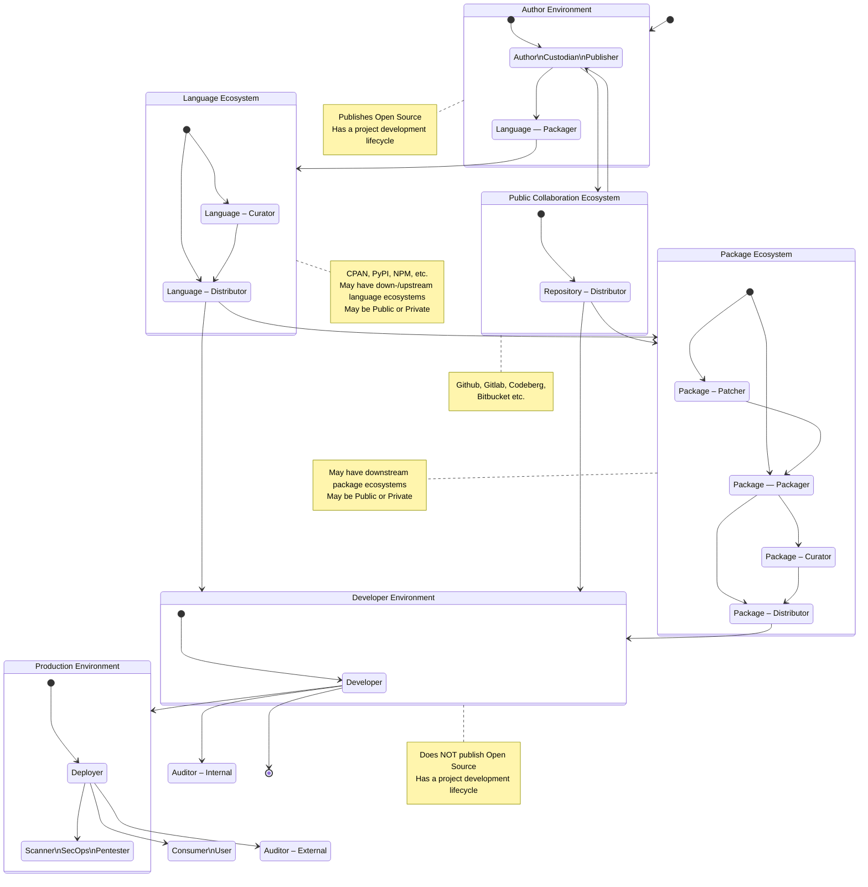

# A Simplified Open Source Supply Chain with SBOMs

> [!CAUTION]
> ## Document status: :warning: DRAFT
> What you see here is a DRAFT of the Supply Chain SBOM roles & responsibilites overview, used by the CPAN Security Group (CPANSec).
> As long as this document is in DRAFT, all of the points and ideas below are _suggestions_, and open to revision, deletion or amending – by you!
>
> - Contribute on Github: https://github.com/CPAN-Security/security.metacpan.org/tree/sbom-draft/sbom
> - Discuss on IRC: ircs://ssl.irc.perl.org:7063/#cpan-security

# Roles

What roles and responsibilities exist in an open source supplychain, and what do each care about in an SBOM?

In a supply chain, we can expect to meet many people filling distinct roles.
Here is a list where we try to distinguish clearly between them.
Any single person can be expected to have one or more roles, and switch between them as needed.
Common for all roles, is that they have some need for SBOM documents - either to ensure they are correct (create, update, rename, delete, assemble), passed on (distribute) or ensure that they are correct, and match the accompanying software (verify).

## Owner

Has the legal owership rights for the dist (e.g a business, or the Author).
May decide the name of the project, or other parameters for (or on behalf of) the Author.

## Author

The initial and/or main creator of the component in question.
Typically works on all aspects of the code, including features, bugfixes, tests and security issues.
Has the final say on the original contents of the package.
The Author _can_ be a group of people, though a single point of responsibility is common.
If an Author has upstream (reverse) dependencies, the Author is also considered to be a Developer (as seen from the upstream Author's perspective.
See below).

| Field            | CycloneDX | SPDX |
| :--------------: | --------- | ---- |
| Name             |  |  |
| Version          |  |  |
| Unique ID (pURL) |  |  |
| Code repo        |  |  |
| Code revision    |  |  |
| SBOM Type        |  |  |
| Vulnerable versions w/locs |  |  |

### Custodian

A type of Steward with reduced responsibilities.
Cares about the ongoing security of the code.
Typically only conserned with updating dependencies or applying security fixes.
Works with the Author primarily, and may take responsibility on their behalf when it comes to security concerns.

### Publisher

Places the component on an ecosystem publishing platform, on behalf of the Author, Steward or Custodian.
Typically this role is done by the same people, but in some cases a separate account may be used; e.g. a business or organization account.

## Patcher

Applies security and bugfixes to distributed native packages.
Works mainly with the Packager, and is downstream of the Author.
This task is only necessary if upstream (Author, Steward or Custodian) roles are not responsive or available, or when downstream constraints requirements call for it (e.g.
when backporting of fixes are needed due to downstream version pinning).

> Patchers (which is a role that usually is held by the same person as the Packager), may select and apply patches before building.
> These patches may include backports of features, security fixes or other accommodations necessary for distributing multiple releases of the same upstream project, but within publishing constraints of the distribution (e.g. LTS releases, or whatever).
> A packager can both be working in-house (e.g. your business) or for the ecosystem provider (e.g. Debian).

## Packager

Builds and creates native packages from a dist received from upstream, optionally with patches applied from the Patcher.
Concerns themselves with correct package format and structure, and that package metadata is preserved and updated.

> Packagers take upstream components from upstream source (e.g. Authors repositories, or Custodian's if an project is dormant), and build and install them into a custom environment for producing objects in their own packaging ecosystem.
> E.g. someone in the #debian-perl group downloads, builds, tests and installs something from CPAN, but instead of doing a regular install, they us tooling like `dh-make-perl` to produce a custom installation directory that can be incorporated into a .deb archive.
> They may want to store build environment metadata in the accompanying SBOM file.

## Curator

Selects or pins which releases are suitable for use within an organization.
Concerns themselves with both the stability and predictability of components, and how this is prioritized against the need for features, bugfixes and security updates.

> Curators may select which built package is distributed where.
> Curators may exist both in-house, in order to keep an eye on what is being automatically installed there, or they may make the decisions that happen on the ecosystem provider side.
> The Curator role can by executed by individuals who do other tasks too.

## Distributor

Ensures the availability of packages, that they are indexed correctly, and that any related metadata is up-to-date, correct and available.

> Distributors take what Packagers, Patchers and Curators produce, and ensure they are made available in a reliable way for downstream users (e.g. by setting up and managing a Debian APT repository, or a CPAN mirror, or whatever).
> If SBOM objects are made available in parallell with the packages in question, they make sure this happens.

### Language Ecosystem

A language ecosystem hosts, indexes and distributes compontnents specific for a programming language.
Examples include CPAN (Perl), PyPI (Python), NPM (Node/JS) and others.

| Field         | CycloneDX | SPDX |
| :-----------: | --------- | ---- |
| Download location |  |  |

### Collaboration Ecosystem

A website or tool that offers a public collaboration repository to Authors, so they may cooperate and share ongoing work in public.
Examples for this include github.com, gitlab.com, codeberg.org, gitea.com and others.

| Field         | CycloneDX | SPDX |
| :-----------: | --------- | ---- |
| Download location |  |  |

### Package Ecosystem

A service that makes components repackaged for a specific OS distribution available for easy download and use.
Examples include APT (Debian, Ubuntu), RPM (AlmaLinux, SuSE), Ports (FreeBSD, OpenBSD) and others.

| Field         | CycloneDX | SPDX |
| :-----------: | --------- | ---- |
| Download location |  |  |

## Developer

Uses packages and components as dependencies in their own project or product.
A Developer is considered to be identical to an Author from the upstream (Author's) perspective.
The main difference from an Author is that a Developer doesn't publish their work as Open Source.

| Field            | CycloneDX | SPDX |
| :--------------: | --------- | ---- |
| Name             |  |  |
| Version          |  |  |
| Unique ID (pURL) |  |  |
| Code repo        |  |  |
| Code revision    |  |  |
| SBOM Type        |  |  |
| Vulnerable versions w/locs |  |  |

## Deployer

Final preparation and installation of the software into production environment.

## Scanner

Runtime and static security checks; Vulnerability monitoring, etc.

## Consumer

The software in use in production, by a user.

## Auditor / Compliance

Verifies that all necessary metadata is available, up-to-date and made use of.

# Other terms

## Steward

~~A type of Author with reduced responsibilities.
Ensures the ongoing quality of the code.
Typically only works on security issues and bugfixes.
Usually doesn't work on new features.
Works with the Author primarily, and may take responsiblity on their behalf when security and bugs are concerned.~~

> NOTE: Steward gets a specific defined meaning in the Cyber Resilience Act, so until this defenition is established, we'll avoid using the term.

# License

This is © Salve J. Nilsen <sjn@cpan.org>.
Some rights reserved.
You may use, modify and share this file under the terms of the CC-BY-SA-4.0 license.
